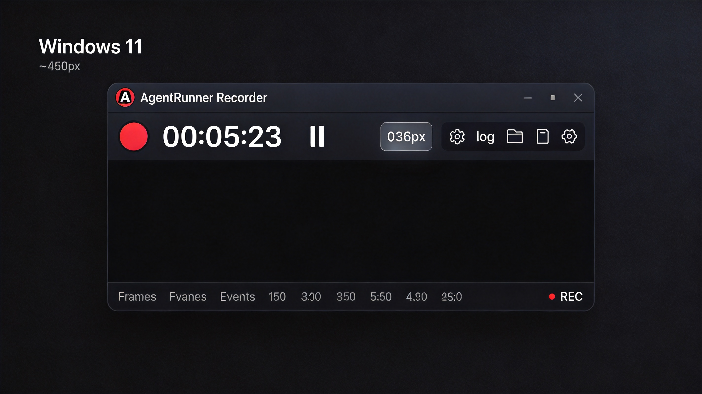

# AgentRunner Recorder

[English](#english) | [中文](#中文)

---

## 中文

轻量级桌面录屏工具，专为测试用例生成场景设计。同步录制屏幕视频、键盘鼠标操作事件，并在每次事件触发时自动截取屏幕快照。




### 功能特性

- **屏幕录制** — 基于 mss + OpenCV，支持多显示器、可调帧率（10/15/20/25/30 fps）
- **事件采集** — 记录键盘按键、鼠标点击、滚轮、移动等操作，输出结构化 JSONL 日志
- **自动截图** — 每次输入事件触发时自动截取屏幕快照，按序号命名
- **暂停/继续** — 录制过程中可随时暂停和恢复，视频和事件日志无缝衔接
- **全局热键** — `Ctrl+Shift+F5` 停止录制，`Ctrl+Shift+F9` 暂停/继续
- **一键导出** — 将录制项目打包为 ZIP 压缩包，方便传输和归档
- **暗色主题** — 深色 GUI 界面，透明背景 PNG 图标，折叠式设置/日志面板

### 快速开始

#### 从源码运行

```bash
git clone https://github.com/dragondjf/AgentRunnerRecorder.git
cd AgentRunnerRecorder
pip install -r requirements.txt
python recorder_app.py
```

#### 下载预构建版本

前往 [Releases](../../releases) 页面下载对应平台的安装包：

| 平台 | 文件 |
|------|------|
| Windows | `AgentRunnerRecorder-Setup.exe` |
| macOS | `AgentRunnerRecorder-mac.zip` |

> 无需安装 Python，双击即可运行。

### 使用方法

1. **开始录制** — 点击红色录制按钮
2. **暂停/继续** — 点击暂停/恢复按钮，或按 `Ctrl+Shift+F9`
3. **停止录制** — 点击停止按钮，或按 `Ctrl+Shift+F5`
4. **打开目录** — 在资源管理器中查看录制输出
5. **导出 ZIP** — 将录制项目打包为 ZIP 文件

### 录制输出结构

```
{output_dir}/
└── recording_20240101_120000/
    └── inputs/
        ├── recording_20240101_120000.mp4          # 屏幕录像
        ├── input_log_recording_20240101_120000.txt # 事件日志 (JSONL)
        └── screenshots/
            ├── 0001.png
            ├── 0002.png
            └── ...
```

### 事件日志格式（JSONL）

每行一条 JSON 记录，示例：

```json
{"type": "mouse_click", "button": "left", "x": 960, "y": 540, "timestamp": 1704067200.123, "screenshot": "screenshots/0001.png", "window": "Chrome - Google"}
```

### 项目结构

```
├── recorder_app.py          # GUI 主程序（tkinter）
├── recorder.spec             # PyInstaller 打包配置
├── requirements.txt          # Python 依赖
├── recorder/
│   ├── __init__.py          # 懒加载导出
│   ├── core.py              # RecordingSession 录制会话编排
│   ├── screen_capture.py    # mss + OpenCV 屏幕录制
│   ├── event_listener.py    # pynput 键盘/鼠标事件监听
│   ├── window_tracker.py    # 活动窗口标题检测
│   └── manager.py           # 线程安全状态管理
├── images/
│   ├── app_icon.ico         # 窗口图标（多尺寸 ICO）
│   ├── app_icon.png         # 窗口图标（64x64）
│   └── icons_64/            # 功能图标（64x64, 透明背景）
└── docs/
    └── screenshot.png       # 界面截图
```

### 依赖要求

| 依赖 | 版本 | 用途 | 必需 |
|------|------|------|------|
| Python | >= 3.7 | 运行环境 | 是 |
| Pillow | >= 8.0 | 图标加载 / 图像处理 | 是 |
| OpenCV | >= 4.5 | 屏幕录制视频编码 | 是 |
| NumPy | >= 1.21 | 屏幕帧数据处理 | 是 |
| mss | >= 0.5 | 跨平台屏幕捕获 | 是 |
| pynput | >= 1.7 | 全局热键监听 | 否 |

### 快捷键

| 快捷键 | 功能 |
|--------|------|
| `Ctrl+Shift+F5` | 停止录制 |
| `Ctrl+Shift+F9` | 暂停 / 继续录制 |

### 构建发布

通过 GitHub Actions 自动构建，推送 tag 即可触发：

```bash
git tag v1.0.0
git push origin v1.0.0
```

构建产物会自动上传到 [Releases](../../releases) 页面（Draft 状态，手动审核后发布）。

支持平台：Windows（exe）、macOS（zip）。

### License

MIT

---

## English

A lightweight desktop screen recorder designed for test case generation workflows. It simultaneously records screen video, keyboard and mouse events, and automatically captures screenshots on each input event trigger.


### Features

- **Screen Recording** — mss + OpenCV based, multi-monitor support, adjustable FPS (10/15/20/25/30)
- **Event Capture** — Records keystrokes, mouse clicks, scrolls, and movements as structured JSONL logs
- **Auto Screenshot** — Automatically captures screen snapshots on each input event, sequentially numbered
- **Pause / Resume** — Pause and resume recording at any time with seamless video and event log continuity
- **Global Hotkeys** — `Ctrl+Shift+F5` to stop, `Ctrl+Shift+F9` to pause/resume
- **One-click Export** — Package recording projects as ZIP archives for easy sharing
- **Dark Theme** — Dark GUI with transparent PNG icons, collapsible settings and log panels

### Quick Start

#### From Source

```bash
git clone https://github.com/dragondjf/AgentRunnerRecorder.git
cd AgentRunnerRecorder
pip install -r requirements.txt
python recorder_app.py
```

#### Pre-built Binaries

Download the latest build from the [Releases](../../releases) page:

| Platform | File |
|----------|------|
| Windows | `AgentRunnerRecorder-Setup.exe` |
| macOS | `AgentRunnerRecorder-mac.zip` |

> No Python installation required. Just double-click to run.

### Usage

1. **Start Recording** — Click the red record button
2. **Pause / Resume** — Click the pause/resume button, or press `Ctrl+Shift+F9`
3. **Stop Recording** — Click the stop button, or press `Ctrl+Shift+F5`
4. **Open Directory** — View recording output in file explorer
5. **Export ZIP** — Package the recording project as a ZIP archive

### Output Structure

```
{output_dir}/
└── recording_20240101_120000/
    └── inputs/
        ├── recording_20240101_120000.mp4          # Screen video
        ├── input_log_recording_20240101_120000.txt # Event log (JSONL)
        └── screenshots/
            ├── 0001.png
            ├── 0002.png
            └── ...
```

### Event Log Format (JSONL)

One JSON record per line, example:

```json
{"type": "mouse_click", "button": "left", "x": 960, "y": 540, "timestamp": 1704067200.123, "screenshot": "screenshots/0001.png", "window": "Chrome - Google"}
```

### Project Structure

```
├── recorder_app.py          # GUI main program (tkinter)
├── recorder.spec             # PyInstaller build config
├── requirements.txt          # Python dependencies
├── recorder/
│   ├── __init__.py          # Lazy-load exports
│   ├── core.py              # RecordingSession orchestration
│   ├── screen_capture.py    # mss + OpenCV screen recording
│   ├── event_listener.py    # pynput keyboard/mouse events
│   ├── window_tracker.py    # Active window title detection
│   └── manager.py           # Thread-safe state management
├── images/
│   ├── app_icon.ico         # Window icon (multi-size ICO)
│   ├── app_icon.png         # Window icon (64x64)
│   └── icons_64/            # Button icons (64x64, transparent)
└── docs/
    └── screenshot.png       # UI screenshot
```

### Dependencies

| Dependency | Version | Purpose | Required |
|------------|---------|---------|----------|
| Python | >= 3.7 | Runtime | Yes |
| Pillow | >= 8.0 | Icon loading / image processing | Yes |
| OpenCV | >= 4.5 | Screen recording video encoding | Yes |
| NumPy | >= 1.21 | Screen frame data processing | Yes |
| mss | >= 0.5 | Cross-platform screen capture | Yes |
| pynput | >= 1.7 | Global hotkey listener | No |

### Keyboard Shortcuts

| Shortcut | Action |
|-----------|--------|
| `Ctrl+Shift+F5` | Stop recording |
| `Ctrl+Shift+F9` | Pause / Resume recording |

### Build & Release

Automated builds via GitHub Actions. Push a tag to trigger:

```bash
git tag v1.0.0
git push origin v1.0.0
```

Build artifacts are automatically uploaded to the [Releases](../../releases) page (Draft status, review before publishing).

Supported platforms: Windows (exe), macOS (zip).

### License

MIT
