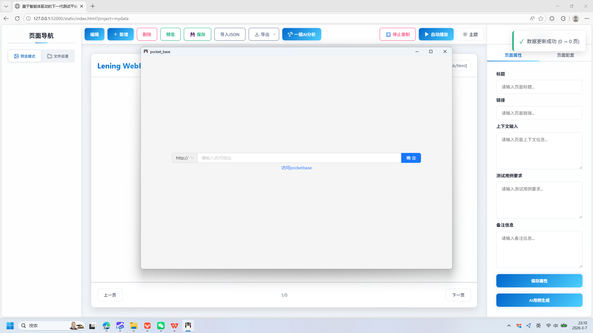
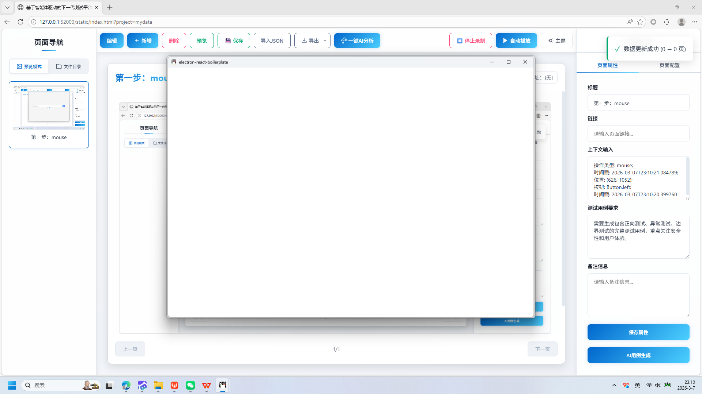
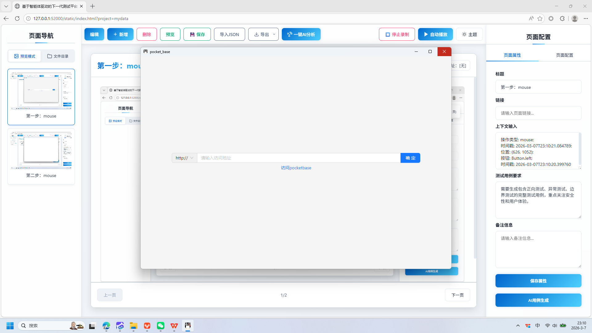
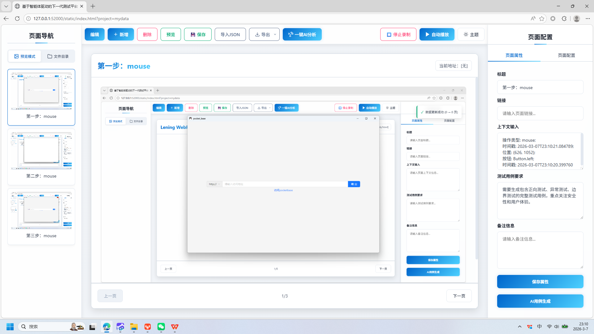

# 基于智能体驱动的下一代测试平台 AgentRunner

+ **生成时间**: 2026-03-07 23:58:30
+ **数据源**: F:\workspace\yfjzworkspace\webspace\ai-template\uirecorder\filestorage\mydata\records.json
+ **操作总数**: 4

# 1. 第一步：mouse

**操作详情**:
+ 操作类型: mouse; 
+ 时间戳: 2026-03-07T23:10:21.084789; 
+ 位置: (626, 1052); 
+ 按钮: Button.left; 
+ 时间戳: 2026-03-07T23:10:20.399760

# 2. 第二步：mouse

**操作详情**:
+ 操作类型: mouse; 
+ 时间戳: 2026-03-07T23:10:22.082580; 
+ 位置: (937, 546); 
+ 按钮: Button.left; 
+ 时间戳: 2026-03-07T23:10:21.574711

# 3. 访问地址配置

**操作详情**:
+ 操作类型: mouse; 
+ 时间戳: 2026-03-07T23:10:25.209834; 
+ 位置: (1433, 177); 
+ 按钮: Button.left; 
+ 时间戳: 2026-03-07T23:10:24.726944

**页面描述**:
该界面用于配置访问地址，用户可在输入框中填写目标网址，并通过点击“确定”按钮完成设置。界面上方显示当前页面标题为'pocket_base'，下方提供了一个链接提示'访问pocketbase'，方便用户快速跳转至指定页面。

# 4. 第四步：mouse

**操作详情**:
+ 操作类型: mouse; 
+ 时间戳: 2026-03-07T23:10:26.724198; 
+ 位置: (1428, 174); 
+ 按钮: Button.left; 
+ 时间戳: 2026-03-07T23:10:26.166488

---

*报告由 AgentRunner Markdown Exporter 生成*