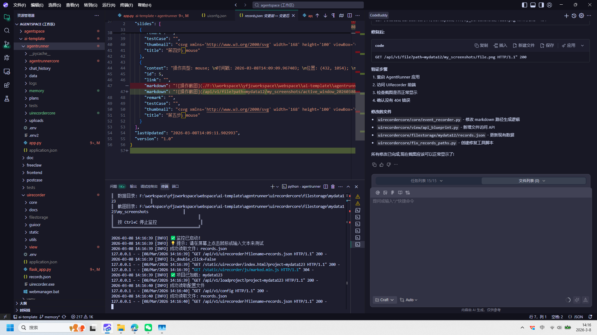
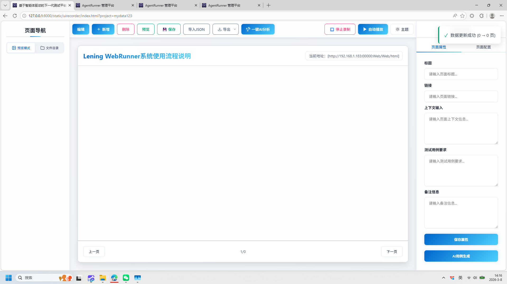

# 基于智能体驱动的下一代测试平台 AgentRunner

+ **生成时间**: 2026-03-08 14:25:12
+ **数据源**: F:\workspace\yfjzworkspace\webspace\ai-template\agentrunner\uirecordercore\filestorage\mydata123\records.json
+ **操作总数**: 2

# 1. 代码调试与界面录制功能集成

**操作详情**:
+ 操作类型: mouse; 
+ 时间戳: 2026-03-08T14:16:40.274883; 
+ 位置: (349, 1053); 
+ 按钮: Button.left; 
+ 时间戳: 2026-03-08T14:16:39.818139

**页面描述**:
该界面展示了开发环境中代码调试与用户界面录制功能的集成应用。左侧为项目文件结构和代码编辑器，显示了JSON格式的测试用例配置，包含操作截图路径、时间戳和鼠标位置等信息。中间部分是运行日志输出，记录了程序启动、文件读取和API请求等关键步骤。右侧为调试辅助工具，提供了修复建议、修改文件列表以及任务执行状态。整体实现了对用户操作行为的精准捕捉与分析，支持自动化测试流程的构建与验证。

# 2. 第二步：mouse

**操作详情**:
+ 操作类型: mouse; 
+ 时间戳: 2026-03-08T14:16:41.090963; 
+ 位置: (349, 1053); 
+ 按钮: Button.left; 
+ 时间戳: 2026-03-08T14:16:40.593571

---

*报告由 AgentRunner Markdown Exporter 生成*