# 基于智能体驱动的下一代测试平台 AgentRunner

+ **生成时间**: 2026-03-08 15:14:52
+ **数据源**: F:\workspace\yfjzworkspace\webspace\ai-template\agentrunner\uirecordercore\filestorage\mydata11230\records.json
+ **操作总数**: 20

# 1. 第一步：mouse

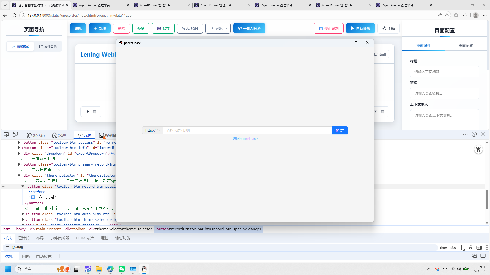

**操作详情**:
+ 操作类型: mouse; 
+ 时间戳: 2026-03-08T15:14:09.692475; 
+ 位置: (562, 1066); 
+ 按钮: Button.left; 
+ 时间戳: 2026-03-08T15:14:09.217193

# 2. 第二步：mouse

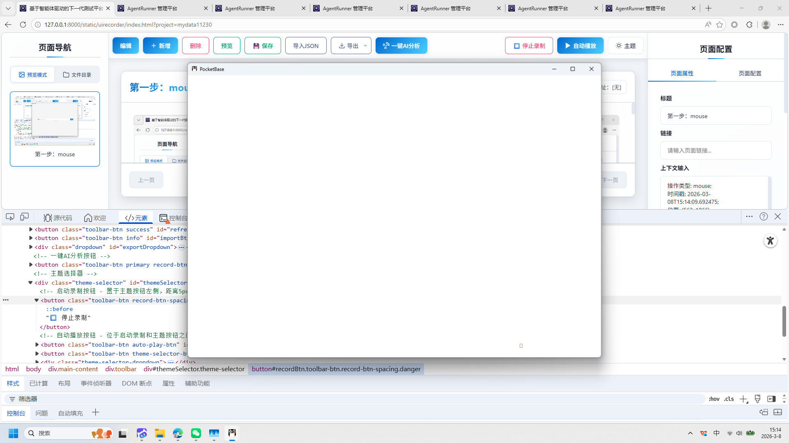

**操作详情**:
+ 操作类型: mouse; 
+ 时间戳: 2026-03-08T15:14:10.885043; 
+ 位置: (987, 545); 
+ 按钮: Button.left; 
+ 时间戳: 2026-03-08T15:14:10.401451

# 3. 第三步：mouse

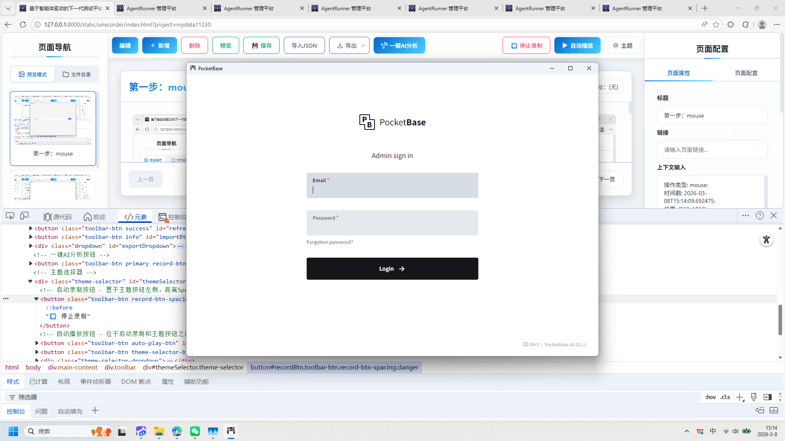

**操作详情**:
+ 操作类型: mouse; 
+ 时间戳: 2026-03-08T15:14:13.353166; 
+ 位置: (913, 451); 
+ 按钮: Button.left; 
+ 时间戳: 2026-03-08T15:14:12.889248

# 4. 第四步：keyboard

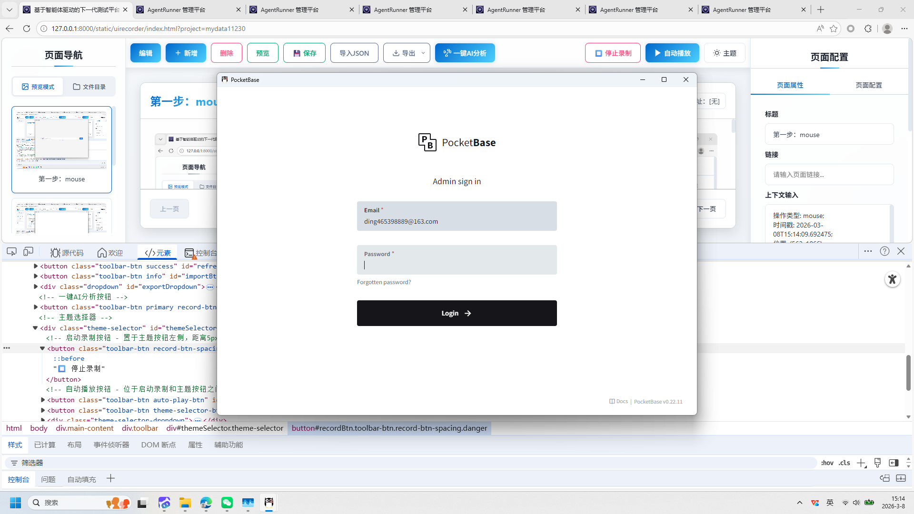

**操作详情**:
+ 操作类型: keyboard; 
+ 时间戳: 2026-03-08T15:14:20.786151; 
+ 输入内容: ding465398889@163.com; 
+ 长度: 21; 
+ 首字符: d; 
+ 末字符: m; 
+ 结束原因: tab_key; 
+ 时间戳: 2026-03-08T15:14:20.505245; 
+ 截图类型: 首字符

# 5. 第五步：keyboard

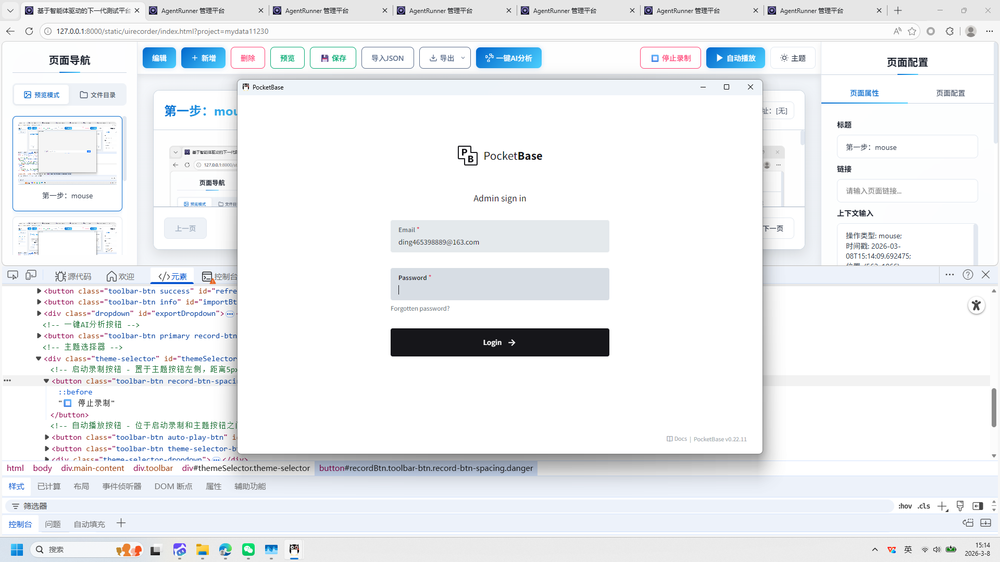

**操作详情**:
+ 操作类型: keyboard; 
+ 时间戳: 2026-03-08T15:14:20.789209; 
+ 输入内容: ding465398889@163.com; 
+ 长度: 21; 
+ 首字符: d; 
+ 末字符: m; 
+ 结束原因: tab_key; 
+ 时间戳: 2026-03-08T15:14:20.505245; 
+ 截图类型: 末字符

# 6. 第六步：mouse

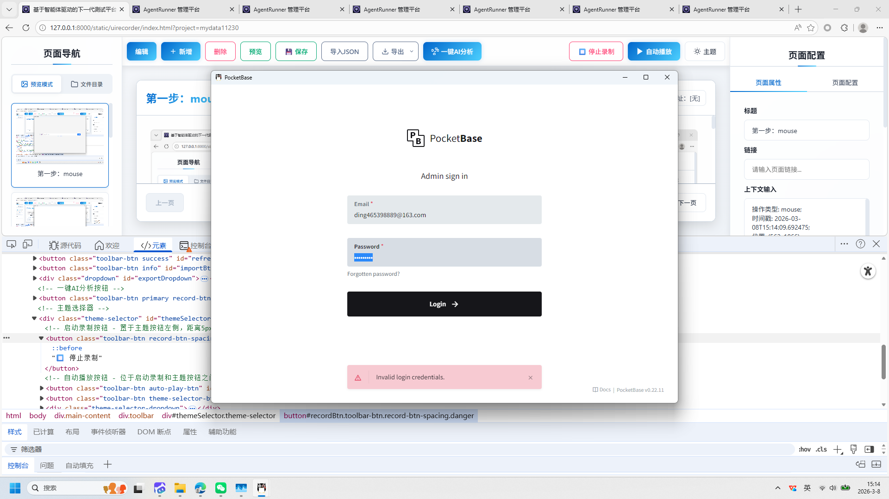

**操作详情**:
+ 操作类型: mouse; 
+ 时间戳: 2026-03-08T15:14:28.907845; 
+ 位置: (854, 556); 
+ 按钮: Button.left; 
+ 时间戳: 2026-03-08T15:14:28.433852

# 7. 第七步：mouse

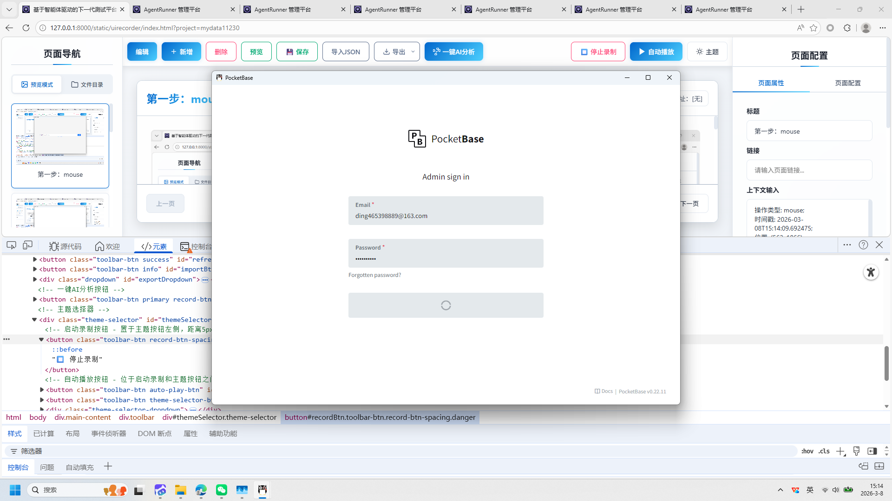

**操作详情**:
+ 操作类型: mouse; 
+ 时间戳: 2026-03-08T15:14:32.663031; 
+ 位置: (962, 670); 
+ 按钮: Button.left; 
+ 时间戳: 2026-03-08T15:14:32.225544

# 8. 第八步：mouse

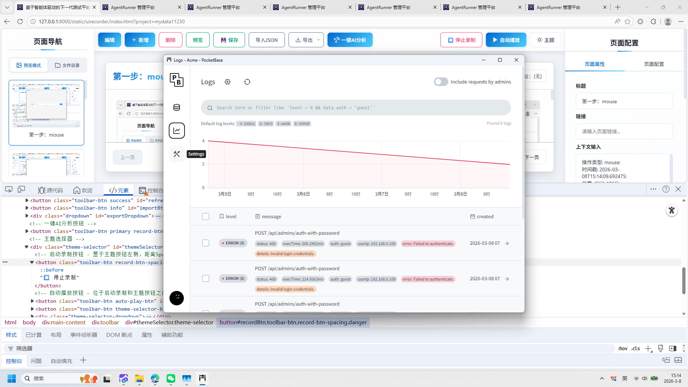

**操作详情**:
+ 操作类型: mouse; 
+ 时间戳: 2026-03-08T15:14:34.520068; 
+ 位置: (492, 351); 
+ 按钮: Button.left; 
+ 时间戳: 2026-03-08T15:14:34.056612

# 9. 第九步：mouse

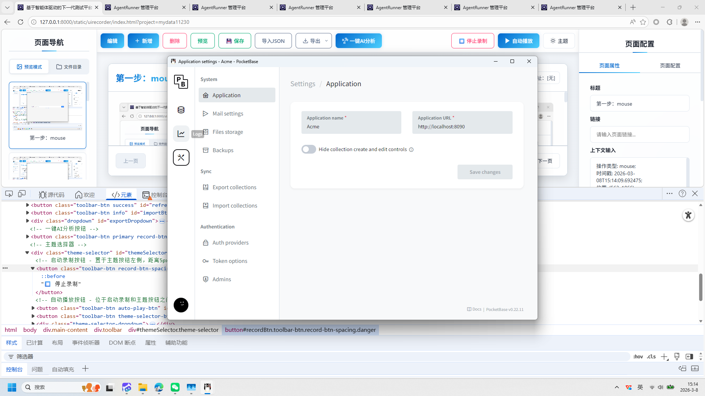

**操作详情**:
+ 操作类型: mouse; 
+ 时间戳: 2026-03-08T15:14:35.025088; 
+ 位置: (494, 431); 
+ 按钮: Button.left; 
+ 时间戳: 2026-03-08T15:14:34.521067

# 10. 第十步：keyboard

**操作详情**:
+ 操作类型: keyboard; 
+ 时间戳: 2026-03-08T15:14:35.169195; 
+ 输入内容: 1234567899
+ 1234567890; 
+ 长度: 21; 
+ 首字符: 1; 
+ 末字符: 0; 
+ 结束原因: timeout; 
+ 时间戳: 2026-03-08T15:14:34.834568; 
+ 截图类型: 首字符

# 11. 第十一步：keyboard

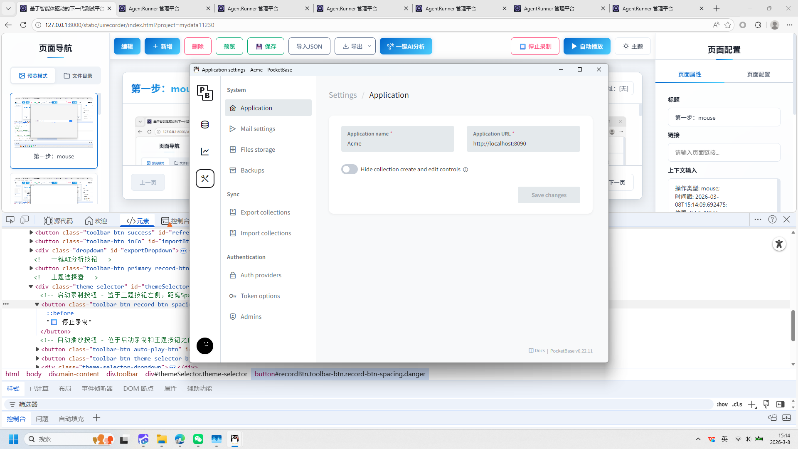

**操作详情**:
+ 操作类型: keyboard; 
+ 时间戳: 2026-03-08T15:14:35.173192; 
+ 输入内容: 1234567899
+ 1234567890; 
+ 长度: 21; 
+ 首字符: 1; 
+ 末字符: 0; 
+ 结束原因: timeout; 
+ 时间戳: 2026-03-08T15:14:34.834568; 
+ 截图类型: 末字符

# 12. 第十二步：mouse

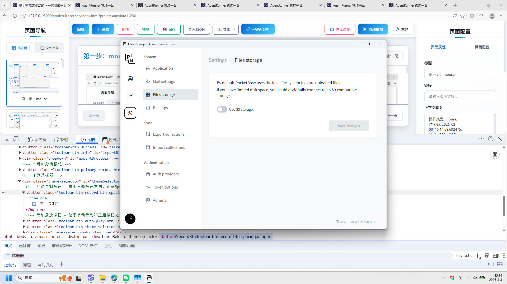

**操作详情**:
+ 操作类型: mouse; 
+ 时间戳: 2026-03-08T15:14:36.070763; 
+ 位置: (616, 366); 
+ 按钮: Button.left; 
+ 时间戳: 2026-03-08T15:14:35.593374

# 13. 第十三步：mouse

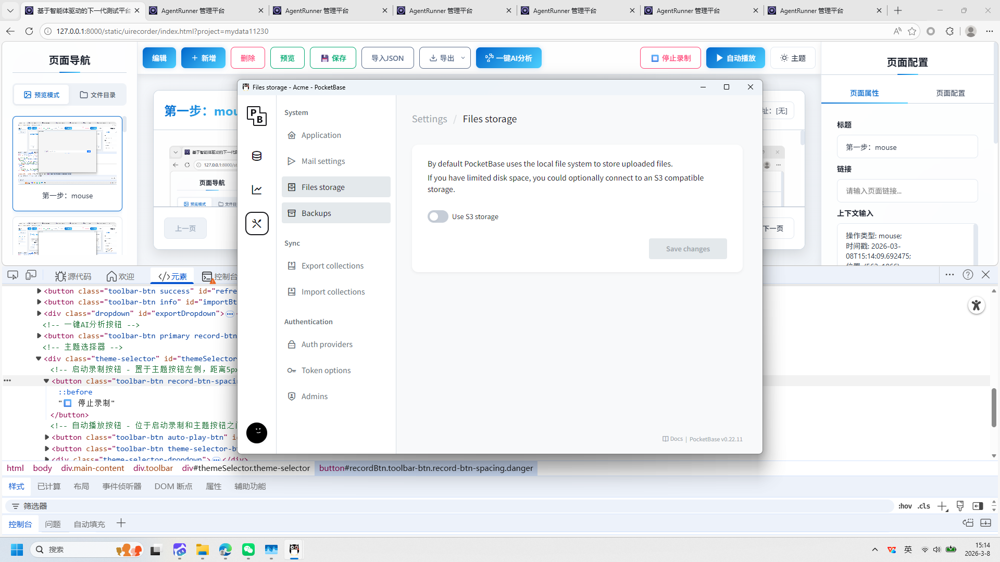

**操作详情**:
+ 操作类型: mouse; 
+ 时间戳: 2026-03-08T15:14:36.548890; 
+ 位置: (610, 429); 
+ 按钮: Button.left; 
+ 时间戳: 2026-03-08T15:14:35.970985

# 14. 第十四步：mouse

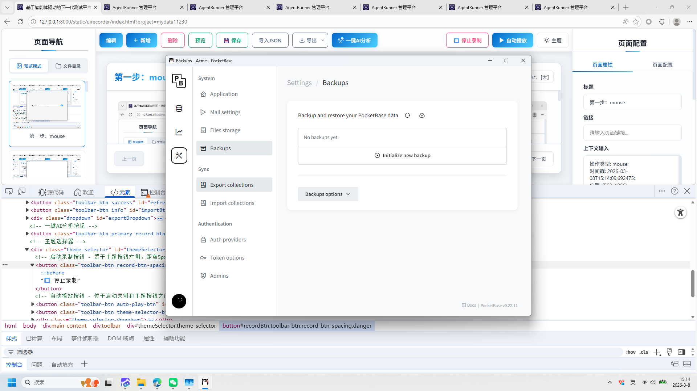

**操作详情**:
+ 操作类型: mouse; 
+ 时间戳: 2026-03-08T15:14:37.011735; 
+ 位置: (613, 408); 
+ 按钮: Button.left; 
+ 时间戳: 2026-03-08T15:14:36.431168

# 15. 第十五步：mouse

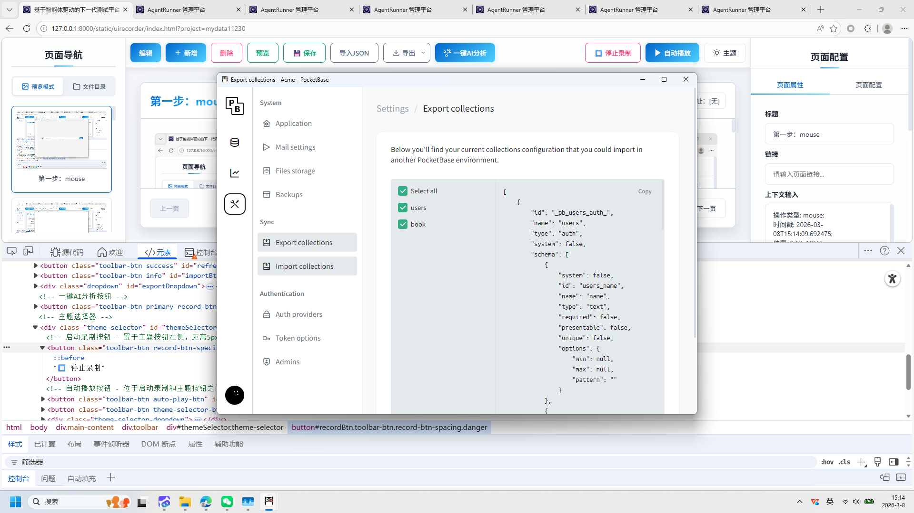

**操作详情**:
+ 操作类型: mouse; 
+ 时间戳: 2026-03-08T15:14:37.507646; 
+ 位置: (646, 495); 
+ 按钮: Button.left; 
+ 时间戳: 2026-03-08T15:14:36.918003

# 16. 第十六步：mouse

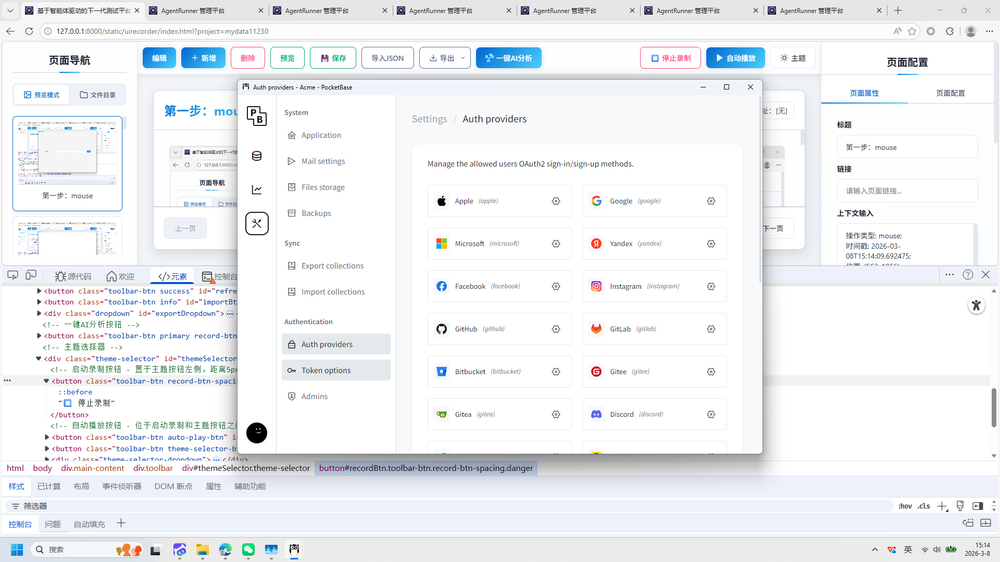

**操作详情**:
+ 操作类型: mouse; 
+ 时间戳: 2026-03-08T15:14:38.221757; 
+ 位置: (629, 655); 
+ 按钮: Button.left; 
+ 时间戳: 2026-03-08T15:14:37.762618

# 17. 第十七步：mouse

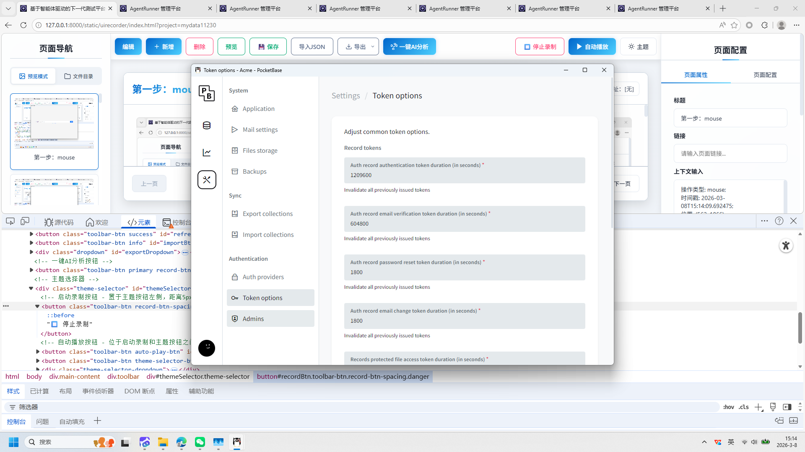

**操作详情**:
+ 操作类型: mouse; 
+ 时间戳: 2026-03-08T15:14:38.695625; 
+ 位置: (633, 711); 
+ 按钮: Button.left; 
+ 时间戳: 2026-03-08T15:14:38.192702

# 18. 第十八步：mouse

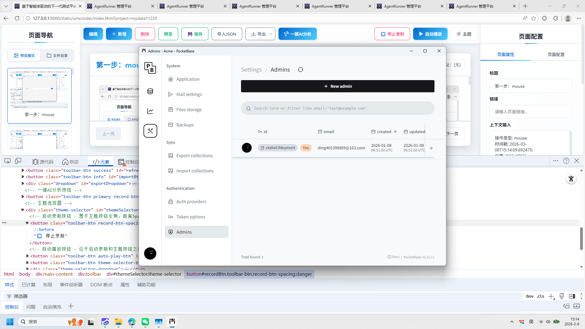

**操作详情**:
+ 操作类型: mouse; 
+ 时间戳: 2026-03-08T15:14:39.173273; 
+ 位置: (611, 758); 
+ 按钮: Button.left; 
+ 时间戳: 2026-03-08T15:14:38.600938

# 19. 第十九步：mouse

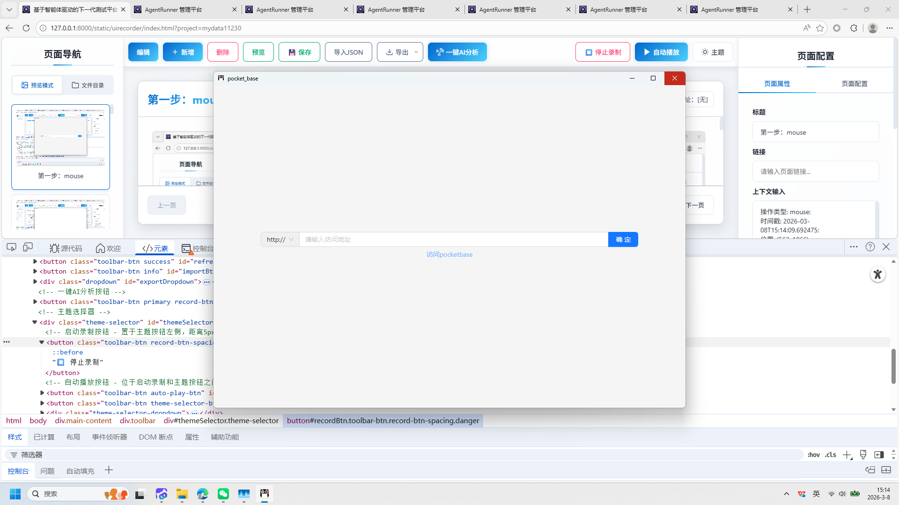

**操作详情**:
+ 操作类型: mouse; 
+ 时间戳: 2026-03-08T15:14:40.788985; 
+ 位置: (1425, 174); 
+ 按钮: Button.left; 
+ 时间戳: 2026-03-08T15:14:40.281110

# 20. 第二十步：mouse

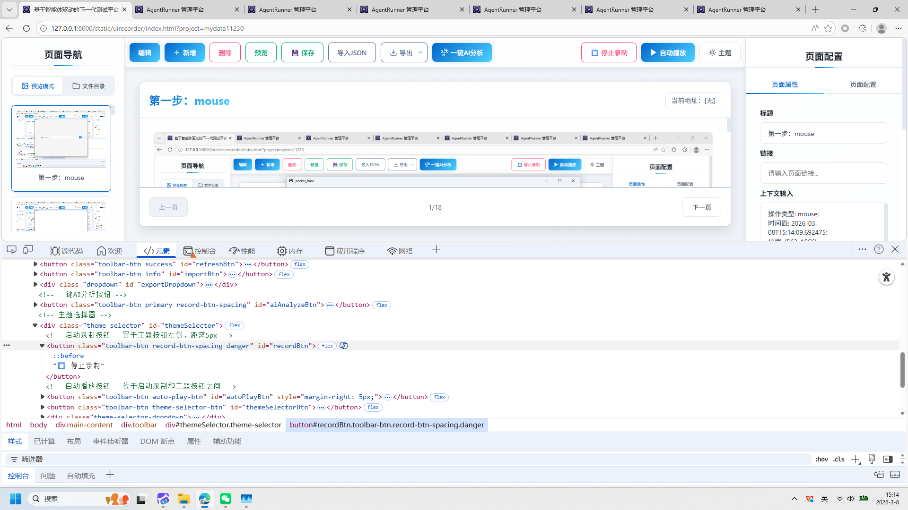

**操作详情**:
+ 操作类型: mouse; 
+ 时间戳: 2026-03-08T15:14:41.383364; 
+ 位置: (1423, 171); 
+ 按钮: Button.left; 
+ 时间戳: 2026-03-08T15:14:40.867566

---

*报告由 AgentRunner Markdown Exporter 生成*