# 基于智能体驱动的下一代测试平台 AgentRunner

+ **生成时间**: 2026-03-11 16:48:32
+ **数据源**: F:\workspace\yfjzworkspace\webspace\ai-template\agentrunner\uirecordercore\filestorage\fddf\records.json
+ **操作总数**: 29

# 1. 第一步：mouse

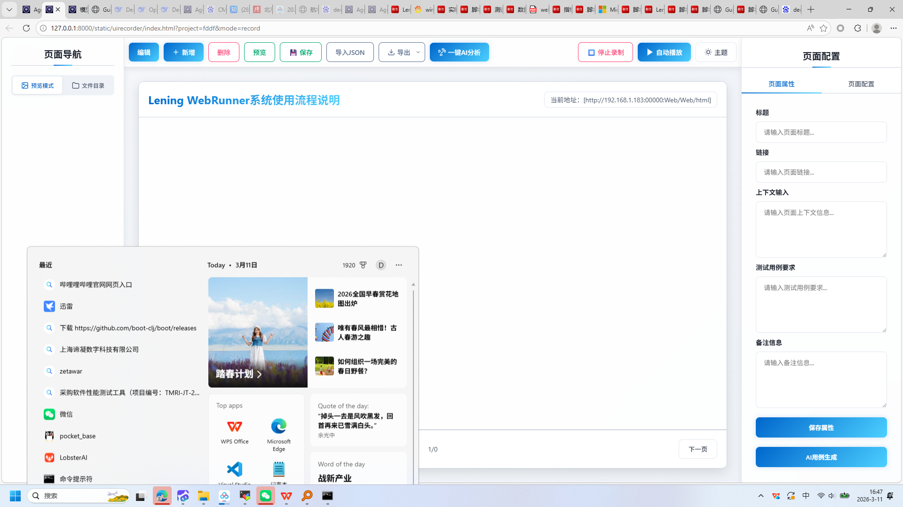

**操作详情**:
+ 操作类型: mouse; 
+ 时间戳: 2026-03-11T16:47:07.188277; 
+ 位置: (164, 560); 
+ 按钮: Button.left; 
+ 时间戳: 2026-03-11T16:47:06.575578

# 2. 第二步：mouse

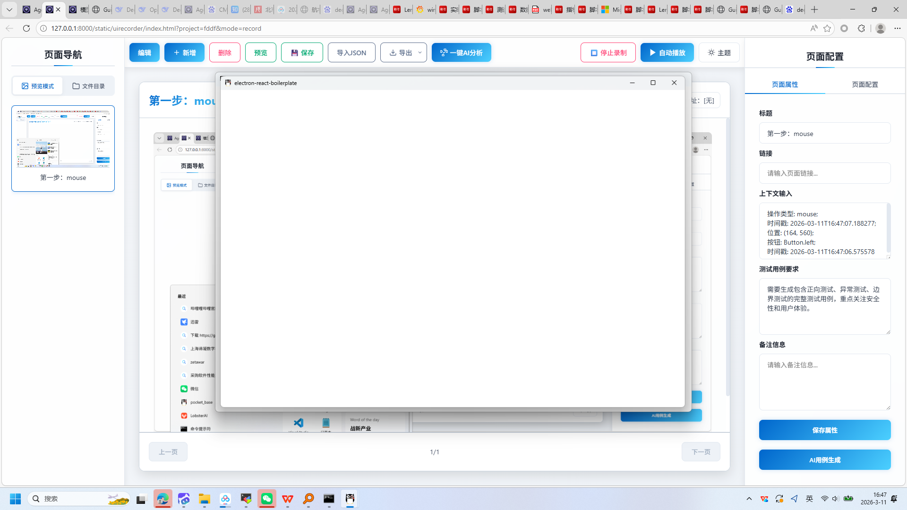

**操作详情**:
+ 操作类型: mouse; 
+ 时间戳: 2026-03-11T16:47:10.044594; 
+ 位置: (986, 541); 
+ 按钮: Button.left; 
+ 时间戳: 2026-03-11T16:47:09.533217

# 3. 管理员登录界面

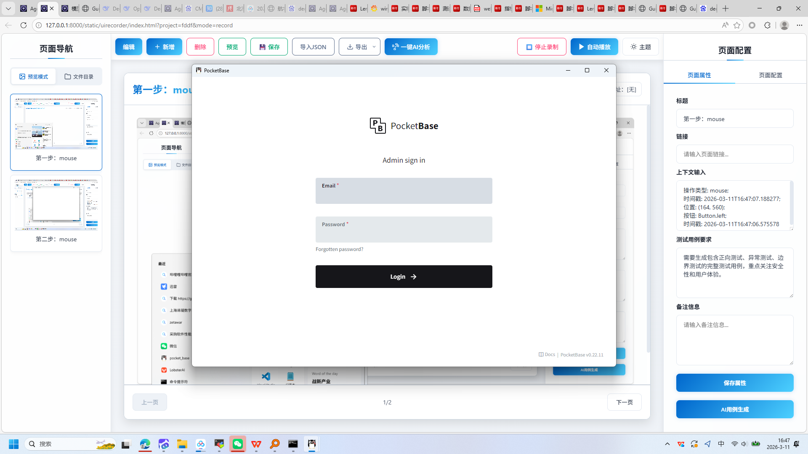

**操作详情**:
+ 操作类型: mouse; 
+ 时间戳: 2026-03-11T16:47:11.259464; 
+ 位置: (872, 468); 
+ 按钮: Button.left; 
+ 时间戳: 2026-03-11T16:47:10.694068

**页面描述**:
这是一个简洁的管理员登录界面，包含邮箱和密码输入框，支持密码找回功能。用户可通过点击登录按钮进入系统，界面设计现代且直观，专注于提升用户体验和安全性。

# 4. 第四步：mouse

**操作详情**:
+ 操作类型: mouse; 
+ 时间戳: 2026-03-11T16:47:20.927182; 
+ 位置: (852, 466); 
+ 按钮: Button.left; 
+ 时间戳: 2026-03-11T16:47:20.360173

# 5. 第五步：keyboard

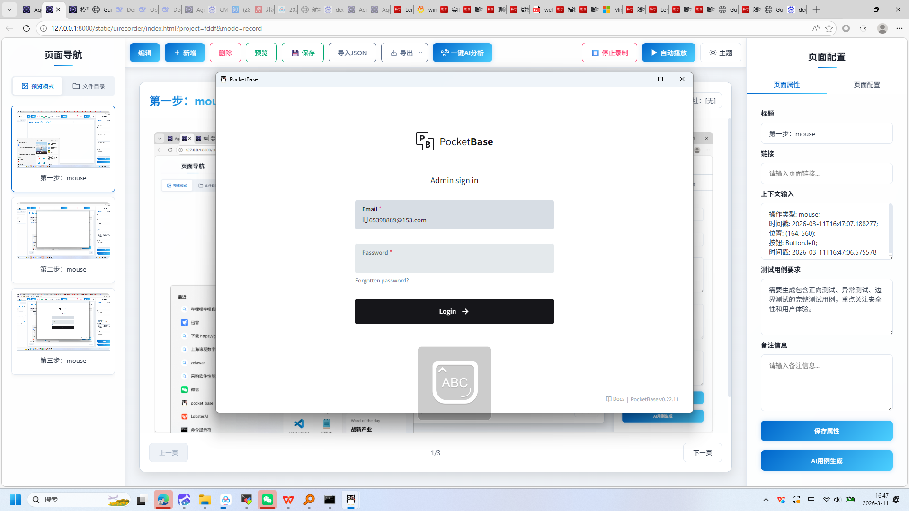

**操作详情**:
+ 操作类型: keyboard; 
+ 时间戳: 2026-03-11T16:47:20.961186; 
+ 输入内容: ding465398889@153.com; 
+ 长度: 21; 
+ 首字符: d; 
+ 末字符: m; 
+ 结束原因: timeout; 
+ 时间戳: 2026-03-11T16:47:20.448705; 
+ 截图类型: 首字符

# 6. 第六步：keyboard

**操作详情**:
+ 操作类型: keyboard; 
+ 时间戳: 2026-03-11T16:47:20.965709; 
+ 输入内容: ding465398889@153.com; 
+ 长度: 21; 
+ 首字符: d; 
+ 末字符: m; 
+ 结束原因: timeout; 
+ 时间戳: 2026-03-11T16:47:20.448705; 
+ 截图类型: 末字符

# 7. 第七步：mouse

**操作详情**:
+ 操作类型: mouse; 
+ 时间戳: 2026-03-11T16:47:23.419768; 
+ 位置: (781, 461); 
+ 按钮: Button.left; 
+ 时间戳: 2026-03-11T16:47:22.940767

# 8. 第八步：mouse

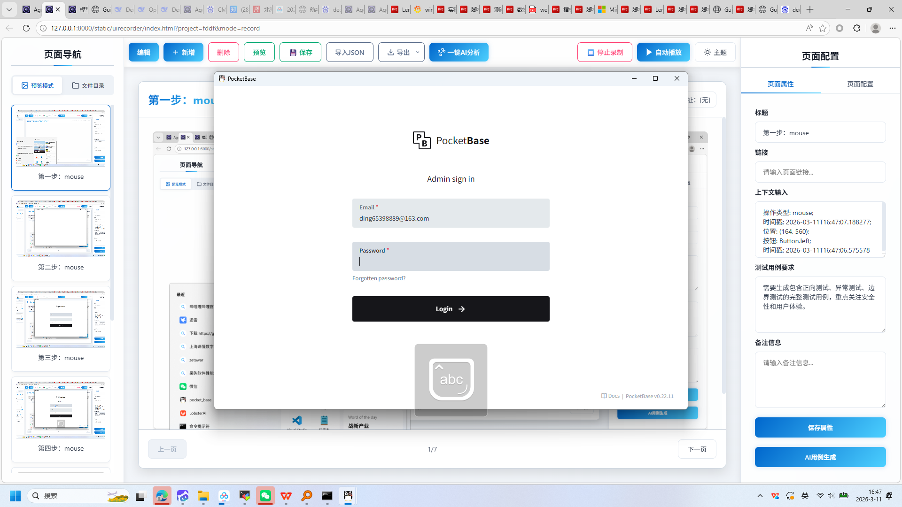

**操作详情**:
+ 操作类型: mouse; 
+ 时间戳: 2026-03-11T16:47:29.184314; 
+ 位置: (821, 555); 
+ 按钮: Button.left; 
+ 时间戳: 2026-03-11T16:47:28.709075

# 9. 第九步：keyboard

**操作详情**:
+ 操作类型: keyboard; 
+ 时间戳: 2026-03-11T16:47:30.322577; 
+ 输入内容: 16ding; 
+ 长度: 6; 
+ 首字符: 1; 
+ 末字符: g; 
+ 结束原因: timeout; 
+ 时间戳: 2026-03-11T16:47:29.961769; 
+ 截图类型: 首字符

# 10. 第十步：keyboard

**操作详情**:
+ 操作类型: keyboard; 
+ 时间戳: 2026-03-11T16:47:30.326568; 
+ 输入内容: 16ding; 
+ 长度: 6; 
+ 首字符: 1; 
+ 末字符: g; 
+ 结束原因: timeout; 
+ 时间戳: 2026-03-11T16:47:29.961769; 
+ 截图类型: 末字符

# 11. 第十一步：mouse

**操作详情**:
+ 操作类型: mouse; 
+ 时间戳: 2026-03-11T16:47:30.893989; 
+ 位置: (789, 467); 
+ 按钮: Button.left; 
+ 时间戳: 2026-03-11T16:47:30.374765

# 12. 第十二步：mouse

**操作详情**:
+ 操作类型: mouse; 
+ 时间戳: 2026-03-11T16:47:31.633013; 
+ 位置: (790, 468); 
+ 按钮: Button.left; 
+ 时间戳: 2026-03-11T16:47:31.175430

# 13. 第十三步：mouse

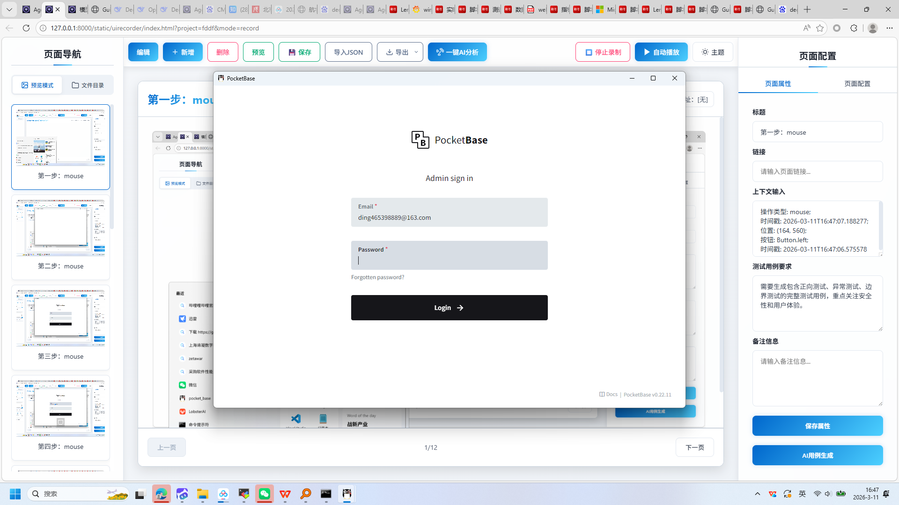

**操作详情**:
+ 操作类型: mouse; 
+ 时间戳: 2026-03-11T16:47:32.988789; 
+ 位置: (809, 564); 
+ 按钮: Button.left; 
+ 时间戳: 2026-03-11T16:47:32.492783

# 14. 第十四步：mouse

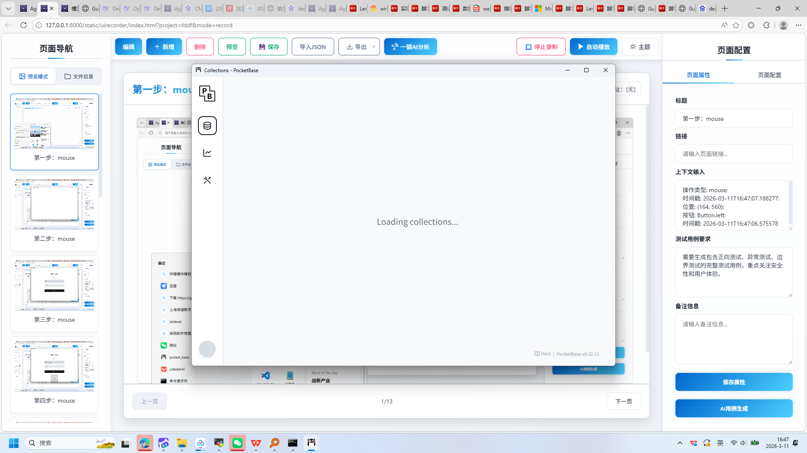

**操作详情**:
+ 操作类型: mouse; 
+ 时间戳: 2026-03-11T16:47:38.236184; 
+ 位置: (965, 674); 
+ 按钮: Button.left; 
+ 时间戳: 2026-03-11T16:47:37.733865

# 15. 第十五步：mouse

**操作详情**:
+ 操作类型: mouse; 
+ 时间戳: 2026-03-11T16:47:40.009439; 
+ 位置: (481, 365); 
+ 按钮: Button.left; 
+ 时间戳: 2026-03-11T16:47:39.437804

# 16. 第十六步：keyboard

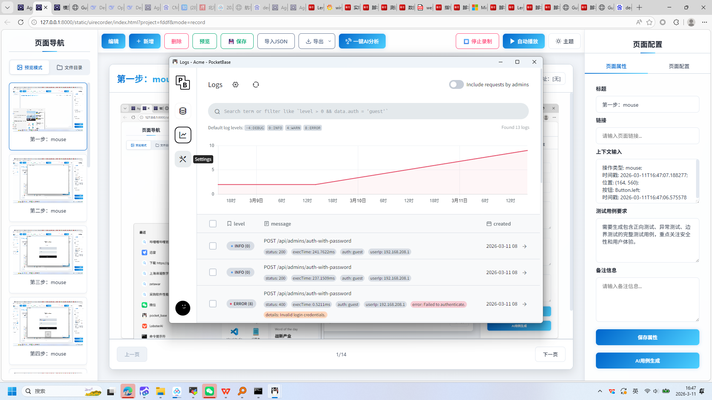

**操作详情**:
+ 操作类型: keyboard; 
+ 时间戳: 2026-03-11T16:47:40.096349; 
+ 输入内容: 41234567890; 
+ 长度: 11; 
+ 首字符: 4; 
+ 末字符: 0; 
+ 结束原因: timeout; 
+ 时间戳: 2026-03-11T16:47:39.691044; 
+ 截图类型: 首字符

# 17. 第十七步：keyboard

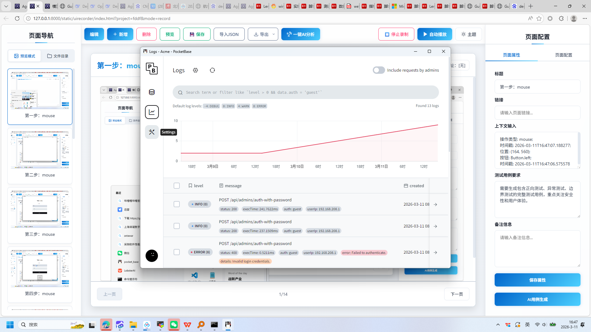

**操作详情**:
+ 操作类型: keyboard; 
+ 时间戳: 2026-03-11T16:47:40.100351; 
+ 输入内容: 41234567890; 
+ 长度: 11; 
+ 首字符: 4; 
+ 末字符: 0; 
+ 结束原因: timeout; 
+ 时间戳: 2026-03-11T16:47:39.691044; 
+ 截图类型: 末字符

# 18. 第十八步：mouse

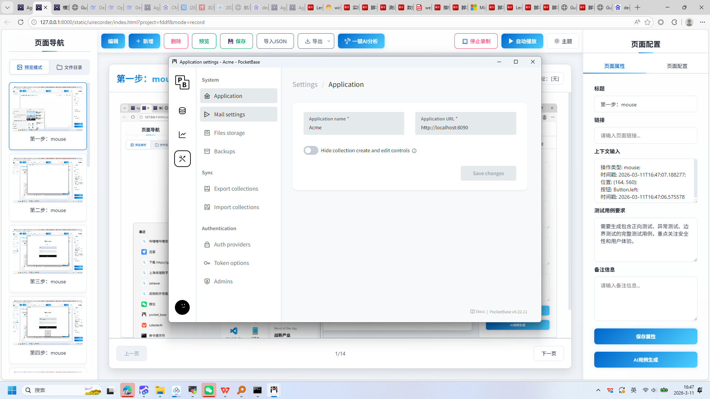

**操作详情**:
+ 操作类型: mouse; 
+ 时间戳: 2026-03-11T16:47:40.566210; 
+ 位置: (486, 420); 
+ 按钮: Button.left; 
+ 时间戳: 2026-03-11T16:47:39.879402

# 19. 第十九步：mouse

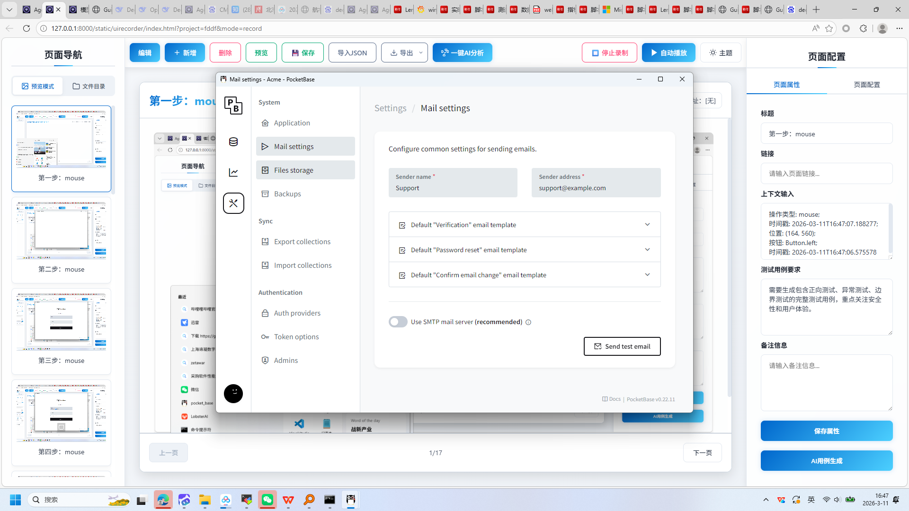

**操作详情**:
+ 操作类型: mouse; 
+ 时间戳: 2026-03-11T16:47:41.103665; 
+ 位置: (590, 289); 
+ 按钮: Button.left; 
+ 时间戳: 2026-03-11T16:47:40.565212

# 20. 第二十步：mouse

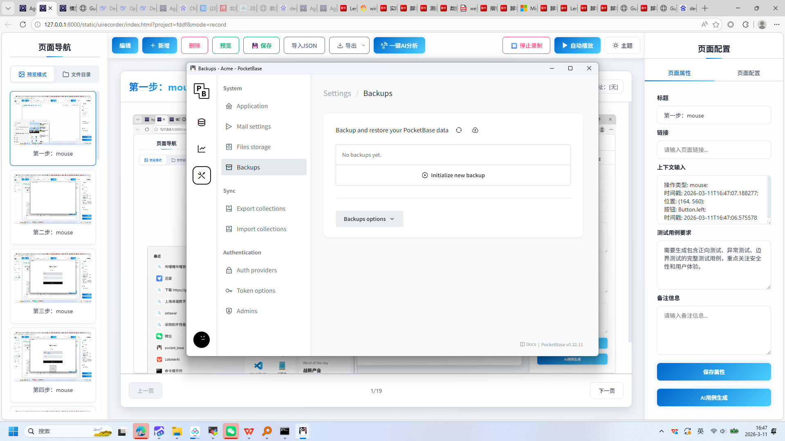

**操作详情**:
+ 操作类型: mouse; 
+ 时间戳: 2026-03-11T16:47:41.804026; 
+ 位置: (619, 417); 
+ 按钮: Button.left; 
+ 时间戳: 2026-03-11T16:47:41.252774

# 21. 第21步：mouse

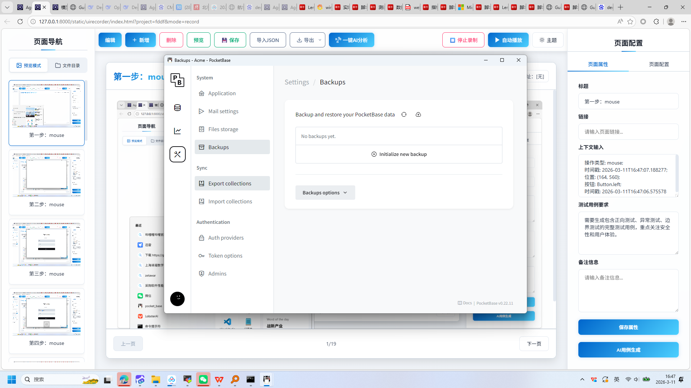

**操作详情**:
+ 操作类型: mouse; 
+ 时间戳: 2026-03-11T16:47:42.311710; 
+ 位置: (624, 486); 
+ 按钮: Button.left; 
+ 时间戳: 2026-03-11T16:47:41.765090

# 22. 第22步：mouse

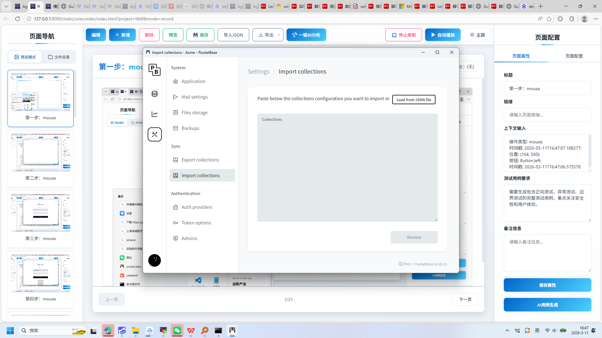

**操作详情**:
+ 操作类型: mouse; 
+ 时间戳: 2026-03-11T16:47:43.095854; 
+ 位置: (629, 554); 
+ 按钮: Button.left; 
+ 时间戳: 2026-03-11T16:47:42.526646

# 23. 第23步：mouse

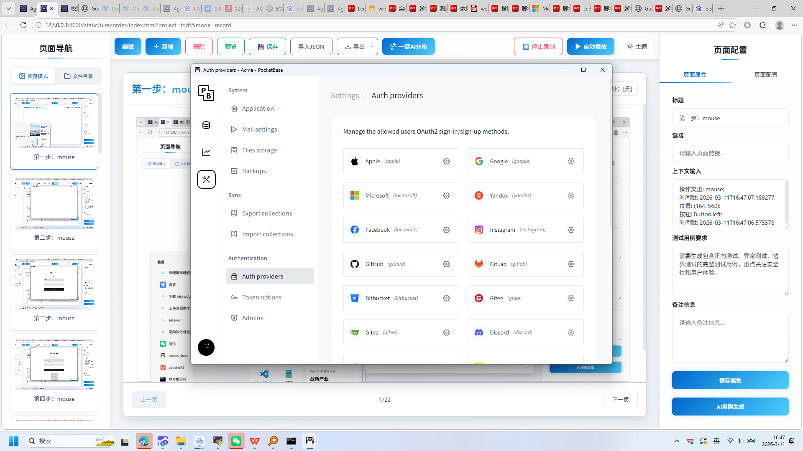

**操作详情**:
+ 操作类型: mouse; 
+ 时间戳: 2026-03-11T16:47:43.898941; 
+ 位置: (637, 661); 
+ 按钮: Button.left; 
+ 时间戳: 2026-03-11T16:47:43.376826

# 24. 第24步：mouse

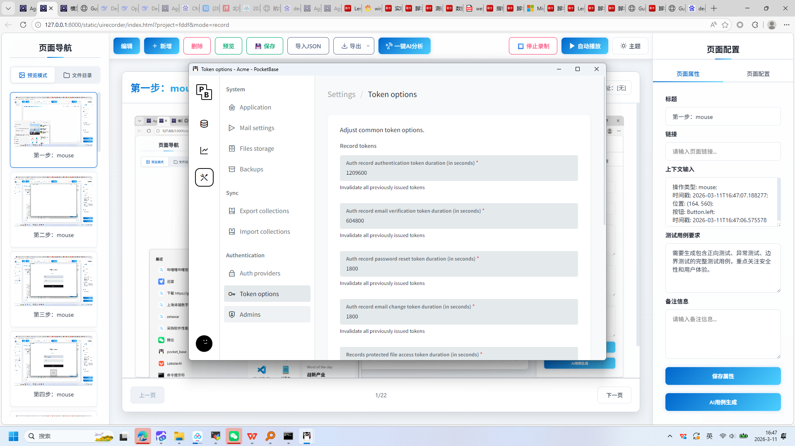

**操作详情**:
+ 操作类型: mouse; 
+ 时间戳: 2026-03-11T16:47:44.464935; 
+ 位置: (639, 703); 
+ 按钮: Button.left; 
+ 时间戳: 2026-03-11T16:47:43.951533

# 25. 第25步：mouse

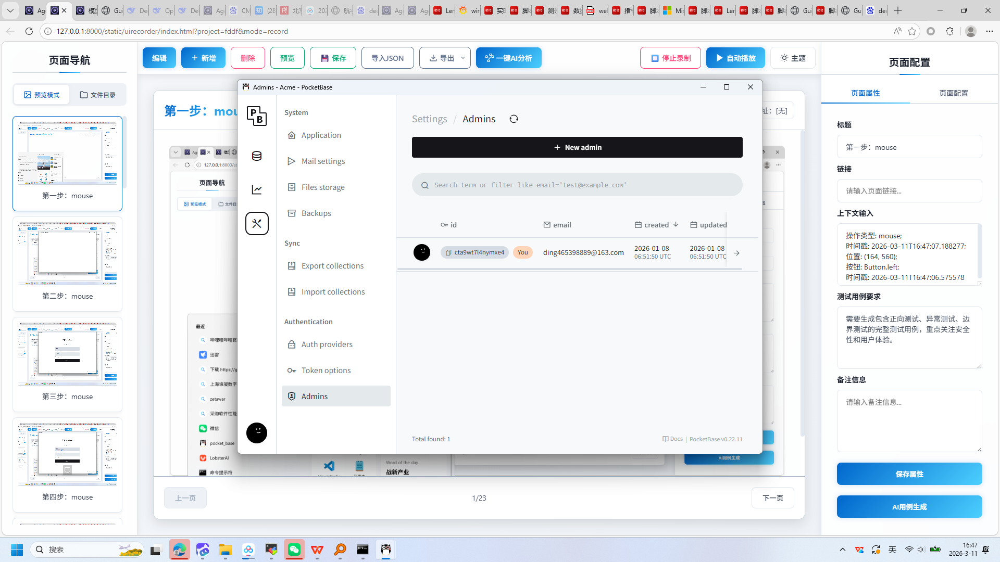

**操作详情**:
+ 操作类型: mouse; 
+ 时间戳: 2026-03-11T16:47:44.931425; 
+ 位置: (629, 756); 
+ 按钮: Button.left; 
+ 时间戳: 2026-03-11T16:47:44.358858

# 26. 第26步：mouse

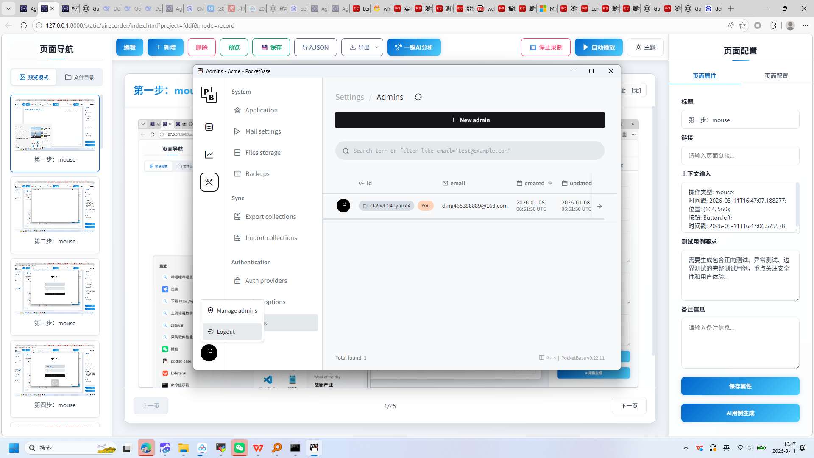

**操作详情**:
+ 操作类型: mouse; 
+ 时间戳: 2026-03-11T16:47:45.728147; 
+ 位置: (492, 839); 
+ 按钮: Button.left; 
+ 时间戳: 2026-03-11T16:47:45.197215

# 27. 第27步：mouse

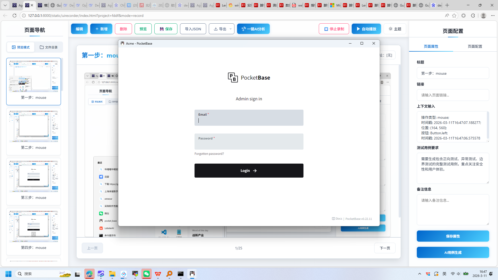

**操作详情**:
+ 操作类型: mouse; 
+ 时间戳: 2026-03-11T16:47:46.577679; 
+ 位置: (551, 777); 
+ 按钮: Button.left; 
+ 时间戳: 2026-03-11T16:47:46.054092

# 28. 第28步：mouse

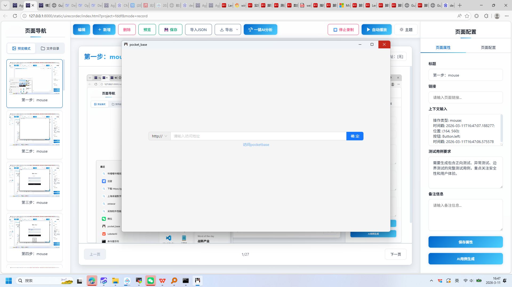

**操作详情**:
+ 操作类型: mouse; 
+ 时间戳: 2026-03-11T16:47:47.647347; 
+ 位置: (1457, 167); 
+ 按钮: Button.left; 
+ 时间戳: 2026-03-11T16:47:47.164018

# 29. 第29步：mouse

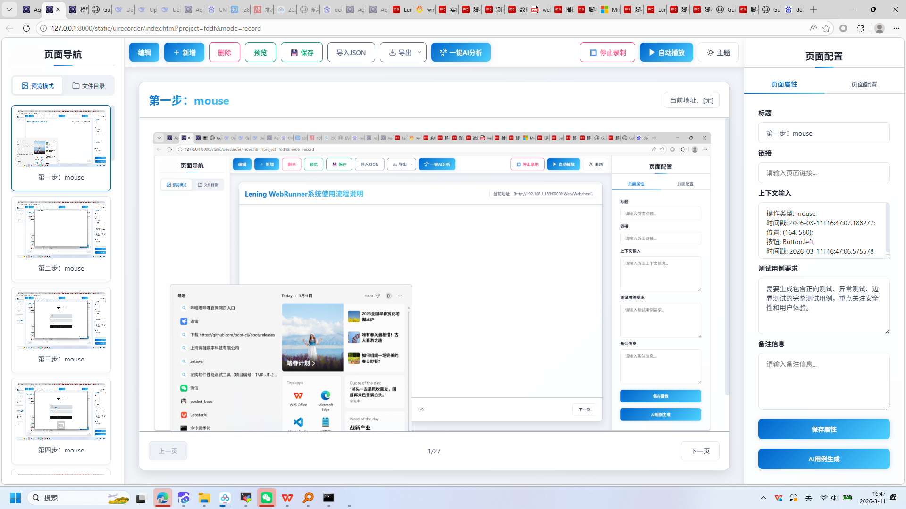

**操作详情**:
+ 操作类型: mouse; 
+ 时间戳: 2026-03-11T16:47:48.281882; 
+ 位置: (1456, 168); 
+ 按钮: Button.left; 
+ 时间戳: 2026-03-11T16:47:47.774052

---

*报告由 AgentRunner Markdown Exporter 生成*