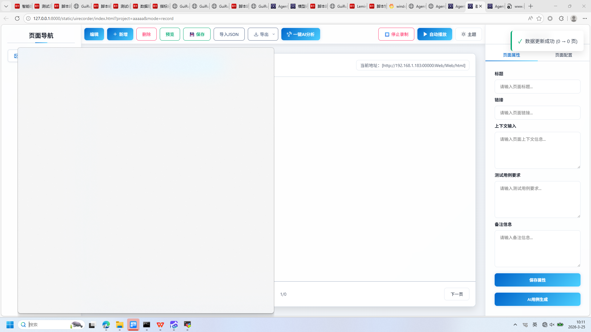
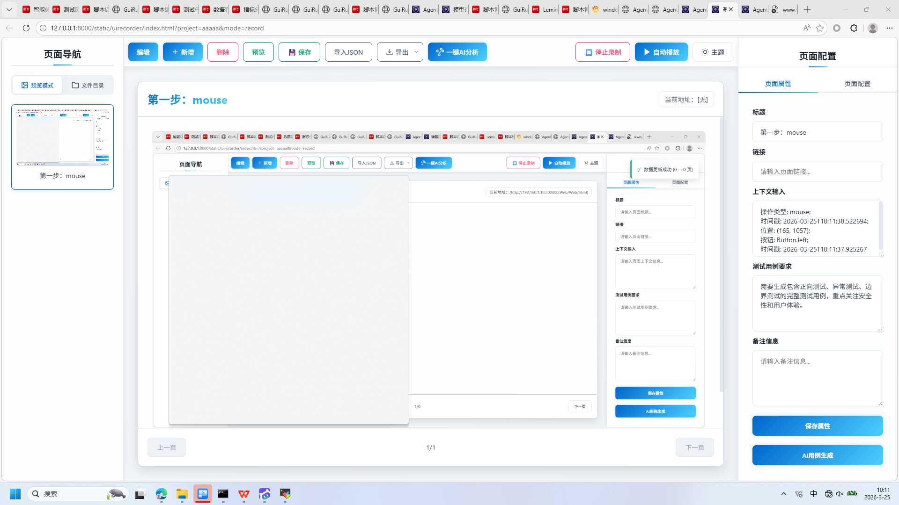
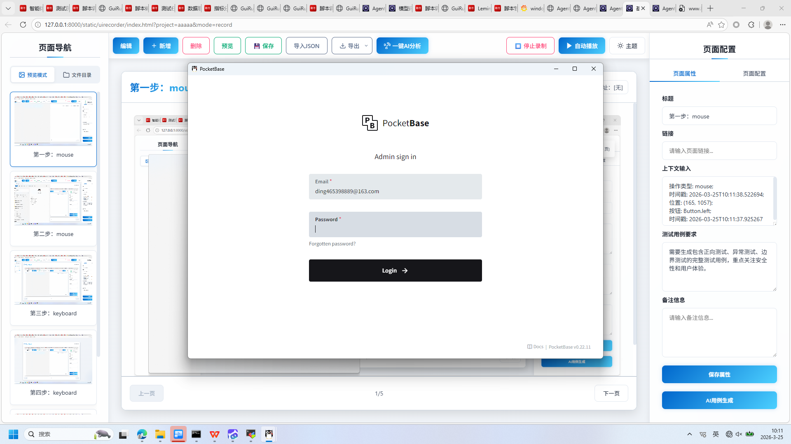
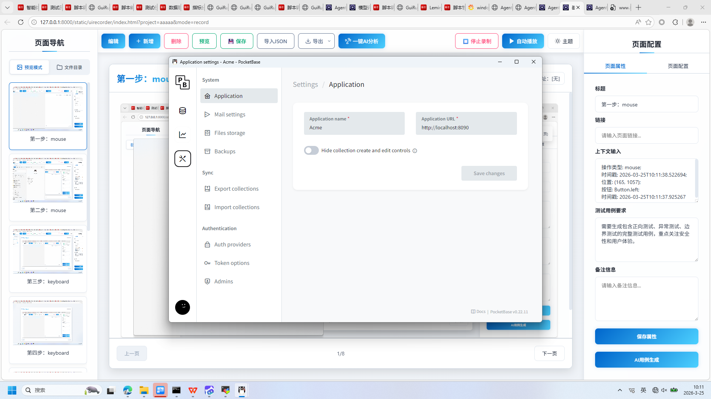
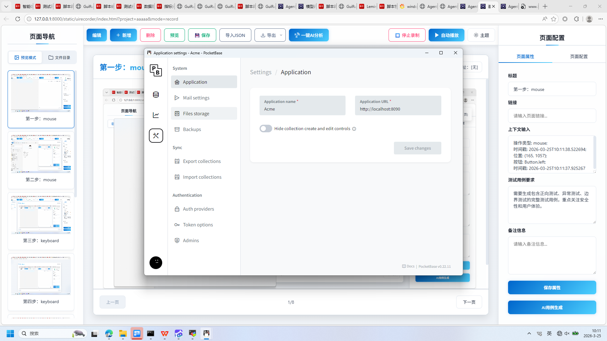
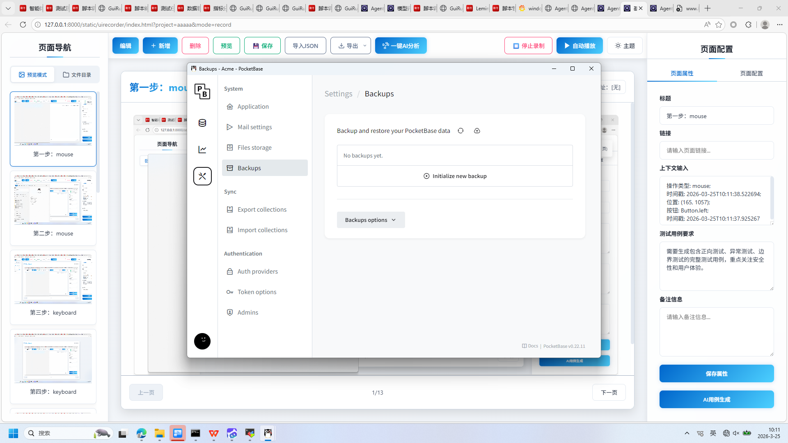
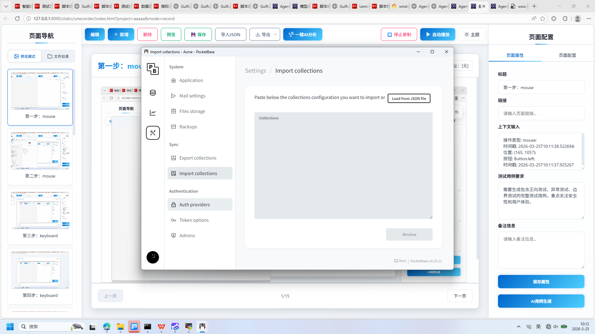
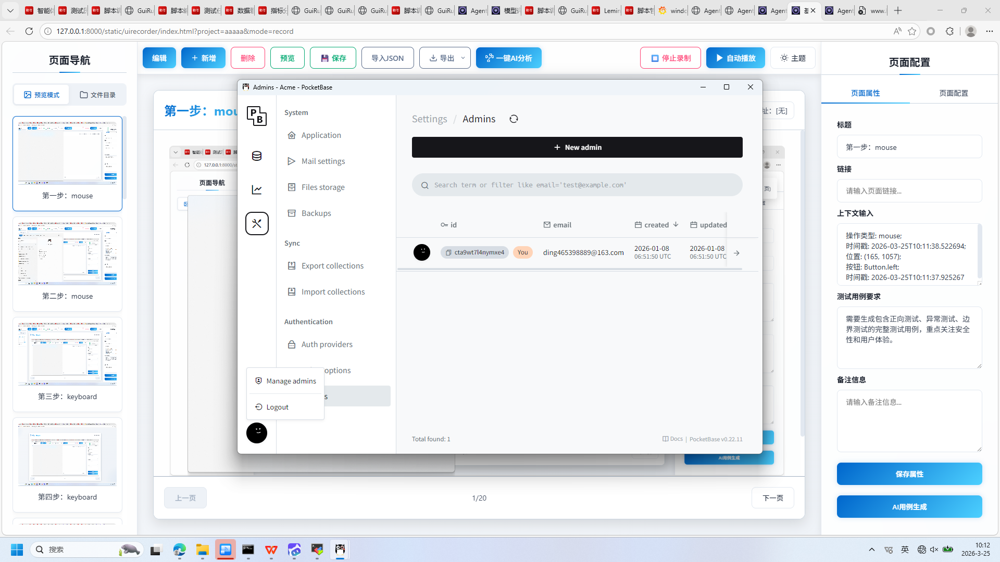
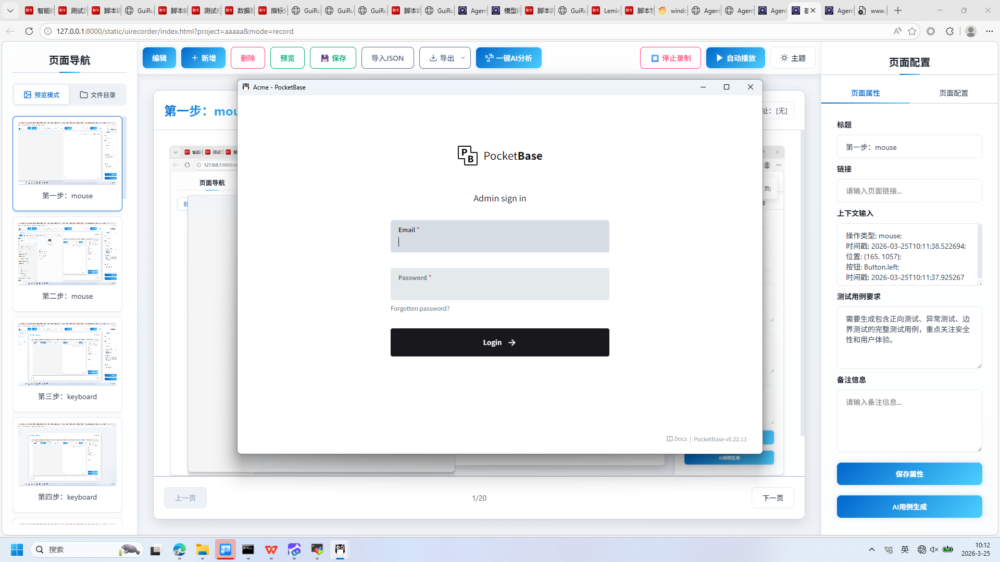
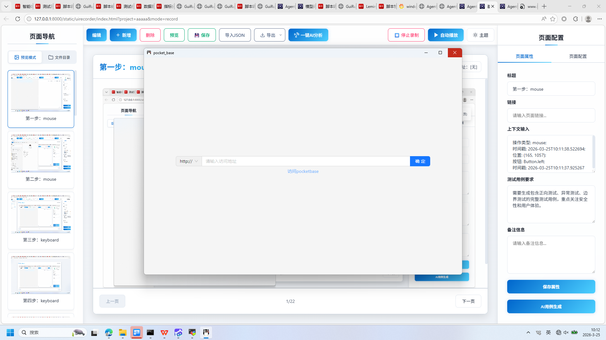

# 基于智能体驱动的下一代测试平台 AgentRunner

+ **生成时间**: 2026-03-25 10:13:47
+ **数据源**: F:\workspace\yfjzworkspace\webspace\ai-template\agentrunner\uirecordercore\filestorage\aaaaa\records.json
+ **操作总数**: 24

# 1. 页面属性配置

**操作详情**:
+ 操作类型: mouse; 
+ 时间戳: 2026-03-25T10:11:38.522694; 
+ 位置: (165, 1057); 
+ 按钮: Button.left; 
+ 时间戳: 2026-03-25T10:11:37.925267

**页面描述**:
该界面用于配置当前页面的属性信息，包括标题、链接、上下文输入、测试用例要求和备注信息。用户可在右侧表单中填写相关内容，并通过“保存属性”按钮保存设置。此外，支持生成AI测试用例，提升自动化测试效率。左侧为页面导航区域，中间显示当前页面内容预览，顶部提供编辑、新增、删除、预览、保存、导入导出及一键AI分析等功能按钮。

# 2. 页面属性配置

**操作详情**:
+ 操作类型: mouse; 
+ 时间戳: 2026-03-25T10:11:43.207179; 
+ 位置: (209, 274); 
+ 按钮: Button.left; 
+ 时间戳: 2026-03-25T10:11:42.564324

**页面描述**:
该界面用于配置当前页面的属性信息，包括标题、链接、上下文输入、测试用例要求和备注信息。用户可以在右侧属性面板中填写相关内容，并通过“保存属性”按钮保存设置。此外，界面支持AI用例生成功能，可自动生成测试用例，提升测试效率。左侧为页面导航区域，中间为预览区域，顶部提供编辑、新增、删除、预览、保存、导入导出及AI分析等操作按钮，支持完整的页面录制与管理流程。

# 3. 第三步：keyboard

**操作详情**:
+ 操作类型: keyboard; 
+ 时间戳: 2026-03-25T10:11:43.481625; 
+ 输入内容: pock; 
+ 长度: 4; 
+ 首字符: p; 
+ 末字符: k; 
+ 结束原因: timeout; 
+ 时间戳: 2026-03-25T10:11:43.069851; 
+ 截图类型: 首字符

# 4. 第四步：keyboard

**操作详情**:
+ 操作类型: keyboard; 
+ 时间戳: 2026-03-25T10:11:43.485643; 
+ 输入内容: pock; 
+ 长度: 4; 
+ 首字符: p; 
+ 末字符: k; 
+ 结束原因: timeout; 
+ 时间戳: 2026-03-25T10:11:43.069851; 
+ 截图类型: 末字符

# 5. 第五步：mouse

**操作详情**:
+ 操作类型: mouse; 
+ 时间戳: 2026-03-25T10:11:45.527199; 
+ 位置: (985, 542); 
+ 按钮: Button.left; 
+ 时间戳: 2026-03-25T10:11:45.012353

# 6. 第六步：keyboard

**操作详情**:
+ 操作类型: keyboard; 
+ 时间戳: 2026-03-25T10:11:53.264750; 
+ 输入内容: ding465398889@163.com; 
+ 长度: 21; 
+ 首字符: d; 
+ 末字符: m; 
+ 结束原因: tab_key; 
+ 时间戳: 2026-03-25T10:11:52.959770; 
+ 截图类型: 首字符

# 7. 管理员登录界面

**操作详情**:
+ 操作类型: keyboard; 
+ 时间戳: 2026-03-25T10:11:53.267796; 
+ 输入内容: ding465398889@163.com; 
+ 长度: 21; 
+ 首字符: d; 
+ 末字符: m; 
+ 结束原因: tab_key; 
+ 时间戳: 2026-03-25T10:11:52.959770; 
+ 截图类型: 末字符

**页面描述**:
这是一个简洁的管理员登录界面，包含邮箱和密码输入框，用户可输入凭据进行身份验证。界面顶部显示PocketBase品牌标识，底部提供登录按钮和忘记密码链接，整体设计现代且直观。

# 8. 第八步：mouse

**操作详情**:
+ 操作类型: mouse; 
+ 时间戳: 2026-03-25T10:11:56.974919; 
+ 位置: (958, 681); 
+ 按钮: Button.left; 
+ 时间戳: 2026-03-25T10:11:56.452772

# 9. 第九步：mouse

**操作详情**:
+ 操作类型: mouse; 
+ 时间戳: 2026-03-25T10:11:58.561375; 
+ 位置: (493, 358); 
+ 按钮: Button.left; 
+ 时间戳: 2026-03-25T10:11:58.006232

# 10. 第十步：mouse

**操作详情**:
+ 操作类型: mouse; 
+ 时间戳: 2026-03-25T10:11:59.114176; 
+ 位置: (495, 433); 
+ 按钮: Button.left; 
+ 时间戳: 2026-03-25T10:11:58.556376

# 11. 第十一步：keyboard

**操作详情**:
+ 操作类型: keyboard; 
+ 时间戳: 2026-03-25T10:11:59.138280; 
+ 输入内容: 1234567890; 
+ 长度: 10; 
+ 首字符: 1; 
+ 末字符: 0; 
+ 结束原因: timeout; 
+ 时间戳: 2026-03-25T10:11:58.639477; 
+ 截图类型: 首字符

# 12. 第十二步：keyboard

**操作详情**:
+ 操作类型: keyboard; 
+ 时间戳: 2026-03-25T10:11:59.142276; 
+ 输入内容: 1234567890; 
+ 长度: 10; 
+ 首字符: 1; 
+ 末字符: 0; 
+ 结束原因: timeout; 
+ 时间戳: 2026-03-25T10:11:58.639477; 
+ 截图类型: 末字符

# 13. 第十三步：mouse

**操作详情**:
+ 操作类型: mouse; 
+ 时间戳: 2026-03-25T10:11:59.813381; 
+ 位置: (607, 314); 
+ 按钮: Button.left; 
+ 时间戳: 2026-03-25T10:11:59.252198

# 14. 第十四步：mouse

**操作详情**:
+ 操作类型: mouse; 
+ 时间戳: 2026-03-25T10:12:00.352787; 
+ 位置: (619, 353); 
+ 按钮: Button.left; 
+ 时间戳: 2026-03-25T10:11:59.637350

# 15. 第十五步：mouse

**操作详情**:
+ 操作类型: mouse; 
+ 时间戳: 2026-03-25T10:12:00.819786; 
+ 位置: (629, 403); 
+ 按钮: Button.left; 
+ 时间戳: 2026-03-25T10:12:00.347801

# 16. 第十六步：mouse

**操作详情**:
+ 操作类型: mouse; 
+ 时间戳: 2026-03-25T10:12:01.384389; 
+ 位置: (635, 491); 
+ 按钮: Button.left; 
+ 时间戳: 2026-03-25T10:12:00.861794

# 17. 第十七步：mouse

**操作详情**:
+ 操作类型: mouse; 
+ 时间戳: 2026-03-25T10:12:01.866681; 
+ 位置: (646, 561); 
+ 按钮: Button.left; 
+ 时间戳: 2026-03-25T10:12:01.348381

# 18. 第十八步：mouse

**操作详情**:
+ 操作类型: mouse; 
+ 时间戳: 2026-03-25T10:12:02.374179; 
+ 位置: (637, 640); 
+ 按钮: Button.left; 
+ 时间戳: 2026-03-25T10:12:01.852456

# 19. 第十九步：mouse

**操作详情**:
+ 操作类型: mouse; 
+ 时间戳: 2026-03-25T10:12:03.138128; 
+ 位置: (644, 700); 
+ 按钮: Button.left; 
+ 时间戳: 2026-03-25T10:12:02.668942

# 20. 第二十步：mouse

**操作详情**:
+ 操作类型: mouse; 
+ 时间戳: 2026-03-25T10:12:03.634349; 
+ 位置: (637, 751); 
+ 按钮: Button.left; 
+ 时间戳: 2026-03-25T10:12:03.124048

# 21. 第21步：mouse

**操作详情**:
+ 操作类型: mouse; 
+ 时间戳: 2026-03-25T10:12:04.571546; 
+ 位置: (496, 833); 
+ 按钮: Button.left; 
+ 时间戳: 2026-03-25T10:12:04.093251

# 22. 第22步：mouse

**操作详情**:
+ 操作类型: mouse; 
+ 时间戳: 2026-03-25T10:12:05.244135; 
+ 位置: (537, 788); 
+ 按钮: Button.left; 
+ 时间戳: 2026-03-25T10:12:04.677448

# 23. 第23步：mouse

**操作详情**:
+ 操作类型: mouse; 
+ 时间戳: 2026-03-25T10:12:06.457784; 
+ 位置: (1439, 174); 
+ 按钮: Button.left; 
+ 时间戳: 2026-03-25T10:12:05.972265

# 24. 第24步：mouse

**操作详情**:
+ 操作类型: mouse; 
+ 时间戳: 2026-03-25T10:12:07.165285; 
+ 位置: (1439, 174); 
+ 按钮: Button.left; 
+ 时间戳: 2026-03-25T10:12:06.676821

---

*报告由 AgentRunner Markdown Exporter 生成*