# 基于智能体驱动的下一代测试平台 AgentRunner

+ **生成时间**: 2026-03-25 10:15:33
+ **数据源**: F:\workspace\yfjzworkspace\webspace\ai-template\agentrunner\uirecordercore\filestorage\aaaaa\records.json
+ **操作总数**: 24

# 1. 页面属性配置

**操作详情**:
+ 操作类型: mouse; 
+ 时间戳: 2026-03-25T10:11:38.522694; 
+ 位置: (165, 1057); 
+ 按钮: Button.left; 
+ 时间戳: 2026-03-25T10:11:37.925267

**页面描述**:
该界面用于配置当前页面的属性信息，包括标题、链接、上下文输入、测试用例要求和备注信息。用户可在右侧表单中填写相关内容，并通过“保存属性”按钮保存设置。此外，支持生成AI测试用例，提升自动化测试效率。左侧为页面导航区域，中间显示当前页面内容预览，顶部提供编辑、新增、删除、预览、保存、导入导出及一键AI分析等功能按钮。

# 2. 页面属性配置

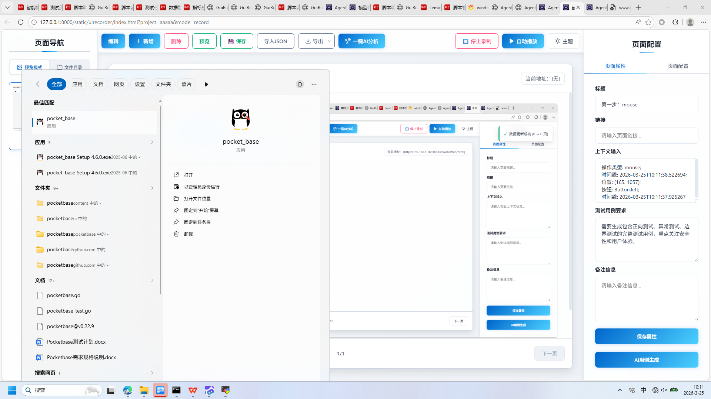

**操作详情**:
+ 操作类型: mouse; 
+ 时间戳: 2026-03-25T10:11:43.207179; 
+ 位置: (209, 274); 
+ 按钮: Button.left; 
+ 时间戳: 2026-03-25T10:11:42.564324

**页面描述**:
该界面用于配置当前页面的属性信息，包括标题、链接、上下文输入、测试用例要求和备注信息。用户可以在右侧属性面板中填写相关内容，并通过“保存属性”按钮保存设置。此外，界面支持AI用例生成功能，可自动生成测试用例，提升测试效率。左侧为页面导航区域，中间为预览区域，顶部提供编辑、新增、删除、预览、保存、导入导出及AI分析等操作按钮，支持完整的页面录制与管理流程。

# 3. 页面属性配置

**操作详情**:
+ 操作类型: keyboard; 
+ 时间戳: 2026-03-25T10:11:43.481625; 
+ 输入内容: pock; 
+ 长度: 4; 
+ 首字符: p; 
+ 末字符: k; 
+ 结束原因: timeout; 
+ 时间戳: 2026-03-25T10:11:43.069851; 
+ 截图类型: 首字符

**页面描述**:
该界面用于配置当前页面的属性信息，包括标题、链接、上下文输入、测试用例要求和备注信息。用户可在右侧表单中填写相关内容，并通过“保存属性”按钮提交配置。同时支持生成AI测试用例，提升自动化测试效率。左侧区域显示页面导航结构，中间区域展示当前页面内容预览，顶部提供编辑、新增、删除、预览、保存、导出及AI分析等功能按钮，实现完整的页面管理与测试准备流程。

# 4. 页面属性编辑

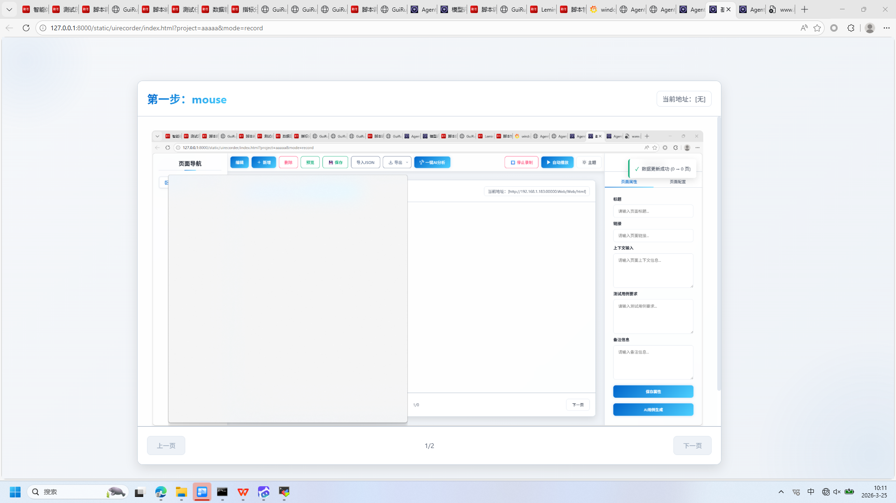

**操作详情**:
+ 操作类型: keyboard; 
+ 时间戳: 2026-03-25T10:11:43.485643; 
+ 输入内容: pock; 
+ 长度: 4; 
+ 首字符: p; 
+ 末字符: k; 
+ 结束原因: timeout; 
+ 时间戳: 2026-03-25T10:11:43.069851; 
+ 截图类型: 末字符

**页面描述**:
该界面用于配置和编辑当前页面的属性信息，包括标题、链接、上下文输入、测试用例要求及备注信息。右侧表单区域提供多个输入框，用户可填写相关描述内容，并通过“保存属性”按钮提交修改。此外，支持一键生成AI测试用例，提升测试效率。顶部工具栏包含编辑、新增、删除、预览、保存、导入导出等功能，便于对页面进行全生命周期管理。

# 5. 页面属性配置

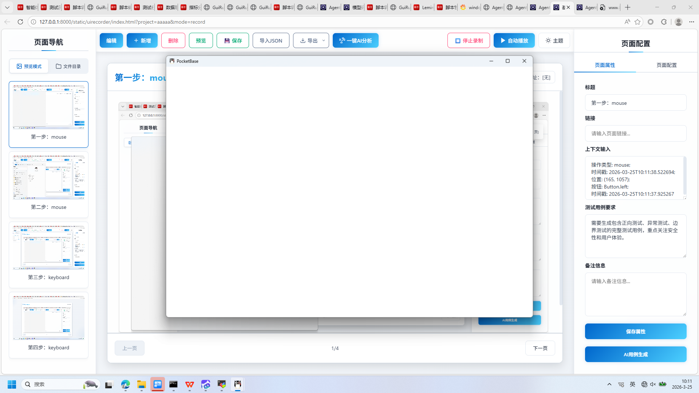

**操作详情**:
+ 操作类型: mouse; 
+ 时间戳: 2026-03-25T10:11:45.527199; 
+ 位置: (985, 542); 
+ 按钮: Button.left; 
+ 时间戳: 2026-03-25T10:11:45.012353

**页面描述**:
该界面用于配置当前页面的属性信息，包括标题、链接、上下文输入、测试用例要求和备注信息。用户可以在右侧的表单中填写相关内容，并通过“保存属性”按钮保存设置。此外，还提供“AI用例生成”功能，可基于配置信息自动生成测试用例。左侧为页面导航区域，中间显示当前页面预览，顶部工具栏支持编辑、新增、删除、预览、保存、导入导出及AI分析等操作。

# 6. 页面属性配置

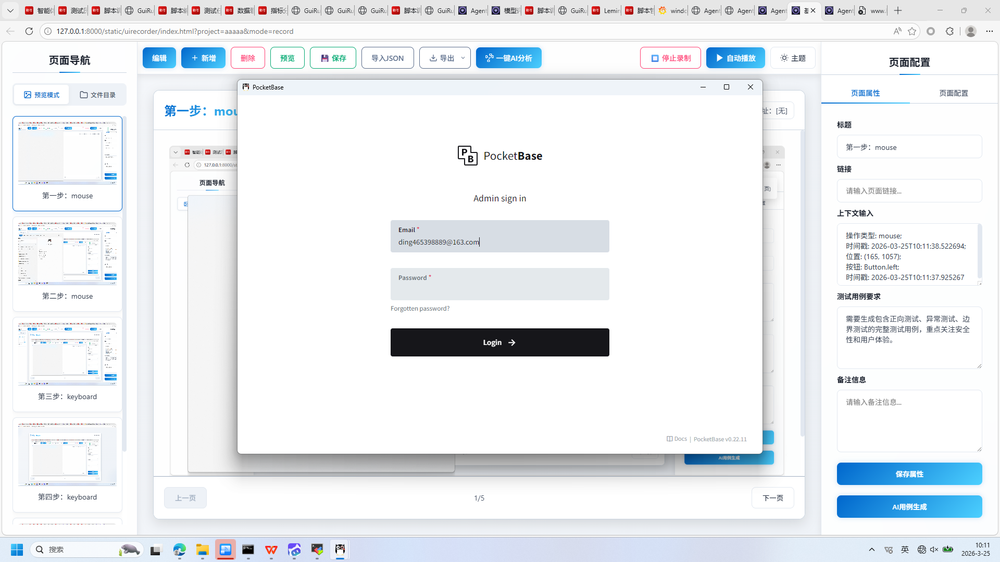

**操作详情**:
+ 操作类型: keyboard; 
+ 时间戳: 2026-03-25T10:11:53.264750; 
+ 输入内容: ding465398889@163.com; 
+ 长度: 21; 
+ 首字符: d; 
+ 末字符: m; 
+ 结束原因: tab_key; 
+ 时间戳: 2026-03-25T10:11:52.959770; 
+ 截图类型: 首字符

**页面描述**:
该界面用于配置当前页面的属性信息，包括标题、链接、上下文输入、测试用例要求和备注信息等。用户可以在右侧的表单区域填写相关信息，并通过“保存属性”按钮提交配置。此外，还支持一键生成AI测试用例，提升测试效率。左侧为页面导航区域，中间展示当前页面内容预览，顶部提供编辑、新增、删除、预览、保存、导入导出及AI分析等功能按钮，整体设计简洁直观，便于用户快速完成页面属性设置与管理。

# 7. 页面属性配置

**操作详情**:
+ 操作类型: keyboard; 
+ 时间戳: 2026-03-25T10:11:53.267796; 
+ 输入内容: ding465398889@163.com; 
+ 长度: 21; 
+ 首字符: d; 
+ 末字符: m; 
+ 结束原因: tab_key; 
+ 时间戳: 2026-03-25T10:11:52.959770; 
+ 截图类型: 末字符

**页面描述**:
该界面用于配置当前页面的属性信息，包括标题、链接、上下文输入、测试用例要求和备注信息等。用户可在右侧表单中填写相关内容，并通过“保存属性”按钮保存设置，或使用“AI用例生成”功能自动生成测试用例。左侧为页面导航区域，中间为预览区域，顶部提供编辑、新增、删除、预览、保存、导出及AI分析等功能按钮，支持对页面进行完整管理与自动化操作。

# 8. 页面属性配置

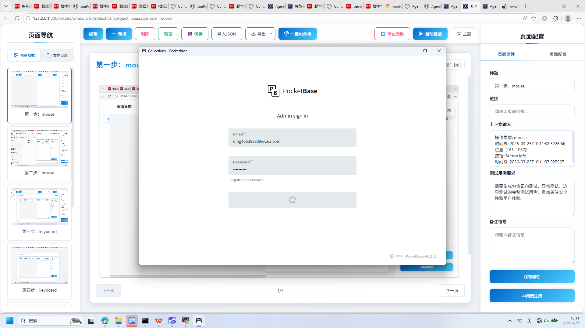

**操作详情**:
+ 操作类型: mouse; 
+ 时间戳: 2026-03-25T10:11:56.974919; 
+ 位置: (958, 681); 
+ 按钮: Button.left; 
+ 时间戳: 2026-03-25T10:11:56.452772

**页面描述**:
该界面用于配置当前页面的属性信息，包括标题、链接、上下文输入、测试用例要求和备注信息。右侧表单区域提供多个文本输入框，用户可填写相关信息以完善页面描述与功能说明。底部设有“保存属性”按钮用于提交配置，以及“AI用例生成”按钮，支持基于配置内容自动生成测试用例。整体布局清晰，便于用户快速完成页面元数据的录入与管理。

# 9. 页面属性配置

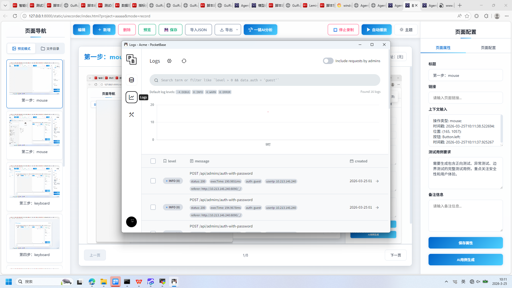

**操作详情**:
+ 操作类型: mouse; 
+ 时间戳: 2026-03-25T10:11:58.561375; 
+ 位置: (493, 358); 
+ 按钮: Button.left; 
+ 时间戳: 2026-03-25T10:11:58.006232

**页面描述**:
该界面用于配置当前页面的属性信息，包括标题、链接、上下文输入、测试用例要求和备注信息。用户可以在右侧表单中填写相关信息，并通过“保存属性”按钮保存设置。此外，还支持生成AI用例，提升测试效率。左侧区域显示页面导航结构，中间区域展示当前页面内容预览，顶部工具栏提供编辑、新增、删除、预览、保存、导入导出及AI分析等功能。

# 10. 页面属性配置

**操作详情**:
+ 操作类型: mouse; 
+ 时间戳: 2026-03-25T10:11:59.114176; 
+ 位置: (495, 433); 
+ 按钮: Button.left; 
+ 时间戳: 2026-03-25T10:11:58.556376

**页面描述**:
该界面用于配置当前页面的属性信息，包括标题、链接、上下文输入、测试用例要求和备注信息。用户可以在右侧的表单中填写相关信息，并通过“保存属性”按钮保存设置。此外，界面还提供了“AI用例生成”功能，支持基于页面属性自动生成测试用例。左侧区域显示页面导航结构，中间区域展示当前页面内容预览，顶部工具栏提供编辑、新增、删除、预览、保存、导入导出及AI分析等功能，便于用户进行页面管理和自动化测试配置。

# 11. 页面属性配置

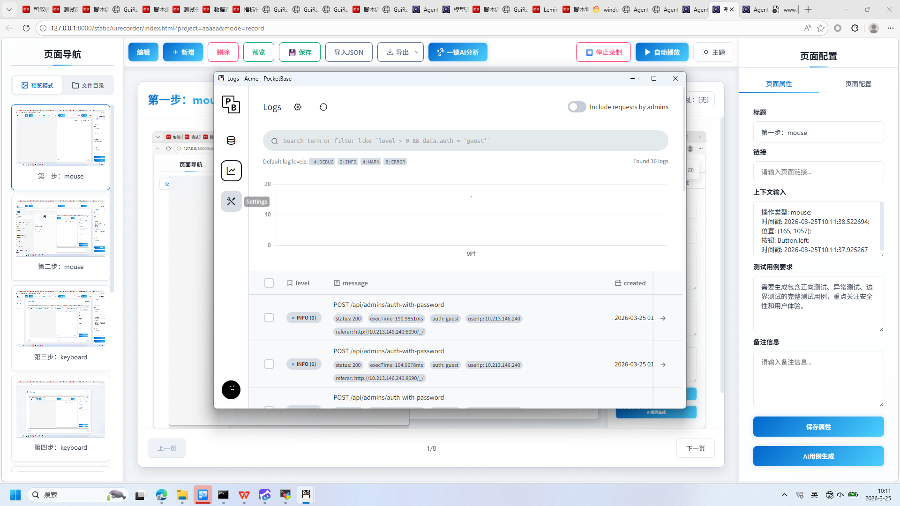

**操作详情**:
+ 操作类型: keyboard; 
+ 时间戳: 2026-03-25T10:11:59.138280; 
+ 输入内容: 1234567890; 
+ 长度: 10; 
+ 首字符: 1; 
+ 末字符: 0; 
+ 结束原因: timeout; 
+ 时间戳: 2026-03-25T10:11:58.639477; 
+ 截图类型: 首字符

**页面描述**:
该界面用于配置当前页面的基本属性，包括标题、链接、上下文信息、测试用例要求和备注信息。用户可以在右侧的表单中输入相关内容，并通过“保存属性”按钮将配置信息保存。此外，还支持一键生成AI用例功能，提升测试效率。左侧为页面导航区域，中间展示当前页面的预览内容，顶部提供编辑、新增、删除、预览、保存、导出及AI分析等操作选项。

# 12. 页面属性配置

**操作详情**:
+ 操作类型: keyboard; 
+ 时间戳: 2026-03-25T10:11:59.142276; 
+ 输入内容: 1234567890; 
+ 长度: 10; 
+ 首字符: 1; 
+ 末字符: 0; 
+ 结束原因: timeout; 
+ 时间戳: 2026-03-25T10:11:58.639477; 
+ 截图类型: 末字符

**页面描述**:
该界面用于配置当前页面的属性信息，包括标题、链接、上下文输入、测试用例要求和备注信息等。用户可在右侧表单区域填写相关信息，并通过“保存属性”按钮提交配置。此外，还支持一键生成AI测试用例，提升测试效率。左侧为页面导航区域，中间为预览区，顶部提供编辑、新增、删除、预览、保存、导出及AI分析等功能按钮，整体设计简洁直观，便于用户快速完成页面属性设置与测试准备。

# 13. 页面属性配置

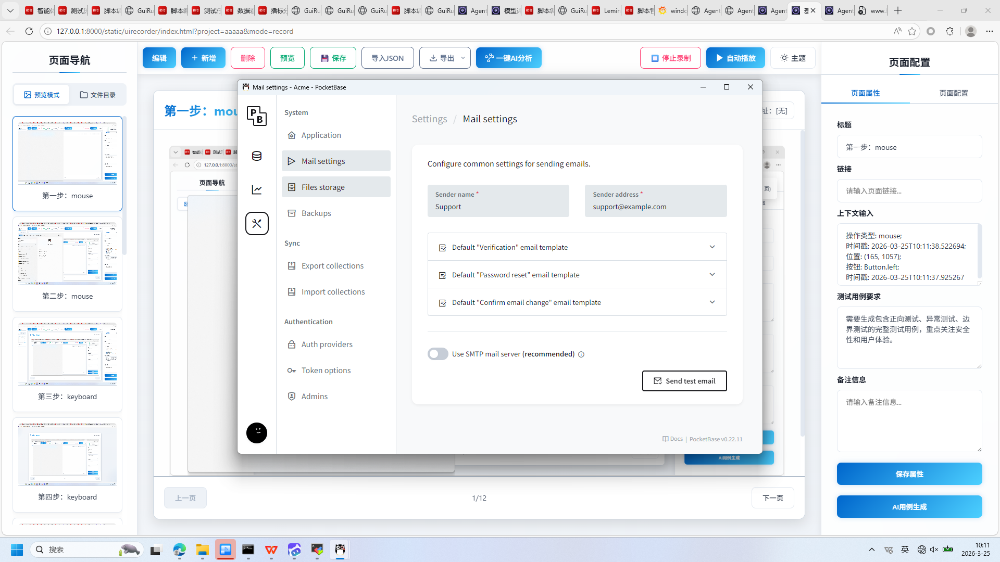

**操作详情**:
+ 操作类型: mouse; 
+ 时间戳: 2026-03-25T10:11:59.813381; 
+ 位置: (607, 314); 
+ 按钮: Button.left; 
+ 时间戳: 2026-03-25T10:11:59.252198

**页面描述**:
该界面用于配置当前页面的属性信息，包括标题、链接、上下文输入、测试用例要求和备注信息。用户可以在右侧的属性面板中填写相关信息，并通过“保存属性”按钮保存配置。此外，还支持生成AI用例，提升测试效率。左侧为页面导航区域，中间展示当前页面内容预览，顶部提供编辑、新增、删除、预览、保存、导入导出及一键AI分析等功能按钮，方便用户进行页面管理和操作。

# 14. 页面属性配置

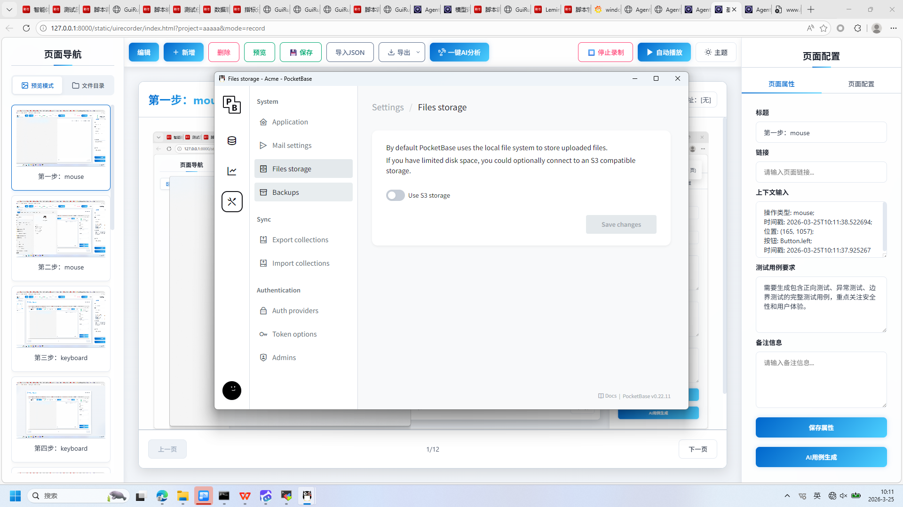

**操作详情**:
+ 操作类型: mouse; 
+ 时间戳: 2026-03-25T10:12:00.352787; 
+ 位置: (619, 353); 
+ 按钮: Button.left; 
+ 时间戳: 2026-03-25T10:11:59.637350

**页面描述**:
该界面用于配置当前页面的属性信息，包括标题、链接、上下文输入、测试用例要求和备注信息。用户可在右侧属性面板中填写相关内容，并通过“保存属性”按钮保存设置。此外，支持一键生成AI测试用例，提升测试效率。左侧为页面导航区域，中间为页面预览区，顶部提供编辑、新增、删除、预览、保存、导入导出及AI分析等功能按钮，整体设计便于用户进行页面管理和测试配置。

# 15. 页面属性配置

**操作详情**:
+ 操作类型: mouse; 
+ 时间戳: 2026-03-25T10:12:00.819786; 
+ 位置: (629, 403); 
+ 按钮: Button.left; 
+ 时间戳: 2026-03-25T10:12:00.347801

**页面描述**:
该界面用于配置当前页面的属性信息，包括标题、链接、上下文输入、测试用例要求和备注信息。用户可以在右侧的表单区域填写相关信息，并通过“保存属性”按钮保存配置。此外，界面支持AI用例生成功能，可自动生成测试用例以提高效率。左侧为页面导航区域，中间展示当前页面内容预览，顶部提供编辑、新增、删除、预览、保存、导入导出及AI分析等功能按钮，整体设计便于用户进行页面管理和测试配置。

# 16. 页面属性配置

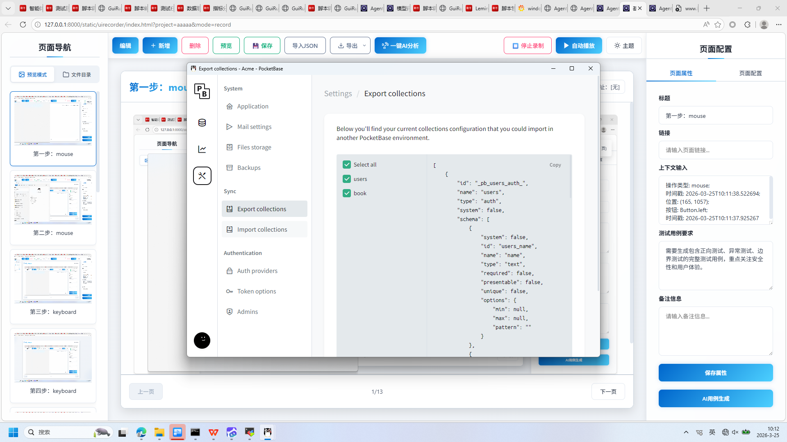

**操作详情**:
+ 操作类型: mouse; 
+ 时间戳: 2026-03-25T10:12:01.384389; 
+ 位置: (635, 491); 
+ 按钮: Button.left; 
+ 时间戳: 2026-03-25T10:12:00.861794

**页面描述**:
该界面用于配置当前页面的属性信息，包括标题、链接、上下文输入、测试用例要求和备注信息。用户可在右侧属性面板中填写相关信息，并通过“保存属性”按钮保存设置。此外，支持一键生成AI用例，提升测试效率。左侧为页面导航区域，中间展示当前页面内容预览，顶部提供编辑、新增、删除、预览、保存、导入导出及AI分析等功能按钮，整体设计便于用户进行页面管理和自动化测试配置。

# 17. 页面属性配置

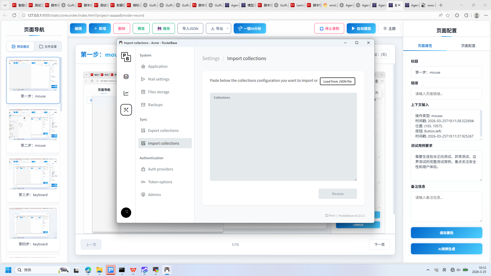

**操作详情**:
+ 操作类型: mouse; 
+ 时间戳: 2026-03-25T10:12:01.866681; 
+ 位置: (646, 561); 
+ 按钮: Button.left; 
+ 时间戳: 2026-03-25T10:12:01.348381

**页面描述**:
该界面用于配置当前页面的属性信息，包括标题、链接、上下文输入、测试用例要求和备注信息。用户可以在右侧的属性面板中填写相关内容，并通过“保存属性”按钮保存设置。此外，界面支持一键生成AI测试用例，提升测试效率。左侧为页面导航区域，中间显示当前页面内容预览，顶部提供编辑、新增、删除、预览、保存、导入导出及AI分析等功能按钮，便于用户进行页面管理与操作。

# 18. 页面属性配置

**操作详情**:
+ 操作类型: mouse; 
+ 时间戳: 2026-03-25T10:12:02.374179; 
+ 位置: (637, 640); 
+ 按钮: Button.left; 
+ 时间戳: 2026-03-25T10:12:01.852456

**页面描述**:
该界面用于配置当前页面的属性信息，包括标题、链接、上下文输入、测试用例要求和备注信息。用户可以在右侧属性面板中填写相关内容，并通过“保存属性”按钮保存设置。此外，界面支持AI辅助生成测试用例，提升配置效率。左侧为页面导航区域，中间显示当前页面内容预览，顶部提供编辑、新增、删除、预览、保存、导入导出及AI分析等功能按钮，便于用户进行页面管理与操作。

# 19. 页面属性配置

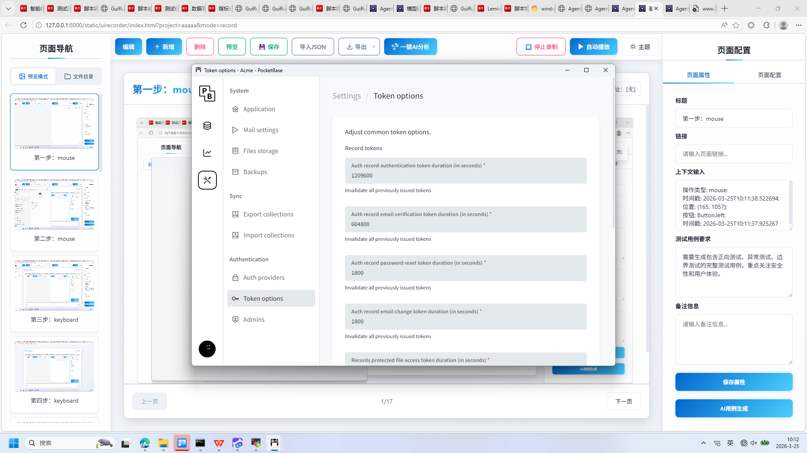

**操作详情**:
+ 操作类型: mouse; 
+ 时间戳: 2026-03-25T10:12:03.138128; 
+ 位置: (644, 700); 
+ 按钮: Button.left; 
+ 时间戳: 2026-03-25T10:12:02.668942

**页面描述**:
该界面用于配置当前页面的属性信息，包括标题、链接、上下文输入、测试用例要求和备注信息。用户可在右侧表单中填写相关内容，并通过“保存属性”按钮保存配置。此外，界面支持一键生成AI测试用例，提升测试效率。左侧区域显示页面导航结构，中间区域展示当前页面内容预览，顶部提供编辑、新增、删除、预览、保存、导入导出及AI分析等功能按钮。

# 20. 页面属性配置

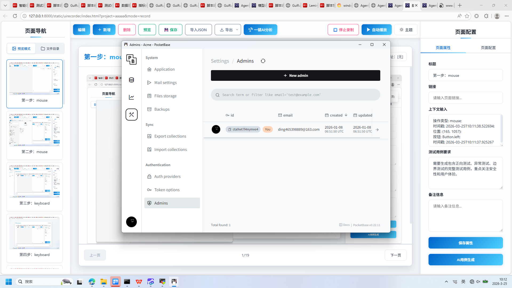

**操作详情**:
+ 操作类型: mouse; 
+ 时间戳: 2026-03-25T10:12:03.634349; 
+ 位置: (637, 751); 
+ 按钮: Button.left; 
+ 时间戳: 2026-03-25T10:12:03.124048

**页面描述**:
该界面用于配置当前页面的属性信息，包括标题、链接、上下文输入、测试用例要求和备注信息。用户可以在右侧的属性面板中填写相关内容，并通过“保存属性”按钮保存配置。此外，还支持一键生成AI用例，提升测试效率。左侧为页面导航区域，中间展示当前页面内容预览，顶部提供编辑、新增、删除、预览、保存、导入导出及AI分析等功能按钮。

# 21. 第21步：mouse

**操作详情**:
+ 操作类型: mouse; 
+ 时间戳: 2026-03-25T10:12:04.571546; 
+ 位置: (496, 833); 
+ 按钮: Button.left; 
+ 时间戳: 2026-03-25T10:12:04.093251

# 22. 第22步：mouse

**操作详情**:
+ 操作类型: mouse; 
+ 时间戳: 2026-03-25T10:12:05.244135; 
+ 位置: (537, 788); 
+ 按钮: Button.left; 
+ 时间戳: 2026-03-25T10:12:04.677448

# 23. 第23步：mouse

**操作详情**:
+ 操作类型: mouse; 
+ 时间戳: 2026-03-25T10:12:06.457784; 
+ 位置: (1439, 174); 
+ 按钮: Button.left; 
+ 时间戳: 2026-03-25T10:12:05.972265

# 24. 第24步：mouse

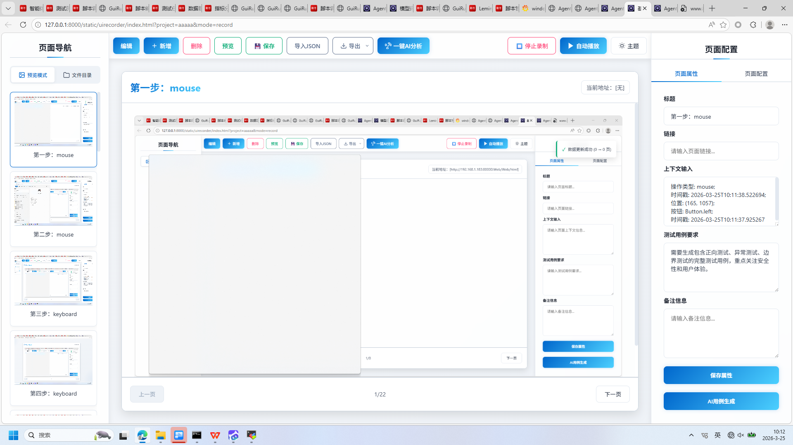

**操作详情**:
+ 操作类型: mouse; 
+ 时间戳: 2026-03-25T10:12:07.165285; 
+ 位置: (1439, 174); 
+ 按钮: Button.left; 
+ 时间戳: 2026-03-25T10:12:06.676821

---

*报告由 AgentRunner Markdown Exporter 生成*