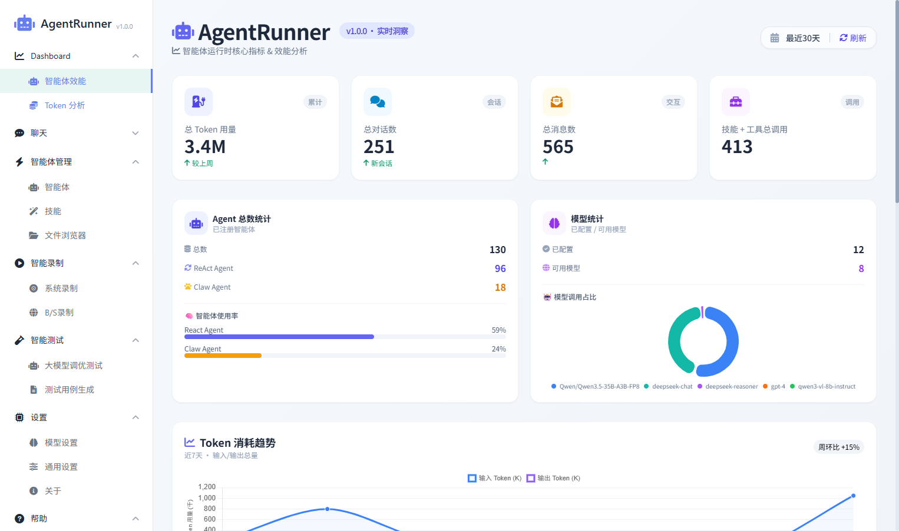
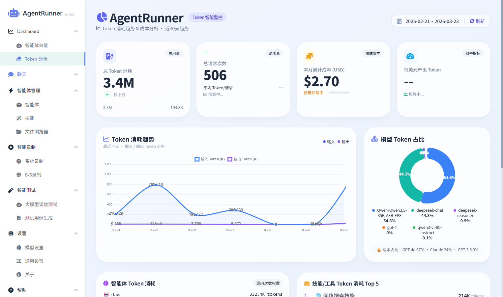
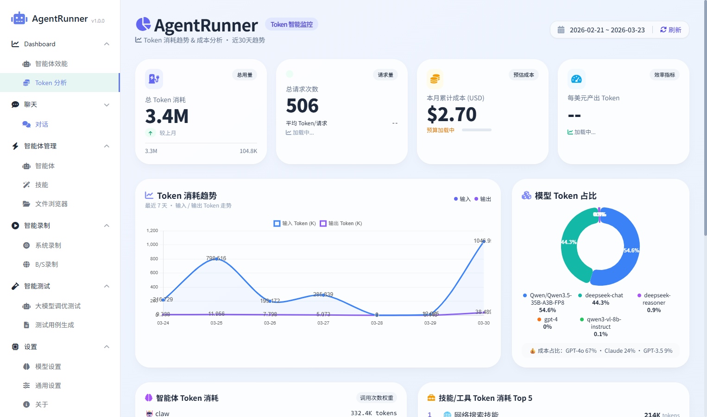
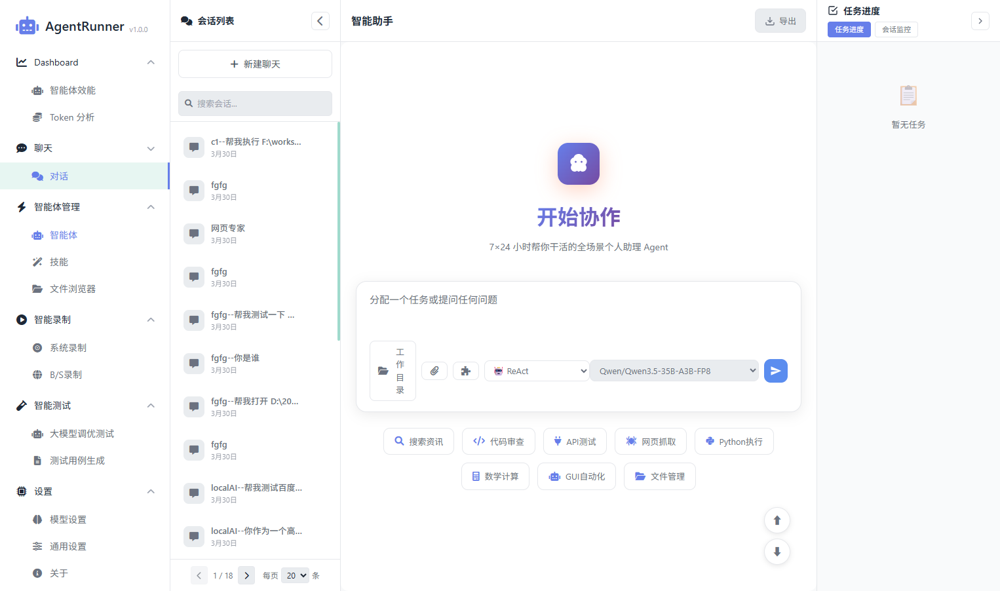
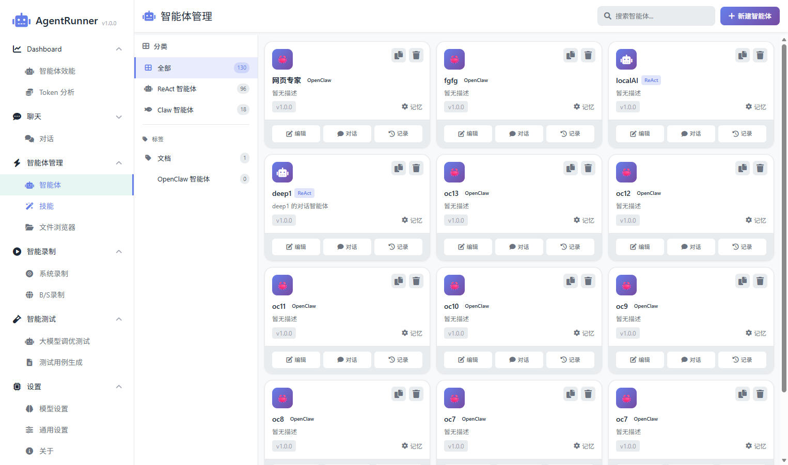
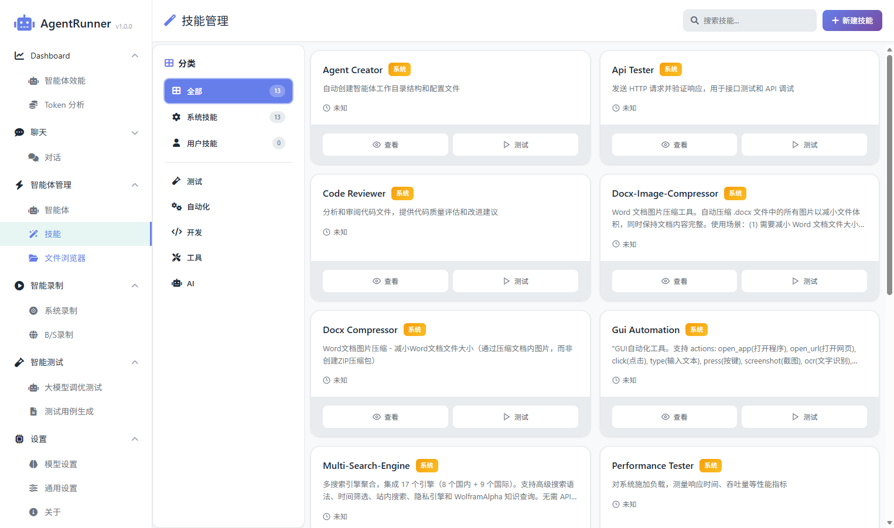

# 基于智能体驱动的下一代测试平台 AgentRunner

+ **生成时间**: 2026-03-30 14:32:58
+ **数据源**: F:\workspace\yfjzworkspace\webspace\ai-template\agentrunner\uirecordercore\filestorage\test12212121\records.json
+ **操作总数**: 6

# 1. 第1步: Token 分析

**操作详情**:
+ 操作类型: normal; 时间戳: 2026-03-30T06:32:16.097Z

# 2. 第2步: 

**操作详情**:
+ 操作类型: normal; 时间戳: 2026-03-30T06:32:17.109Z

# 3. 第3步: 

**操作详情**:
+ 操作类型: normal; 时间戳: 2026-03-30T06:32:17.933Z

# 4. 第4步: 智能体

**操作详情**:
+ 操作类型: normal; 时间戳: 2026-03-30T06:32:18.511Z

# 5. 第5步: 

**操作详情**:
+ 操作类型: normal; 时间戳: 2026-03-30T06:32:19.126Z

# 6. 第6步: 文件浏览器

**操作详情**:
+ 操作类型: normal; 时间戳: 2026-03-30T06:32:19.898Z

---

*报告由 AgentRunner Markdown Exporter 生成*