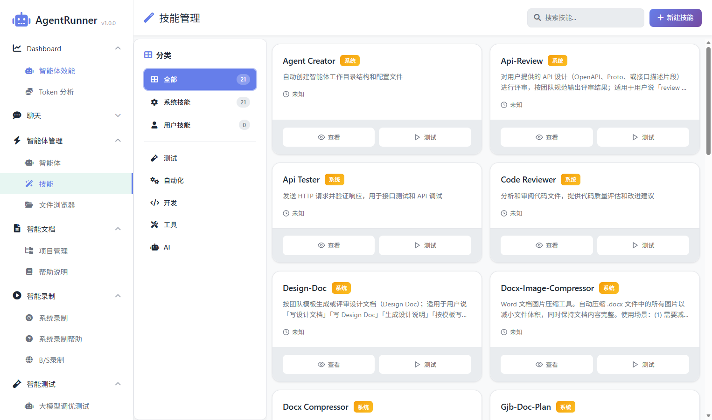
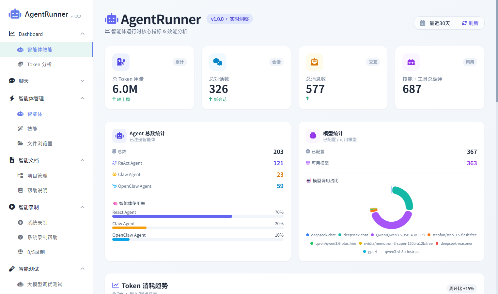
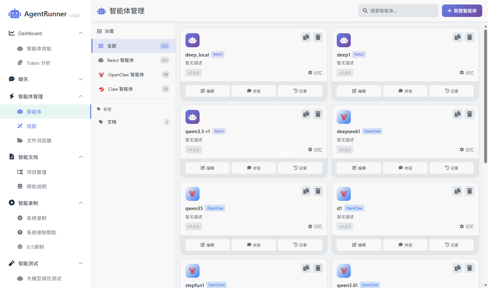

# 基于智能体驱动的下一代测试平台 AgentRunner

+ **生成时间**: 2026-04-13 15:40:05
+ **数据源**: F:\workspace\yfjzworkspace\webspace\ai-template\agentrunner\uirecordercore\filestorage\test2112\records.json
+ **操作总数**: 3

# 1. 第1步: 智能体效能

**操作详情**:
+ 操作类型: normal; 时间戳: 2026-04-13T07:39:47.915Z

# 2. 第2步: 智能体

**操作详情**:
+ 操作类型: normal; 时间戳: 2026-04-13T07:39:48.800Z

# 3. 第3步: 

**操作详情**:
+ 操作类型: normal; 时间戳: 2026-04-13T07:39:49.406Z

---

*报告由 AgentRunner Markdown Exporter 生成*