# 基于智能体驱动的下一代测试平台 AgentRunner

+ **生成时间**: 2026-05-19 15:18:21
+ **数据源**: F:\workspace\yfjzworkspace\webspace\ai-template\agentrunner\uirecordercore\filestorage\dsdssd\records.json
+ **操作总数**: 51

# 1. 第一步：mouse

**操作详情**:
+ 操作类型: mouse; 
+ 时间戳: 2026-05-13T21:48:32.197040; 
+ 位置: (960, 546); 
+ 按钮: Button.left; 
+ 时间戳: 2026-05-13T21:48:31.603837

# 2. 第二步：keyboard

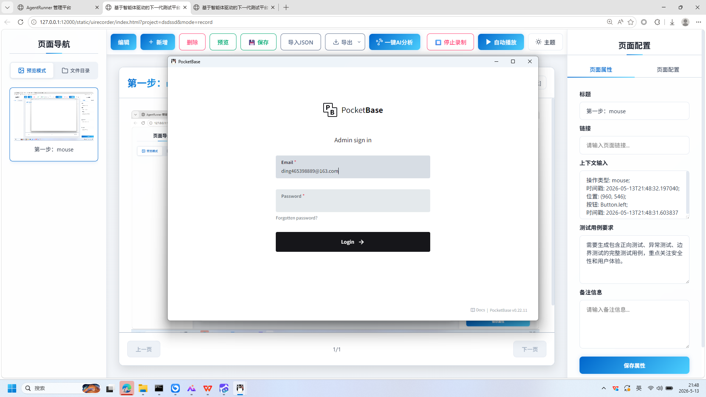

**操作详情**:
+ 操作类型: keyboard; 
+ 时间戳: 2026-05-13T21:48:43.380309; 
+ 输入内容: ding465398889@163.com; 
+ 长度: 21; 
+ 首字符: d; 
+ 末字符: m; 
+ 结束原因: tab_key; 
+ 时间戳: 2026-05-13T21:48:42.820451; 
+ 截图类型: 首字符

# 3. 登录界面设计与配置

**操作详情**:
+ 操作类型: keyboard; 
+ 时间戳: 2026-05-13T21:48:43.387631; 
+ 输入内容: ding465398889@163.com; 
+ 长度: 21; 
+ 首字符: d; 
+ 末字符: m; 
+ 结束原因: tab_key; 
+ 时间戳: 2026-05-13T21:48:42.820451; 
+ 截图类型: 末字符

**页面描述**:
该界面展示了一个名为PocketBase的管理员登录页面，包含邮箱和密码输入框以及登录按钮。用户可通过输入凭证进行身份验证。界面简洁，布局清晰，支持预览、编辑和属性配置，适用于测试或开发环境中的登录流程管理。

# 4. 第四步：mouse

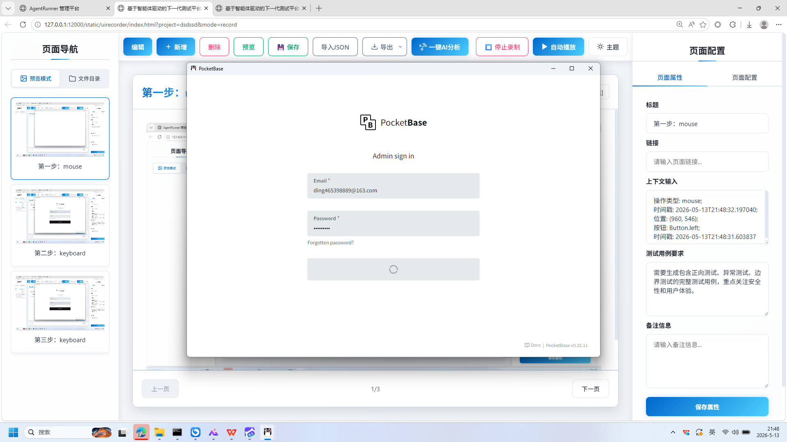

**操作详情**:
+ 操作类型: mouse; 
+ 时间戳: 2026-05-13T21:48:47.818928; 
+ 位置: (940, 672); 
+ 按钮: Button.left; 
+ 时间戳: 2026-05-13T21:48:47.228289

# 5. 第五步：keyboard

**操作详情**:
+ 操作类型: keyboard; 
+ 时间戳: 2026-05-13T21:48:49.173331; 
+ 输入内容: 123456789; 
+ 长度: 9; 
+ 首字符: 1; 
+ 末字符: 9; 
+ 结束原因: timeout; 
+ 时间戳: 2026-05-13T21:48:48.663511; 
+ 截图类型: 首字符

# 6. 第六步：keyboard

**操作详情**:
+ 操作类型: keyboard; 
+ 时间戳: 2026-05-13T21:48:49.178344; 
+ 输入内容: 123456789; 
+ 长度: 9; 
+ 首字符: 1; 
+ 末字符: 9; 
+ 结束原因: timeout; 
+ 时间戳: 2026-05-13T21:48:48.663511; 
+ 截图类型: 末字符

# 7. 第七步：mouse

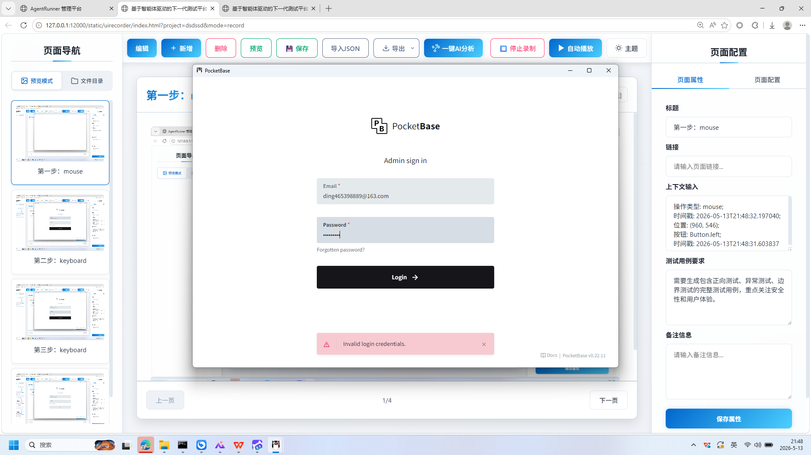

**操作详情**:
+ 操作类型: mouse; 
+ 时间戳: 2026-05-13T21:48:49.527127; 
+ 位置: (896, 540); 
+ 按钮: Button.left; 
+ 时间戳: 2026-05-13T21:48:48.984843

# 8. 第八步：mouse

**操作详情**:
+ 操作类型: mouse; 
+ 时间戳: 2026-05-13T21:48:51.876373; 
+ 位置: (903, 650); 
+ 按钮: Button.left; 
+ 时间戳: 2026-05-13T21:48:51.312827

# 9. 第九步：keyboard

**操作详情**:
+ 操作类型: keyboard; 
+ 时间戳: 2026-05-13T21:48:53.442170; 
+ 输入内容: 0; 
+ 长度: 1; 
+ 首字符: 0; 
+ 末字符: 0; 
+ 结束原因: timeout; 
+ 时间戳: 2026-05-13T21:48:52.928084; 
+ 截图类型: 首字符

# 10. 第十步：keyboard

**操作详情**:
+ 操作类型: keyboard; 
+ 时间戳: 2026-05-13T21:48:53.455123; 
+ 输入内容: 0; 
+ 长度: 1; 
+ 首字符: 0; 
+ 末字符: 0; 
+ 结束原因: timeout; 
+ 时间戳: 2026-05-13T21:48:52.928084; 
+ 截图类型: 末字符

# 11. 第十一步：mouse

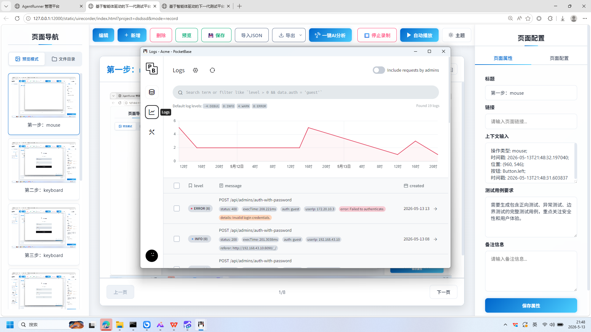

**操作详情**:
+ 操作类型: mouse; 
+ 时间戳: 2026-05-13T21:48:54.040759; 
+ 位置: (505, 346); 
+ 按钮: Button.left; 
+ 时间戳: 2026-05-13T21:48:53.533395

# 12. 第十二步：mouse

**操作详情**:
+ 操作类型: mouse; 
+ 时间戳: 2026-05-13T21:48:55.270873; 
+ 位置: (492, 418); 
+ 按钮: Button.left; 
+ 时间戳: 2026-05-13T21:48:54.632639

# 13. 第十三步：mouse

**操作详情**:
+ 操作类型: mouse; 
+ 时间戳: 2026-05-13T21:48:56.127480; 
+ 位置: (586, 310); 
+ 按钮: Button.left; 
+ 时间戳: 2026-05-13T21:48:55.575787

# 14. 第十四步：mouse

**操作详情**:
+ 操作类型: mouse; 
+ 时间戳: 2026-05-13T21:48:56.725629; 
+ 位置: (596, 374); 
+ 按钮: Button.left; 
+ 时间戳: 2026-05-13T21:48:56.182999

# 15. 第十五步：mouse

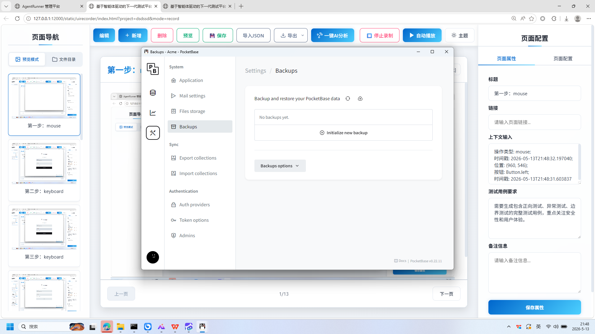

**操作详情**:
+ 操作类型: mouse; 
+ 时间戳: 2026-05-13T21:48:57.434652; 
+ 位置: (602, 416); 
+ 按钮: Button.left; 
+ 时间戳: 2026-05-13T21:48:56.816697

# 16. 第十六步：mouse

**操作详情**:
+ 操作类型: mouse; 
+ 时间戳: 2026-05-13T21:48:58.365149; 
+ 位置: (621, 512); 
+ 按钮: Button.left; 
+ 时间戳: 2026-05-13T21:48:57.781724

# 17. 第十七步：mouse

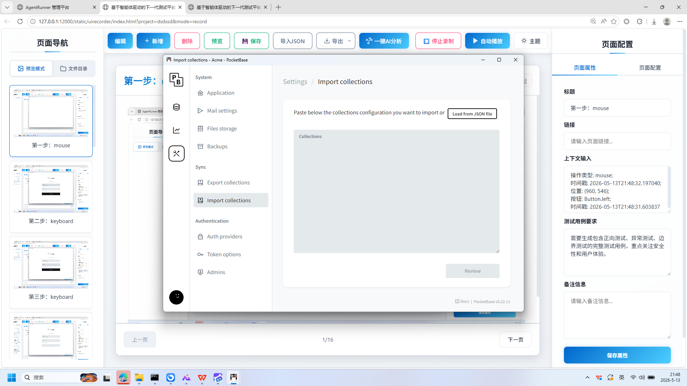

**操作详情**:
+ 操作类型: mouse; 
+ 时间戳: 2026-05-13T21:48:59.386371; 
+ 位置: (623, 561); 
+ 按钮: Button.left; 
+ 时间戳: 2026-05-13T21:48:58.753046

# 18. 第十八步：mouse

**操作详情**:
+ 操作类型: mouse; 
+ 时间戳: 2026-05-13T21:49:00.217960; 
+ 位置: (614, 670); 
+ 按钮: Button.left; 
+ 时间戳: 2026-05-13T21:48:59.617349

# 19. 第十九步：mouse

**操作详情**:
+ 操作类型: mouse; 
+ 时间戳: 2026-05-13T21:49:00.948445; 
+ 位置: (615, 716); 
+ 按钮: Button.left; 
+ 时间戳: 2026-05-13T21:49:00.352589

# 20. 第二十步：mouse

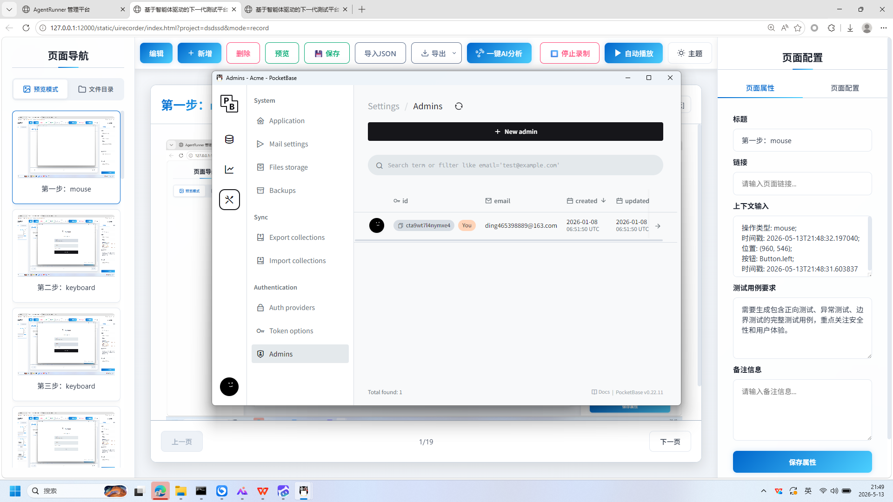

**操作详情**:
+ 操作类型: mouse; 
+ 时间戳: 2026-05-13T21:49:01.767381; 
+ 位置: (604, 769); 
+ 按钮: Button.left; 
+ 时间戳: 2026-05-13T21:49:01.216886

# 21. 第21步：mouse

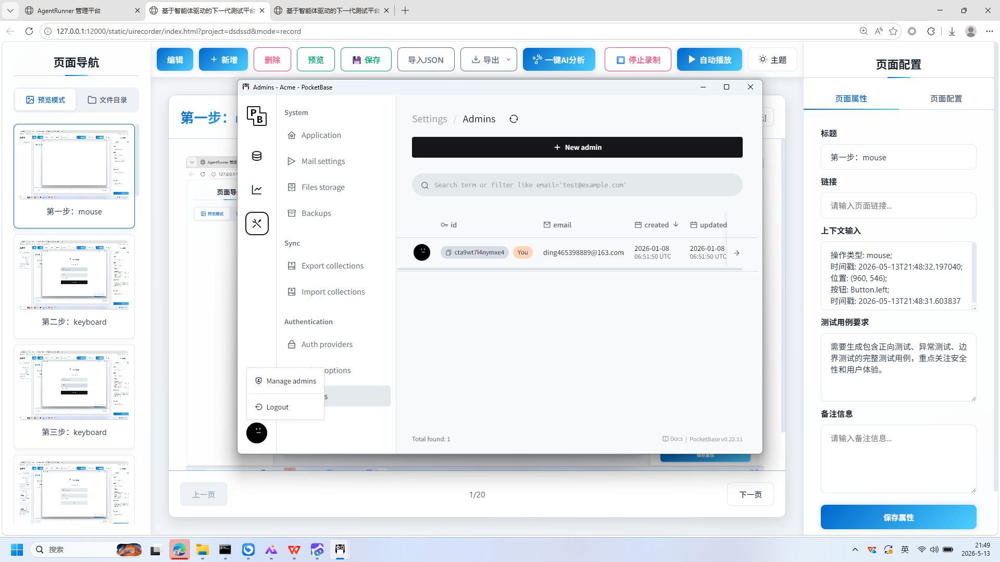

**操作详情**:
+ 操作类型: mouse; 
+ 时间戳: 2026-05-13T21:49:05.426696; 
+ 位置: (490, 835); 
+ 按钮: Button.left; 
+ 时间戳: 2026-05-13T21:49:04.844794

# 22. 第22步：mouse

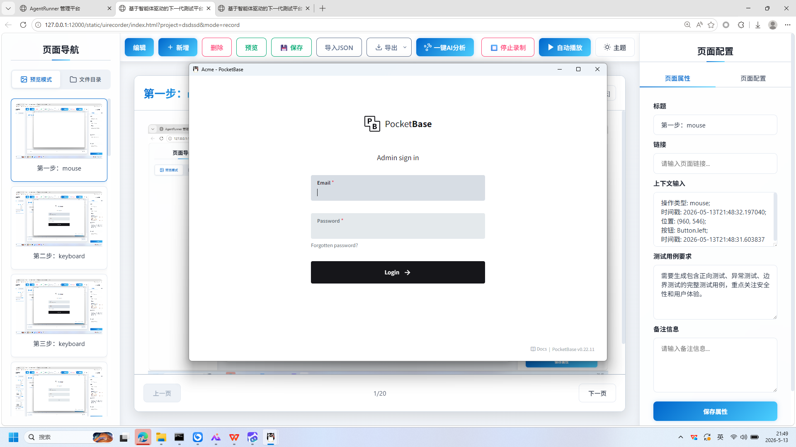

**操作详情**:
+ 操作类型: mouse; 
+ 时间戳: 2026-05-13T21:49:06.298832; 
+ 位置: (542, 777); 
+ 按钮: Button.left; 
+ 时间戳: 2026-05-13T21:49:05.757567

# 23. 第23步：mouse

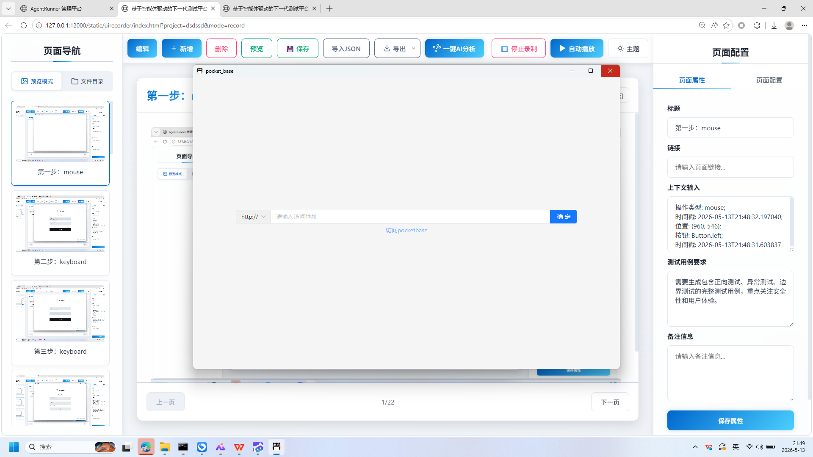

**操作详情**:
+ 操作类型: mouse; 
+ 时间戳: 2026-05-13T21:49:09.646016; 
+ 位置: (1433, 176); 
+ 按钮: Button.left; 
+ 时间戳: 2026-05-13T21:49:09.128962

# 24. 第24步：mouse

**操作详情**:
+ 操作类型: mouse; 
+ 时间戳: 2026-05-13T21:49:10.358686; 
+ 位置: (1433, 176); 
+ 按钮: Button.left; 
+ 时间戳: 2026-05-13T21:49:09.836542

# 25. 第25步：mouse

**操作详情**:
+ 操作类型: mouse; 
+ 时间戳: 2026-05-19T15:17:39.951477; 
+ 位置: (1583, 630); 
+ 按钮: Button.left; 
+ 时间戳: 2026-05-19T15:17:39.368807

# 26. 第26步：mouse

**操作详情**:
+ 操作类型: mouse; 
+ 时间戳: 2026-05-19T15:17:41.204682; 
+ 位置: (807, 458); 
+ 按钮: Button.left; 
+ 时间戳: 2026-05-19T15:17:40.704947

# 27. 第27步：keyboard

**操作详情**:
+ 操作类型: keyboard; 
+ 时间戳: 2026-05-19T15:17:47.297940; 
+ 输入内容: ding4653988892163.com; 
+ 长度: 21; 
+ 首字符: d; 
+ 末字符: m; 
+ 结束原因: tab_key; 
+ 时间戳: 2026-05-19T15:17:46.889542; 
+ 截图类型: 首字符

# 28. 第28步：keyboard

**操作详情**:
+ 操作类型: keyboard; 
+ 时间戳: 2026-05-19T15:17:47.301941; 
+ 输入内容: ding4653988892163.com; 
+ 长度: 21; 
+ 首字符: d; 
+ 末字符: m; 
+ 结束原因: tab_key; 
+ 时间戳: 2026-05-19T15:17:46.889542; 
+ 截图类型: 末字符

# 29. 第29步：mouse

**操作详情**:
+ 操作类型: mouse; 
+ 时间戳: 2026-05-19T15:17:50.600553; 
+ 位置: (857, 465); 
+ 按钮: Button.left; 
+ 时间戳: 2026-05-19T15:17:50.033440

# 30. 第30步：mouse

**操作详情**:
+ 操作类型: mouse; 
+ 时间戳: 2026-05-19T15:17:53.810199; 
+ 位置: (854, 465); 
+ 按钮: Button.left; 
+ 时间戳: 2026-05-19T15:17:53.272700

# 31. 第31步：mouse

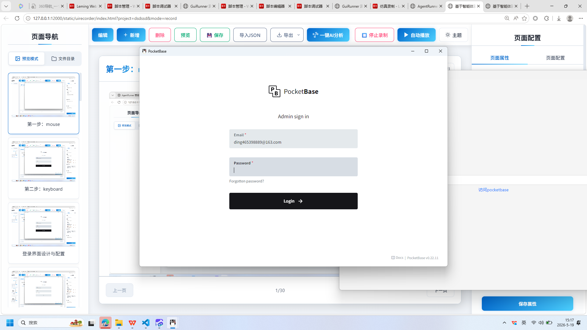

**操作详情**:
+ 操作类型: mouse; 
+ 时间戳: 2026-05-19T15:17:54.813043; 
+ 位置: (869, 555); 
+ 按钮: Button.left; 
+ 时间戳: 2026-05-19T15:17:54.272391

# 32. 第32步：mouse

**操作详情**:
+ 操作类型: mouse; 
+ 时间戳: 2026-05-19T15:17:58.396168; 
+ 位置: (939, 685); 
+ 按钮: Button.left; 
+ 时间戳: 2026-05-19T15:17:57.873122

# 33. 第33步：mouse

**操作详情**:
+ 操作类型: mouse; 
+ 时间戳: 2026-05-19T15:17:58.989414; 
+ 位置: (945, 680); 
+ 按钮: Button.left; 
+ 时间戳: 2026-05-19T15:17:58.481677

# 34. 第34步：mouse

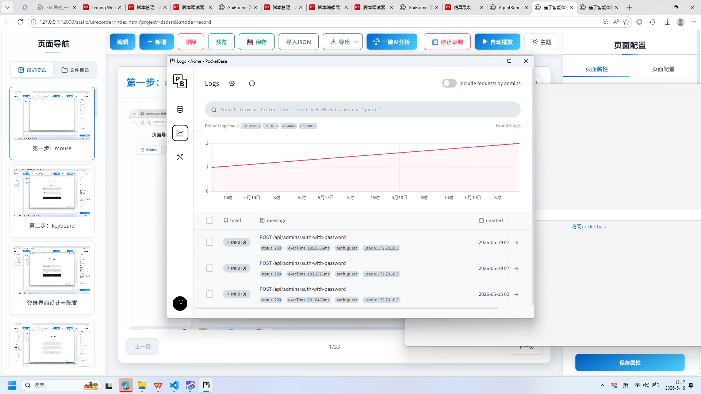

**操作详情**:
+ 操作类型: mouse; 
+ 时间戳: 2026-05-19T15:18:00.349119; 
+ 位置: (494, 362); 
+ 按钮: Button.left; 
+ 时间戳: 2026-05-19T15:17:59.793575

# 35. 第35步：keyboard

**操作详情**:
+ 操作类型: keyboard; 
+ 时间戳: 2026-05-19T15:18:00.431595; 
+ 输入内容: @1234567890; 
+ 长度: 11; 
+ 首字符: @; 
+ 末字符: 0; 
+ 结束原因: timeout; 
+ 时间戳: 2026-05-19T15:18:00.091217; 
+ 截图类型: 首字符

# 36. 第36步：keyboard

**操作详情**:
+ 操作类型: keyboard; 
+ 时间戳: 2026-05-19T15:18:00.435557; 
+ 输入内容: @1234567890; 
+ 长度: 11; 
+ 首字符: @; 
+ 末字符: 0; 
+ 结束原因: timeout; 
+ 时间戳: 2026-05-19T15:18:00.091217; 
+ 截图类型: 末字符

# 37. 第37步：mouse

**操作详情**:
+ 操作类型: mouse; 
+ 时间戳: 2026-05-19T15:18:01.039423; 
+ 位置: (486, 451); 
+ 按钮: Button.left; 
+ 时间戳: 2026-05-19T15:18:00.496860

# 38. 第38步：mouse

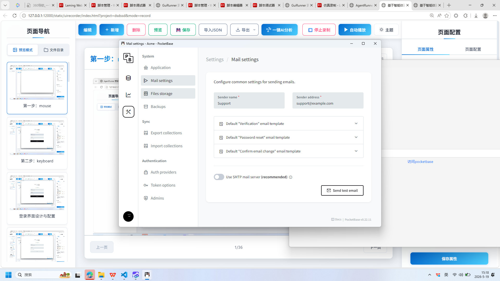

**操作详情**:
+ 操作类型: mouse; 
+ 时间戳: 2026-05-19T15:18:01.563422; 
+ 位置: (591, 321); 
+ 按钮: Button.left; 
+ 时间戳: 2026-05-19T15:18:01.056393

# 39. 第39步：mouse

**操作详情**:
+ 操作类型: mouse; 
+ 时间戳: 2026-05-19T15:18:02.041951; 
+ 位置: (603, 360); 
+ 按钮: Button.left; 
+ 时间戳: 2026-05-19T15:18:01.456871

# 40. 第40步：mouse

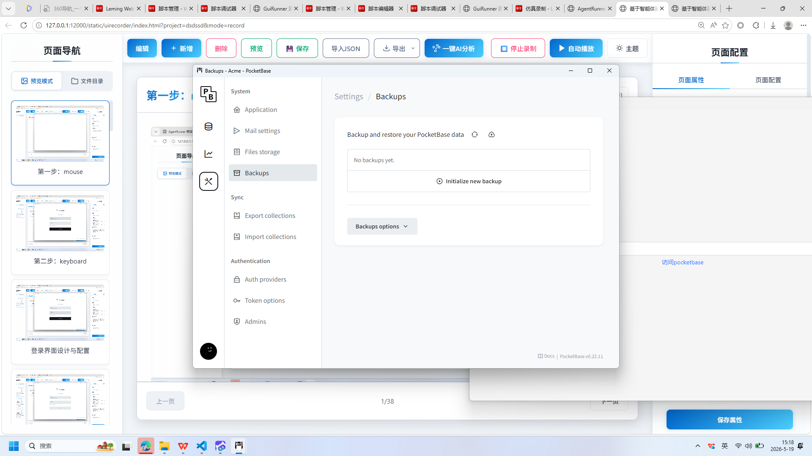

**操作详情**:
+ 操作类型: mouse; 
+ 时间戳: 2026-05-19T15:18:02.547754; 
+ 位置: (609, 413); 
+ 按钮: Button.left; 
+ 时间戳: 2026-05-19T15:18:02.024932

# 41. 第41步：mouse

**操作详情**:
+ 操作类型: mouse; 
+ 时间戳: 2026-05-19T15:18:03.185301; 
+ 位置: (607, 505); 
+ 按钮: Button.left; 
+ 时间戳: 2026-05-19T15:18:02.680310

# 42. 第42步：mouse

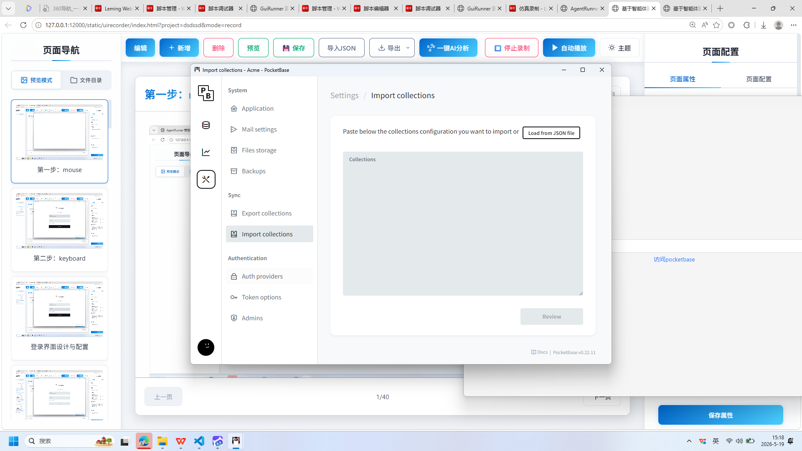

**操作详情**:
+ 操作类型: mouse; 
+ 时间戳: 2026-05-19T15:18:03.793956; 
+ 位置: (607, 574); 
+ 按钮: Button.left; 
+ 时间戳: 2026-05-19T15:18:03.256509

# 43. 第43步：mouse

**操作详情**:
+ 操作类型: mouse; 
+ 时间戳: 2026-05-19T15:18:04.294113; 
+ 位置: (612, 656); 
+ 按钮: Button.left; 
+ 时间戳: 2026-05-19T15:18:03.769247

# 44. 第44步：mouse

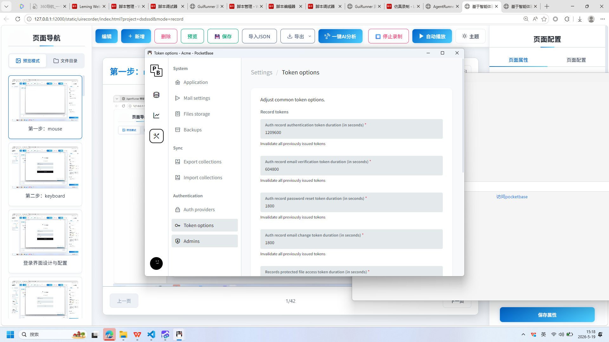

**操作详情**:
+ 操作类型: mouse; 
+ 时间戳: 2026-05-19T15:18:04.784369; 
+ 位置: (614, 710); 
+ 按钮: Button.left; 
+ 时间戳: 2026-05-19T15:18:04.180575

# 45. 第45步：mouse

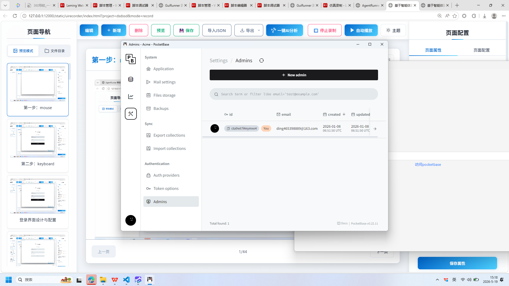

**操作详情**:
+ 操作类型: mouse; 
+ 时间戳: 2026-05-19T15:18:05.266892; 
+ 位置: (604, 756); 
+ 按钮: Button.left; 
+ 时间戳: 2026-05-19T15:18:04.608448

# 46. 第46步：mouse

**操作详情**:
+ 操作类型: mouse; 
+ 时间戳: 2026-05-19T15:18:07.856128; 
+ 位置: (485, 842); 
+ 按钮: Button.left; 
+ 时间戳: 2026-05-19T15:18:07.344505

# 47. 第47步：mouse

**操作详情**:
+ 操作类型: mouse; 
+ 时间戳: 2026-05-19T15:18:08.653784; 
+ 位置: (497, 844); 
+ 按钮: Button.left; 
+ 时间戳: 2026-05-19T15:18:08.096139

# 48. 第48步：mouse

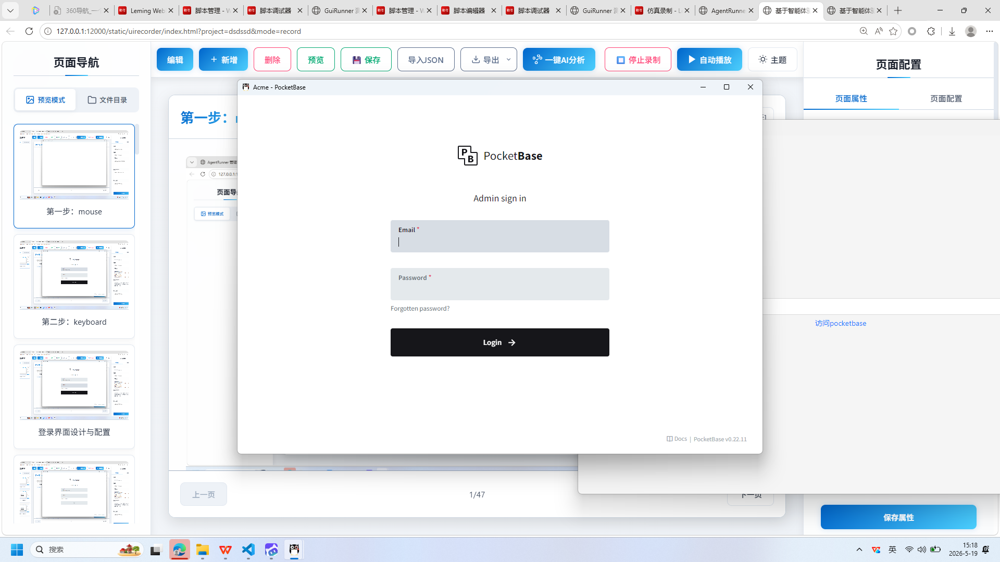

**操作详情**:
+ 操作类型: mouse; 
+ 时间戳: 2026-05-19T15:18:09.318280; 
+ 位置: (532, 792); 
+ 按钮: Button.left; 
+ 时间戳: 2026-05-19T15:18:08.824783

# 49. 第49步：mouse

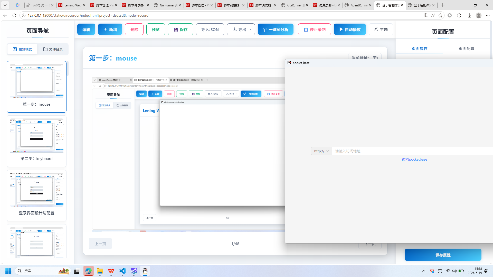

**操作详情**:
+ 操作类型: mouse; 
+ 时间戳: 2026-05-19T15:18:10.814143; 
+ 位置: (1431, 172); 
+ 按钮: Button.left; 
+ 时间戳: 2026-05-19T15:18:10.328733

# 50. 第50步：mouse

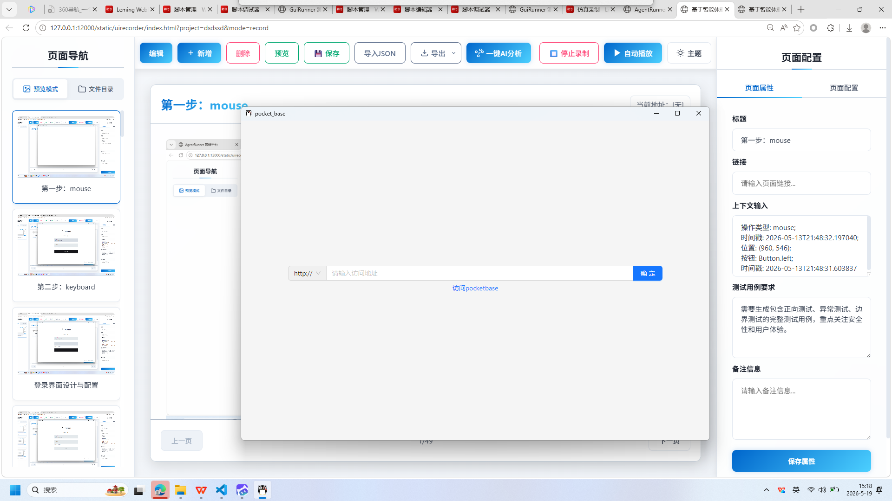

**操作详情**:
+ 操作类型: mouse; 
+ 时间戳: 2026-05-19T15:18:11.729017; 
+ 位置: (1456, 249); 
+ 按钮: Button.left; 
+ 时间戳: 2026-05-19T15:18:11.200456

# 51. 第51步：mouse

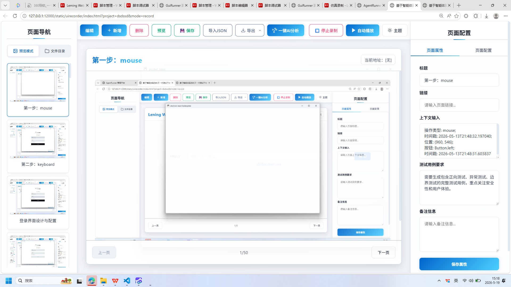

**操作详情**:
+ 操作类型: mouse; 
+ 时间戳: 2026-05-19T15:18:13.178317; 
+ 位置: (1506, 236); 
+ 按钮: Button.left; 
+ 时间戳: 2026-05-19T15:18:12.672507

---

*报告由 AgentRunner Markdown Exporter 生成*