# 基于智能体驱动的下一代测试平台 AgentRunner

+ **生成时间**: 2026-05-25 11:05:57
+ **数据源**: F:\workspace\yfjzworkspace\webspace\ai-template\agentrunner\uirecordercore\filestorage\dsdssd\records.json
+ **操作总数**: 51

# 1. 页面配置与预览

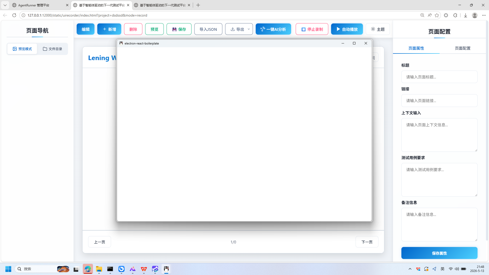

**操作详情**:
+ 操作类型: mouse; 
+ 时间戳: 2026-05-13T21:48:32.197040; 
+ 位置: (960, 546); 
+ 按钮: Button.left; 
+ 时间戳: 2026-05-13T21:48:31.603837

**页面描述**:
该界面提供页面属性的配置功能，用户可在右侧填写标题、链接、上下文信息、测试用例要求及备注等字段。左侧支持页面导航和文件目录管理，顶部工具栏包含新增、删除、保存、导入导出、AI分析、录制控制等功能按钮。中央区域为页面预览窗口，实时展示当前配置效果，支持翻页操作，便于快速查看和调整页面内容。

# 2. 页面配置与预览

**操作详情**:
+ 操作类型: keyboard; 
+ 时间戳: 2026-05-13T21:48:43.380309; 
+ 输入内容: ding465398889@163.com; 
+ 长度: 21; 
+ 首字符: d; 
+ 末字符: m; 
+ 结束原因: tab_key; 
+ 时间戳: 2026-05-13T21:48:42.820451; 
+ 截图类型: 首字符

**页面描述**:
该界面提供页面属性的编辑与配置功能，用户可在右侧面板中设置页面标题、链接、上下文信息、测试用例要求及备注信息。中央区域支持实时预览当前配置效果，左侧导航栏支持页面管理和文件目录浏览。顶部工具栏包含编辑、新增、删除、预览、保存、导入导出JSON、一键AI分析、停止录制和自动播放等功能按钮，便于快速操作与管理。

# 3. 页面配置编辑器

**操作详情**:
+ 操作类型: keyboard; 
+ 时间戳: 2026-05-13T21:48:43.387631; 
+ 输入内容: ding465398889@163.com; 
+ 长度: 21; 
+ 首字符: d; 
+ 末字符: m; 
+ 结束原因: tab_key; 
+ 时间戳: 2026-05-13T21:48:42.820451; 
+ 截图类型: 末字符

**页面描述**:
该界面为一个页面配置管理工具，支持用户对页面属性进行编辑与配置。左侧导航栏提供预览模式和文件目录切换功能，中间区域展示当前页面的预览效果，右侧配置面板允许输入标题、链接、上下文信息、测试用例要求及备注等字段，并通过“保存属性”按钮提交更改。顶部工具栏包含编辑、新增、删除、预览、保存、导入导出JSON、一键AI分析、停止录制和自动播放等功能，适用于快速构建和调试页面配置。

# 4. 页面配置与预览

**操作详情**:
+ 操作类型: mouse; 
+ 时间戳: 2026-05-13T21:48:47.818928; 
+ 位置: (940, 672); 
+ 按钮: Button.left; 
+ 时间戳: 2026-05-13T21:48:47.228289

**页面描述**:
该界面提供页面属性的编辑与配置功能，用户可在右侧面板输入标题、链接、上下文信息、测试用例要求及备注等字段。左侧导航支持预览模式和文件目录切换，中央区域用于展示当前页面内容并支持分页浏览。顶部工具栏包含新增、删除、保存、导入导出JSON、一键AI分析、停止录制和自动播放等功能按钮，便于进行页面管理与测试操作。

# 5. 页面配置与预览

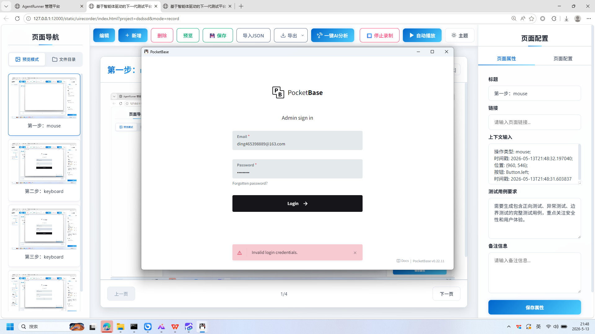

**操作详情**:
+ 操作类型: keyboard; 
+ 时间戳: 2026-05-13T21:48:49.173331; 
+ 输入内容: 123456789; 
+ 长度: 9; 
+ 首字符: 1; 
+ 末字符: 9; 
+ 结束原因: timeout; 
+ 时间戳: 2026-05-13T21:48:48.663511; 
+ 截图类型: 首字符

**页面描述**:
该界面提供了一个直观的页面配置与预览功能，用户可以在右侧的‘页面属性’面板中设置页面标题、链接、上下文信息、测试用例要求和备注信息。左侧的‘页面导航’区域支持页面管理，包括预览模式和文件目录浏览。中央区域展示当前页面的实时预览效果，支持编辑、新增、删除、保存、导入导出JSON数据以及一键AI分析等操作，方便用户快速构建和调试页面内容。

# 6. 页面配置编辑器

**操作详情**:
+ 操作类型: keyboard; 
+ 时间戳: 2026-05-13T21:48:49.178344; 
+ 输入内容: 123456789; 
+ 长度: 9; 
+ 首字符: 1; 
+ 末字符: 9; 
+ 结束原因: timeout; 
+ 时间戳: 2026-05-13T21:48:48.663511; 
+ 截图类型: 末字符

**页面描述**:
该界面为一个页面配置编辑工具，支持用户通过可视化方式配置页面属性，包括标题、链接、上下文信息、测试用例要求及备注信息。右侧的配置面板允许用户输入各项内容，并通过“保存属性”按钮完成设置。顶部工具栏提供新增、删除、预览、保存、导入导出JSON、AI分析和自动播放等功能，支持高效的页面管理与测试流程操作。

# 7. 页面配置与预览

**操作详情**:
+ 操作类型: mouse; 
+ 时间戳: 2026-05-13T21:48:49.527127; 
+ 位置: (896, 540); 
+ 按钮: Button.left; 
+ 时间戳: 2026-05-13T21:48:48.984843

**页面描述**:
该界面提供了一个可视化页面配置工具，用户可以在右侧的‘页面属性’面板中设置页面标题、链接、上下文信息、测试用例要求和备注信息。左侧的‘页面导航’区域支持预览模式和文件目录管理，中间区域用于实时预览当前配置的页面效果。顶部功能栏包含编辑、新增、删除、保存、导入导出JSON、一键AI分析、停止录制和自动播放等操作选项，支持高效的内容管理和自动化测试流程。

# 8. 页面配置与预览

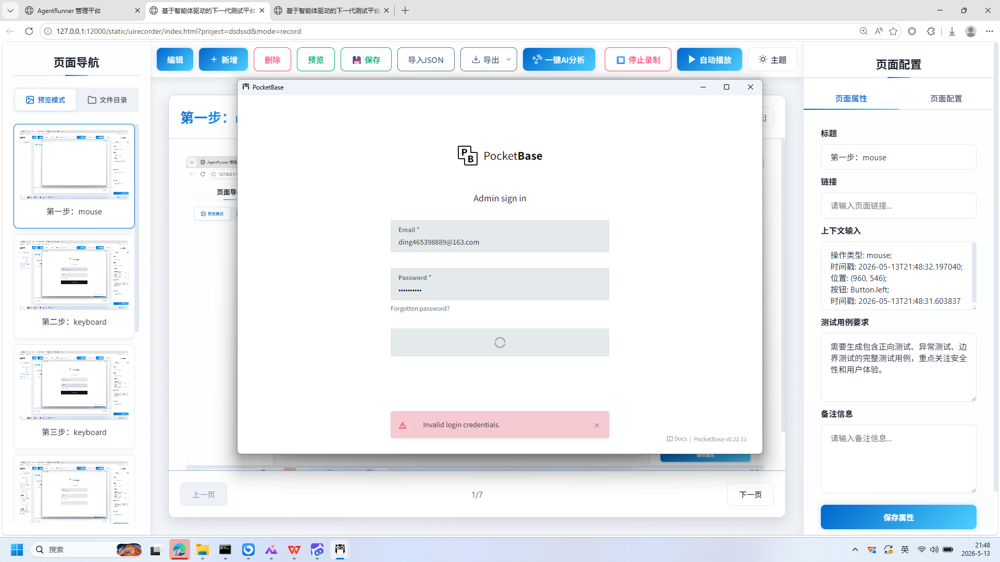

**操作详情**:
+ 操作类型: mouse; 
+ 时间戳: 2026-05-13T21:48:51.876373; 
+ 位置: (903, 650); 
+ 按钮: Button.left; 
+ 时间戳: 2026-05-13T21:48:51.312827

**页面描述**:
该界面提供页面属性的编辑与配置功能，用户可在右侧面板中设置页面标题、链接、上下文信息、测试用例要求及备注信息。中央区域用于实时预览当前配置效果，支持一键AI分析、自动播放和导出等功能，便于快速完成页面内容的搭建与调试。

# 9. 页面配置编辑器

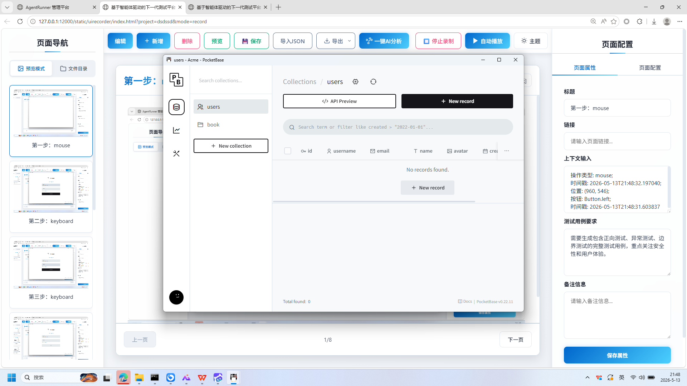

**操作详情**:
+ 操作类型: keyboard; 
+ 时间戳: 2026-05-13T21:48:53.442170; 
+ 输入内容: 0; 
+ 长度: 1; 
+ 首字符: 0; 
+ 末字符: 0; 
+ 结束原因: timeout; 
+ 时间戳: 2026-05-13T21:48:52.928084; 
+ 截图类型: 首字符

**页面描述**:
该界面为一个页面配置编辑工具，支持用户通过可视化方式编辑页面属性，包括标题、链接、上下文信息、测试用例要求和备注信息。左侧提供页面导航与预览模式切换，顶部功能栏包含新增、删除、保存、导入导出JSON、一键AI分析、停止录制和自动播放等操作选项。右侧为页面属性配置区域，用户可输入各项参数并点击“保存属性”按钮完成设置。中央区域展示当前编辑的页面内容预览，支持多页浏览与切换。

# 10. 页面配置编辑器

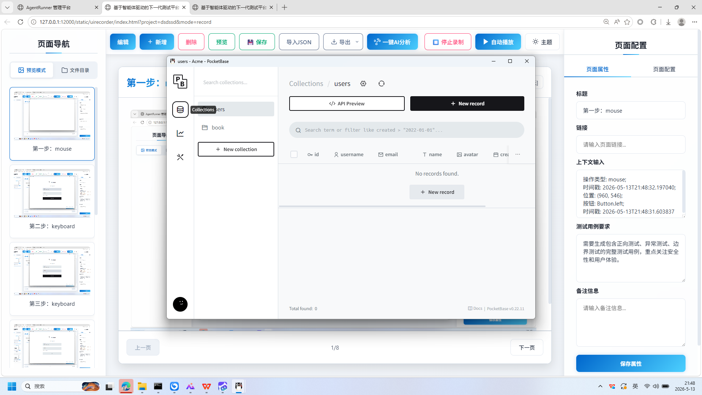

**操作详情**:
+ 操作类型: keyboard; 
+ 时间戳: 2026-05-13T21:48:53.455123; 
+ 输入内容: 0; 
+ 长度: 1; 
+ 首字符: 0; 
+ 末字符: 0; 
+ 结束原因: timeout; 
+ 时间戳: 2026-05-13T21:48:52.928084; 
+ 截图类型: 末字符

**页面描述**:
该界面为一个页面配置管理工具，支持用户对页面属性进行编辑与配置。左侧导航栏提供页面浏览和文件目录管理功能，中间区域展示当前编辑的页面内容预览，右侧配置面板包含标题、链接、上下文输入、测试用例要求及备注信息等字段，用户可填写相关信息并保存配置。顶部工具栏提供新增、删除、预览、保存、导入导出JSON、一键AI分析、停止录制和自动播放等功能，适用于快速构建和调试页面配置。

# 11. 页面配置与预览

**操作详情**:
+ 操作类型: mouse; 
+ 时间戳: 2026-05-13T21:48:54.040759; 
+ 位置: (505, 346); 
+ 按钮: Button.left; 
+ 时间戳: 2026-05-13T21:48:53.533395

**页面描述**:
该界面用于配置和预览网页内容，支持编辑页面标题、链接、上下文信息、测试用例要求及备注信息。用户可通过右侧的配置面板输入相关信息，并在中央区域实时预览效果。顶部工具栏提供新增、删除、保存、导入导出JSON、一键AI分析、停止录制和自动播放等功能，方便进行页面管理和自动化操作。

# 12. 页面配置与预览

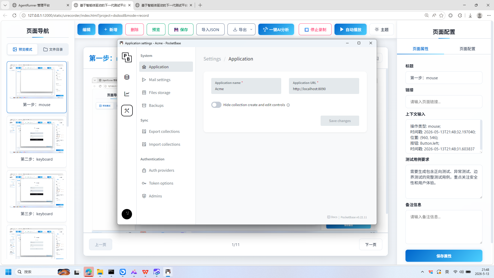

**操作详情**:
+ 操作类型: mouse; 
+ 时间戳: 2026-05-13T21:48:55.270873; 
+ 位置: (492, 418); 
+ 按钮: Button.left; 
+ 时间戳: 2026-05-13T21:48:54.632639

**页面描述**:
该界面提供页面属性的编辑与配置功能，用户可通过右侧表单设置页面标题、链接、上下文信息、测试用例要求及备注。中央区域用于实时预览当前配置效果，支持新增、删除、保存和导出操作。顶部工具栏包含一键AI分析、录制控制和自动播放等高级功能，适用于高效构建和调试页面内容。

# 13. 页面配置与预览

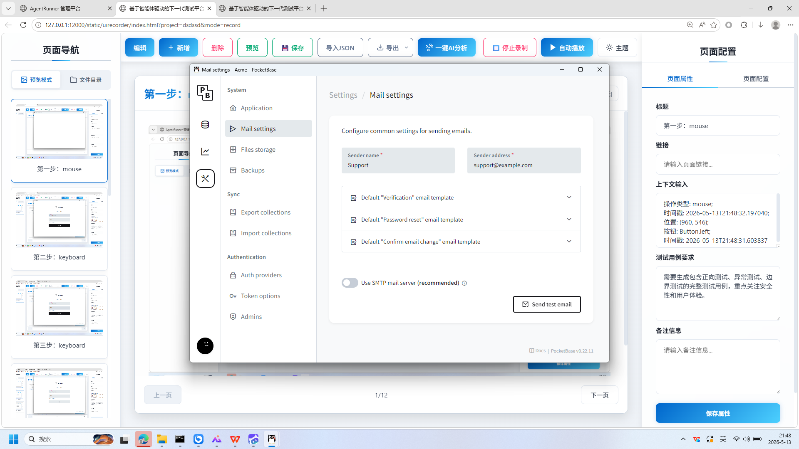

**操作详情**:
+ 操作类型: mouse; 
+ 时间戳: 2026-05-13T21:48:56.127480; 
+ 位置: (586, 310); 
+ 按钮: Button.left; 
+ 时间戳: 2026-05-13T21:48:55.575787

**页面描述**:
该界面提供了一个直观的页面配置与预览功能，用户可以在右侧的‘页面属性’面板中设置页面标题、链接、上下文信息、测试用例要求及备注信息。左侧的‘页面导航’区域支持预览模式和文件目录管理，方便用户在不同页面间切换。中央区域展示当前页面的实时预览效果，用户可通过顶部工具栏进行编辑、新增、删除、保存、导入导出JSON、一键AI分析、停止录制和自动播放等操作，实现高效的内容管理和交互设计。

# 14. 页面配置与编辑界面

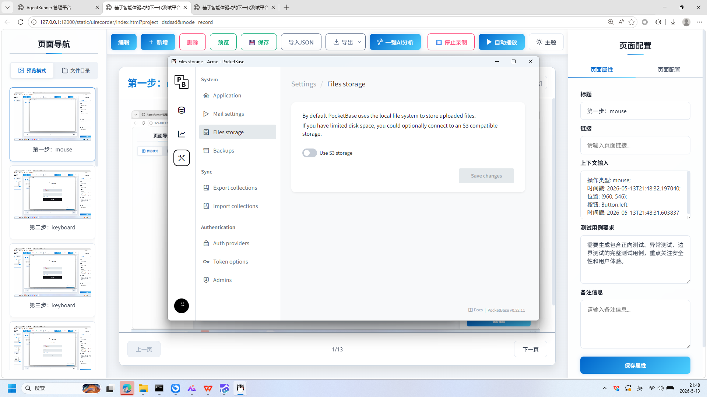

**操作详情**:
+ 操作类型: mouse; 
+ 时间戳: 2026-05-13T21:48:56.725629; 
+ 位置: (596, 374); 
+ 按钮: Button.left; 
+ 时间戳: 2026-05-13T21:48:56.182999

**页面描述**:
该界面提供了一个直观的页面配置与编辑环境，用户可以通过左侧导航栏进行页面管理，包括预览模式和文件目录操作。中间区域展示当前编辑的页面内容，支持实时预览。右侧的页面属性面板允许用户输入标题、链接、上下文信息、测试用例要求及备注信息，并通过‘保存属性’按钮提交更改。顶部工具栏包含编辑、新增、删除、预览、保存、导入导出JSON、一键AI分析、停止录制和自动播放等功能，支持高效的内容管理和自动化测试流程。

# 15. 页面配置与预览

**操作详情**:
+ 操作类型: mouse; 
+ 时间戳: 2026-05-13T21:48:57.434652; 
+ 位置: (602, 416); 
+ 按钮: Button.left; 
+ 时间戳: 2026-05-13T21:48:56.816697

**页面描述**:
该界面提供页面属性的编辑与配置功能，用户可在右侧填写标题、链接、上下文信息、测试用例要求及备注等字段，并通过左侧导航进行页面管理。中央区域用于实时预览当前配置效果，支持新增、删除、保存、导入导出JSON等操作，同时具备一键AI分析和自动播放功能，便于快速完成页面内容的构建与调试。

# 16. 页面配置与预览

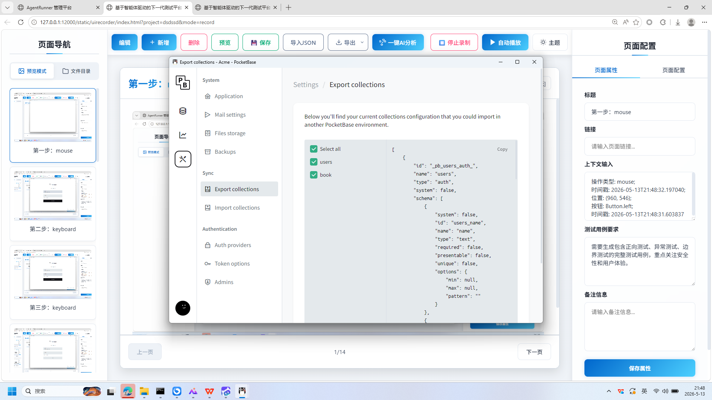

**操作详情**:
+ 操作类型: mouse; 
+ 时间戳: 2026-05-13T21:48:58.365149; 
+ 位置: (621, 512); 
+ 按钮: Button.left; 
+ 时间戳: 2026-05-13T21:48:57.781724

**页面描述**:
该界面提供了一个直观的页面配置与预览功能，用户可以在右侧的‘页面属性’面板中输入标题、链接、上下文信息、测试用例要求和备注信息等。左侧的‘页面导航’区域支持预览模式和文件目录切换，中央区域展示当前页面的实时预览效果。顶部工具栏包含编辑、新增、删除、预览、保存、导入JSON、导出、一键AI分析、停止录制和自动播放等功能按钮，便于用户对页面进行全方位的操作与管理。

# 17. 页面配置与预览

**操作详情**:
+ 操作类型: mouse; 
+ 时间戳: 2026-05-13T21:48:59.386371; 
+ 位置: (623, 561); 
+ 按钮: Button.left; 
+ 时间戳: 2026-05-13T21:48:58.753046

**页面描述**:
该界面提供了一个可视化页面配置工具，用户可以在右侧的属性面板中设置页面标题、链接、上下文信息、测试用例要求和备注信息。左侧导航栏支持预览模式和文件目录管理，中央区域展示当前配置的页面内容，并支持一键AI分析、自动播放等功能。顶部工具栏包含编辑、新增、删除、保存、导入导出等操作，方便用户快速完成页面配置与调试。

# 18. 页面配置与预览

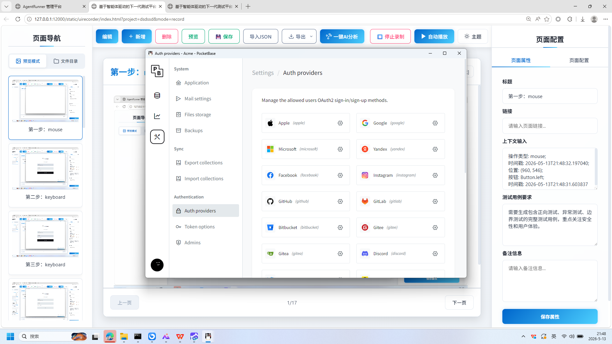

**操作详情**:
+ 操作类型: mouse; 
+ 时间戳: 2026-05-13T21:49:00.217960; 
+ 位置: (614, 670); 
+ 按钮: Button.left; 
+ 时间戳: 2026-05-13T21:48:59.617349

**页面描述**:
该界面提供了一个可视化页面配置工具，用户可以在右侧的‘页面属性’面板中设置页面标题、链接、上下文信息、测试用例要求及备注信息。左侧导航栏支持预览模式和文件目录管理，中央区域用于展示当前配置的页面内容，并支持分页浏览。顶部功能栏包含编辑、新增、删除、预览、保存、导入导出JSON、一键AI分析、停止录制和自动播放等功能，便于用户进行完整的页面开发与测试流程管理。

# 19. 页面配置与预览

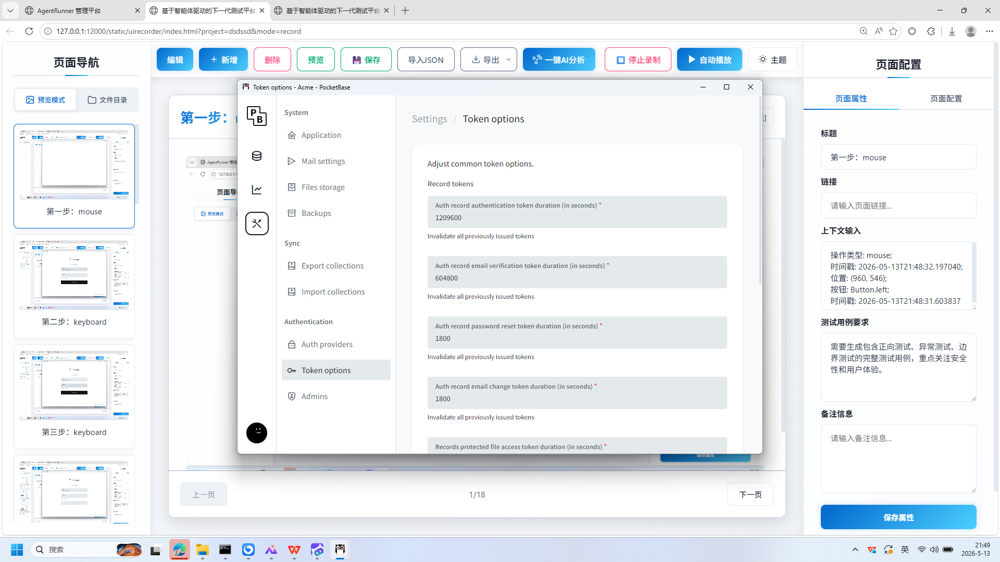

**操作详情**:
+ 操作类型: mouse; 
+ 时间戳: 2026-05-13T21:49:00.948445; 
+ 位置: (615, 716); 
+ 按钮: Button.left; 
+ 时间戳: 2026-05-13T21:49:00.352589

**页面描述**:
该界面提供页面配置功能，用户可在右侧面板设置页面标题、链接、上下文信息、测试用例要求及备注信息。左侧导航支持预览模式和文件目录管理，中央区域用于显示页面内容预览。顶部工具栏包含编辑、新增、删除、保存、导入导出JSON、一键AI分析、停止录制和自动播放等功能按钮，支持完整的页面配置与测试流程操作。

# 20. 页面配置与预览

**操作详情**:
+ 操作类型: mouse; 
+ 时间戳: 2026-05-13T21:49:01.767381; 
+ 位置: (604, 769); 
+ 按钮: Button.left; 
+ 时间戳: 2026-05-13T21:49:01.216886

**页面描述**:
该界面用于配置和预览网页内容，左侧提供页面导航和文件目录管理，中间区域展示当前页面的实时预览效果，右侧支持设置页面标题、链接、上下文信息、测试用例要求及备注等属性。用户可通过顶部工具栏进行新增、编辑、删除、保存、导入导出JSON、一键AI分析、录制控制和自动播放等操作，实现高效的内容管理和交互测试。

# 21. 页面配置与预览

**操作详情**:
+ 操作类型: mouse; 
+ 时间戳: 2026-05-13T21:49:05.426696; 
+ 位置: (490, 835); 
+ 按钮: Button.left; 
+ 时间戳: 2026-05-13T21:49:04.844794

**页面描述**:
该界面提供了一个可视化页面配置工具，用户可以在右侧的‘页面属性’面板中输入标题、链接、上下文信息、测试用例要求和备注等属性，并实时在中央区域预览页面效果。支持一键AI分析、自动播放、导入导出JSON等功能，适用于快速构建和调试前端页面原型。

# 22. 页面配置与预览

**操作详情**:
+ 操作类型: mouse; 
+ 时间戳: 2026-05-13T21:49:06.298832; 
+ 位置: (542, 777); 
+ 按钮: Button.left; 
+ 时间戳: 2026-05-13T21:49:05.757567

**页面描述**:
该界面提供页面属性的编辑与配置功能，用户可在右侧面板设置标题、链接、上下文信息、测试用例要求及备注信息。左侧导航支持预览模式和文件目录管理，中央区域用于显示页面内容预览。顶部工具栏包含新增、删除、保存、导入导出、AI分析、录制控制等操作按钮，实现对页面的全流程管理。

# 23. 页面配置与预览

**操作详情**:
+ 操作类型: mouse; 
+ 时间戳: 2026-05-13T21:49:09.646016; 
+ 位置: (1433, 176); 
+ 按钮: Button.left; 
+ 时间戳: 2026-05-13T21:49:09.128962

**页面描述**:
该界面提供页面的编辑与配置功能，用户可通过左侧导航栏进行页面管理，右侧配置面板支持设置页面标题、链接、上下文信息、测试用例要求及备注。中央区域用于预览当前页面内容，顶部工具栏包含新增、删除、保存、导入导出JSON、一键AI分析、录制控制和自动播放等操作选项，实现高效的内容配置与测试流程管理。

# 24. 页面配置与预览

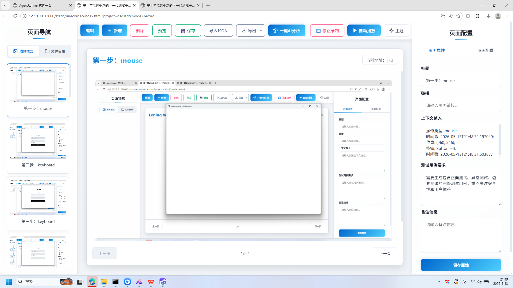

**操作详情**:
+ 操作类型: mouse; 
+ 时间戳: 2026-05-13T21:49:10.358686; 
+ 位置: (1433, 176); 
+ 按钮: Button.left; 
+ 时间戳: 2026-05-13T21:49:09.836542

**页面描述**:
该界面提供页面属性的配置功能，用户可在右侧面板中设置页面标题、链接、上下文信息、测试用例要求及备注信息。中央区域用于预览当前配置的页面效果，支持实时查看调整后的结果。顶部工具栏包含编辑、新增、删除、保存、导入导出、AI分析、录制控制和自动播放等功能，便于用户高效管理页面内容与交互行为。

# 25. 页面配置与预览

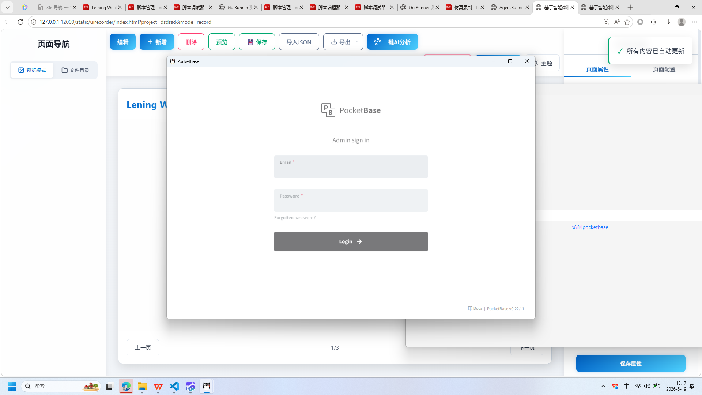

**操作详情**:
+ 操作类型: mouse; 
+ 时间戳: 2026-05-19T15:17:39.951477; 
+ 位置: (1583, 630); 
+ 按钮: Button.left; 
+ 时间戳: 2026-05-19T15:17:39.368807

**页面描述**:
该界面提供页面的配置与预览功能，用户可在右侧配置页面属性，包括标题、链接、上下文信息、测试用例要求和备注信息。中间区域用于实时预览当前页面内容，支持编辑、新增、删除、保存等操作，并可导出为JSON格式或一键进行AI分析。顶部工具栏提供录制控制选项，如开始/停止录制和自动播放，适用于测试流程管理。

# 26. 页面配置与预览

**操作详情**:
+ 操作类型: mouse; 
+ 时间戳: 2026-05-19T15:17:41.204682; 
+ 位置: (807, 458); 
+ 按钮: Button.left; 
+ 时间戳: 2026-05-19T15:17:40.704947

**页面描述**:
该界面提供页面属性的编辑与配置功能，用户可通过右侧表单设置页面标题、链接、上下文信息、测试用例要求及备注信息。中央区域支持页面内容的实时预览，左侧导航栏支持页面管理和文件目录浏览。顶部工具栏包含新增、删除、保存、导入导出JSON、一键AI分析、录制控制和自动播放等功能，实现高效的页面配置与测试流程管理。

# 27. 页面配置与预览

**操作详情**:
+ 操作类型: keyboard; 
+ 时间戳: 2026-05-19T15:17:47.297940; 
+ 输入内容: ding4653988892163.com; 
+ 长度: 21; 
+ 首字符: d; 
+ 末字符: m; 
+ 结束原因: tab_key; 
+ 时间戳: 2026-05-19T15:17:46.889542; 
+ 截图类型: 首字符

**页面描述**:
该界面提供了一个直观的页面配置与预览功能，用户可以在右侧的配置面板中输入页面标题、链接、上下文信息、测试用例要求和备注信息。左侧区域支持页面导航和文件目录管理，中央区域用于实时预览当前配置的页面效果。顶部工具栏包含编辑、新增、删除、预览、保存、导入导出JSON、一键AI分析、停止录制和自动播放等功能按钮，便于用户进行完整的页面管理和操作。

# 28. 页面配置与预览

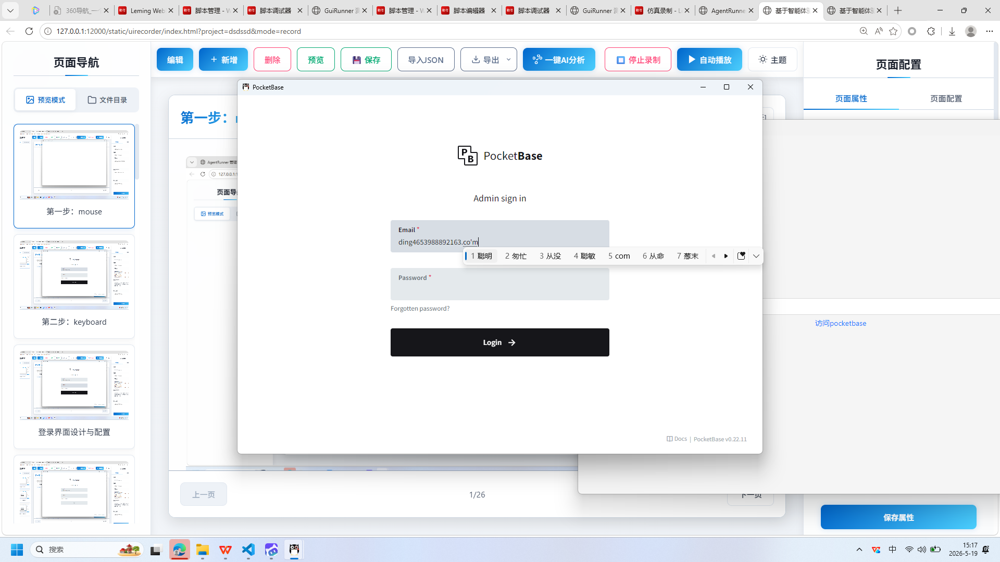

**操作详情**:
+ 操作类型: keyboard; 
+ 时间戳: 2026-05-19T15:17:47.301941; 
+ 输入内容: ding4653988892163.com; 
+ 长度: 21; 
+ 首字符: d; 
+ 末字符: m; 
+ 结束原因: tab_key; 
+ 时间戳: 2026-05-19T15:17:46.889542; 
+ 截图类型: 末字符

**页面描述**:
该界面提供了一个直观的页面配置工具，支持用户通过左侧导航栏进行页面管理，并在中央区域实时预览页面内容。右侧的配置面板允许用户输入页面标题、链接、上下文信息、测试用例要求及备注信息，完成页面属性的详细设置。顶部功能按钮支持编辑、新增、删除、保存、导入导出JSON数据、一键AI分析和自动播放等操作，提升页面配置效率。

# 29. 页面配置与编辑

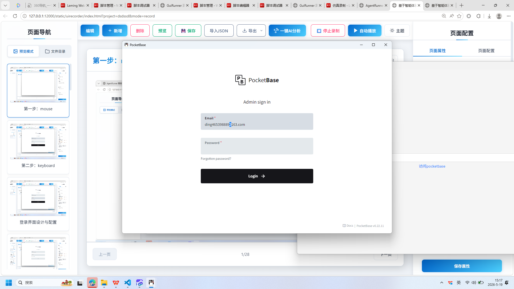

**操作详情**:
+ 操作类型: mouse; 
+ 时间戳: 2026-05-19T15:17:50.600553; 
+ 位置: (857, 465); 
+ 按钮: Button.left; 
+ 时间戳: 2026-05-19T15:17:50.033440

**页面描述**:
该界面提供了一个可视化页面配置工具，用户可以通过左侧的页面导航进行页面管理，支持新增、删除和预览操作。右侧的页面属性面板允许用户输入标题、链接、上下文信息、测试用例要求及备注信息，并可保存配置。顶部功能栏包含编辑、保存、导入导出JSON、一键AI分析、停止录制和自动播放等功能，支持高效的内容配置与自动化测试流程。中央区域用于展示当前页面内容或预览效果，整体设计旨在提升页面配置的便捷性与智能化水平。

# 30. 页面配置与预览

**操作详情**:
+ 操作类型: mouse; 
+ 时间戳: 2026-05-19T15:17:53.810199; 
+ 位置: (854, 465); 
+ 按钮: Button.left; 
+ 时间戳: 2026-05-19T15:17:53.272700

**页面描述**:
该界面提供了一个直观的页面配置与预览功能，用户可以在右侧的配置面板中设置页面标题、链接、上下文信息、测试用例要求和备注信息。左侧的导航栏支持页面管理和文件目录浏览，顶部工具栏包含编辑、新增、删除、预览、保存、导入导出JSON、一键AI分析、停止录制和自动播放等功能按钮。中央区域显示当前页面的实时预览效果，便于用户即时查看配置结果。

# 31. 页面配置与预览

**操作详情**:
+ 操作类型: mouse; 
+ 时间戳: 2026-05-19T15:17:54.813043; 
+ 位置: (869, 555); 
+ 按钮: Button.left; 
+ 时间戳: 2026-05-19T15:17:54.272391

**页面描述**:
该界面提供了一个可视化页面配置工具，支持用户通过左侧导航栏进行页面管理，右侧配置面板可设置页面标题、链接、上下文信息、测试用例要求及备注。中央区域用于实时预览当前配置的页面效果，支持编辑、新增、删除、保存等操作，并具备一键AI分析和自动播放功能，适用于快速构建和调试页面原型。

# 32. 页面配置与预览

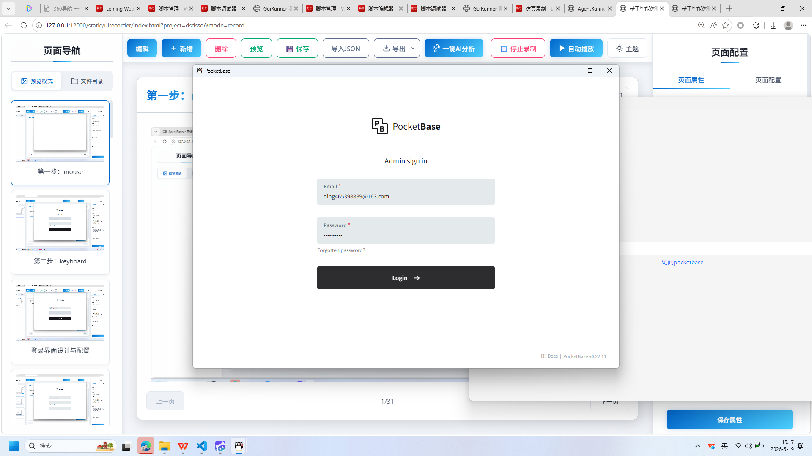

**操作详情**:
+ 操作类型: mouse; 
+ 时间戳: 2026-05-19T15:17:58.396168; 
+ 位置: (939, 685); 
+ 按钮: Button.left; 
+ 时间戳: 2026-05-19T15:17:57.873122

**页面描述**:
该界面提供页面属性的编辑与配置功能，用户可通过右侧表单输入页面标题、链接、上下文信息、测试用例要求及备注信息。左侧导航支持预览模式切换和文件目录管理，中央区域展示页面预览效果。顶部工具栏包含新增、删除、保存、导入导出JSON、一键AI分析、停止录制和自动播放等操作按钮，实现高效的内容管理和自动化测试流程。

# 33. 页面配置与预览

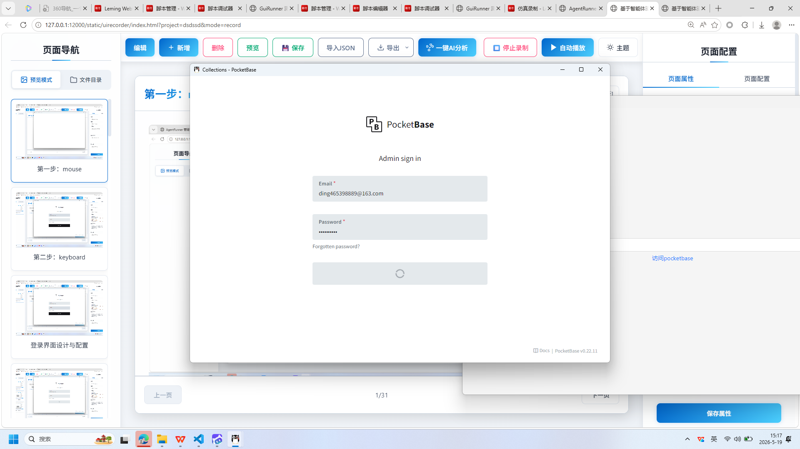

**操作详情**:
+ 操作类型: mouse; 
+ 时间戳: 2026-05-19T15:17:58.989414; 
+ 位置: (945, 680); 
+ 按钮: Button.left; 
+ 时间戳: 2026-05-19T15:17:58.481677

**页面描述**:
该界面提供了一个可视化页面配置工具，用户可以在右侧的‘页面属性’面板中输入标题、链接、上下文信息、测试用例要求和备注信息等字段，完成页面的基本配置。左侧区域用于导航和文件管理，支持预览模式切换。中央区域为页面内容预览区，可实时查看配置效果。顶部功能栏包含编辑、新增、删除、保存、导入导出JSON、一键AI分析、停止录制和自动播放等功能按钮，支持完整的页面开发与测试流程。

# 34. 页面配置与预览

**操作详情**:
+ 操作类型: mouse; 
+ 时间戳: 2026-05-19T15:18:00.349119; 
+ 位置: (494, 362); 
+ 按钮: Button.left; 
+ 时间戳: 2026-05-19T15:17:59.793575

**页面描述**:
该界面用于配置和预览网页内容，左侧提供页面导航和文件目录管理，中间区域展示当前页面的实时预览效果，右侧包含标题、链接、上下文输入、测试用例要求及备注信息等配置项。用户可通过顶部工具栏进行新增、编辑、删除、保存、导入导出JSON、一键AI分析、停止录制和自动播放等操作，实现高效的内容管理和测试流程控制。

# 35. 页面配置与预览

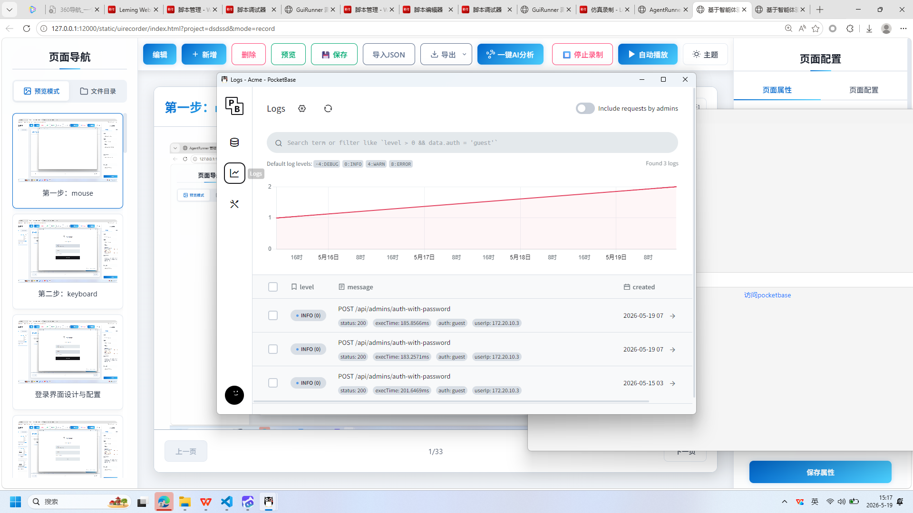

**操作详情**:
+ 操作类型: keyboard; 
+ 时间戳: 2026-05-19T15:18:00.431595; 
+ 输入内容: @1234567890; 
+ 长度: 11; 
+ 首字符: @; 
+ 末字符: 0; 
+ 结束原因: timeout; 
+ 时间戳: 2026-05-19T15:18:00.091217; 
+ 截图类型: 首字符

**页面描述**:
该界面提供页面属性的配置与实时预览功能，用户可在右侧填写标题、链接、上下文信息、测试用例要求及备注等字段，并通过左侧导航栏进行页面管理。中央区域展示当前配置的页面预览效果，支持新增、编辑、删除、保存和导出操作，同时具备一键AI分析和自动播放功能，便于高效完成页面设计与调试。

# 36. 页面配置编辑器

**操作详情**:
+ 操作类型: keyboard; 
+ 时间戳: 2026-05-19T15:18:00.435557; 
+ 输入内容: @1234567890; 
+ 长度: 11; 
+ 首字符: @; 
+ 末字符: 0; 
+ 结束原因: timeout; 
+ 时间戳: 2026-05-19T15:18:00.091217; 
+ 截图类型: 末字符

**页面描述**:
该界面为页面配置编辑器，支持用户对页面属性进行可视化配置。左侧提供页面导航和文件目录管理，中间区域用于预览当前编辑的页面内容，右侧包含标题、链接、上下文输入、测试用例要求及备注信息等字段，可填写并保存页面相关信息。顶部工具栏提供新增、删除、预览、保存、导入导出JSON、AI分析、录制控制等功能，实现高效的内容管理和自动化测试流程配置。

# 37. 页面配置与预览

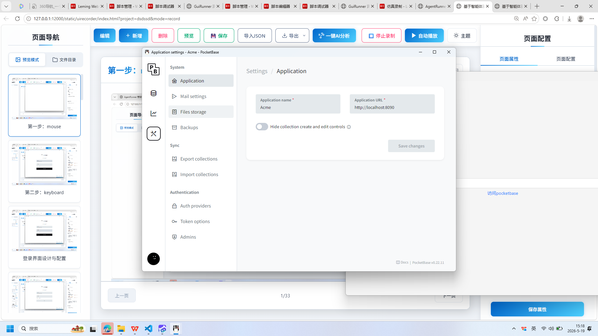

**操作详情**:
+ 操作类型: mouse; 
+ 时间戳: 2026-05-19T15:18:01.039423; 
+ 位置: (486, 451); 
+ 按钮: Button.left; 
+ 时间戳: 2026-05-19T15:18:00.496860

**页面描述**:
该界面用于配置和管理网页内容，支持编辑页面标题、链接、上下文信息、测试用例要求及备注信息。用户可通过左侧导航栏切换预览模式或文件目录，右侧配置面板提供详细的属性设置选项。顶部工具栏包含新增、删除、保存、导入导出JSON、AI分析、录制控制等功能，方便用户进行页面开发与调试。中央区域为页面预览窗口，实时展示当前配置效果，支持分页浏览。

# 38. 页面配置与预览

**操作详情**:
+ 操作类型: mouse; 
+ 时间戳: 2026-05-19T15:18:01.563422; 
+ 位置: (591, 321); 
+ 按钮: Button.left; 
+ 时间戳: 2026-05-19T15:18:01.056393

**页面描述**:
该界面用于配置和预览网页内容，支持标题、链接、上下文信息、测试用例要求及备注信息的编辑。用户可通过右侧属性面板输入相关信息，并在中央区域实时预览效果。顶部工具栏提供新增、删除、保存、导入导出JSON、一键AI分析、停止录制和自动播放等功能，便于高效管理页面配置。

# 39. 页面配置与预览

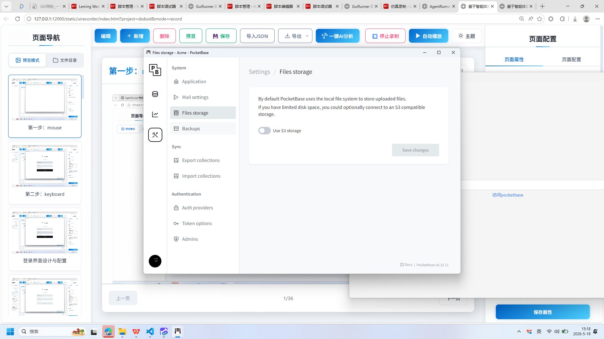

**操作详情**:
+ 操作类型: mouse; 
+ 时间戳: 2026-05-19T15:18:02.041951; 
+ 位置: (603, 360); 
+ 按钮: Button.left; 
+ 时间戳: 2026-05-19T15:18:01.456871

**页面描述**:
该界面提供了一个可视化页面配置工具，用户可以在右侧的属性面板中设置页面标题、链接、上下文信息、测试用例要求及备注信息。左侧导航栏支持预览模式和文件目录管理，中央区域用于展示当前配置的页面内容，并支持翻页操作。顶部功能按钮包括新增、删除、保存、导入导出JSON、一键AI分析、停止录制和自动播放，便于高效完成页面配置与测试流程。

# 40. 页面配置与预览

**操作详情**:
+ 操作类型: mouse; 
+ 时间戳: 2026-05-19T15:18:02.547754; 
+ 位置: (609, 413); 
+ 按钮: Button.left; 
+ 时间戳: 2026-05-19T15:18:02.024932

**页面描述**:
该界面提供了一个可视化页面配置工具，用户可以通过左侧的导航栏管理页面结构，并在右侧的属性面板中设置页面标题、链接、上下文信息、测试用例要求及备注信息。中央区域展示当前页面的实时预览效果，支持编辑、新增、删除、保存等操作，同时具备导入导出JSON配置、一键AI分析和自动播放等功能，便于快速构建和调试页面内容。

# 41. 页面配置与预览

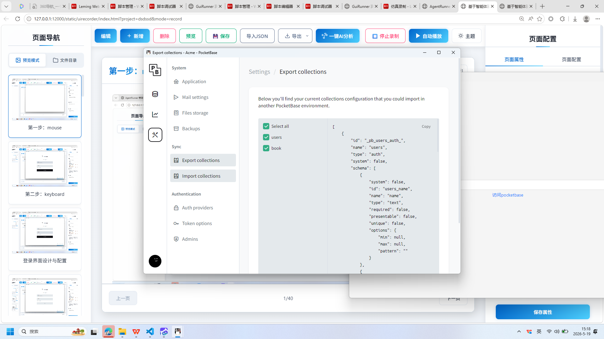

**操作详情**:
+ 操作类型: mouse; 
+ 时间戳: 2026-05-19T15:18:03.185301; 
+ 位置: (607, 505); 
+ 按钮: Button.left; 
+ 时间戳: 2026-05-19T15:18:02.680310

**页面描述**:
该界面提供页面属性的编辑与配置功能，用户可在右侧填写标题、链接、上下文信息、测试用例要求及备注信息。左侧支持页面导航和文件目录管理，顶部工具栏包含新增、删除、保存、导入导出JSON、一键AI分析、停止录制和自动播放等操作选项。中间区域为页面内容预览区，支持实时查看配置效果，底部具备分页导航功能，便于多页面管理。

# 42. 页面配置与预览

**操作详情**:
+ 操作类型: mouse; 
+ 时间戳: 2026-05-19T15:18:03.793956; 
+ 位置: (607, 574); 
+ 按钮: Button.left; 
+ 时间戳: 2026-05-19T15:18:03.256509

**页面描述**:
该界面提供了一个可视化页面配置工具，用户可以在右侧的‘页面属性’面板中输入标题、链接、上下文信息、测试用例要求和备注信息等元数据。左侧区域显示当前编辑页面的预览效果，支持实时更新。顶部功能栏包含编辑、新增、删除、预览、保存、导入导出JSON、一键AI分析、停止录制和自动播放等功能按钮，便于快速操作与管理。底部导航支持多页切换，整体设计旨在提升页面配置效率与用户体验。

# 43. 页面配置与编辑界面

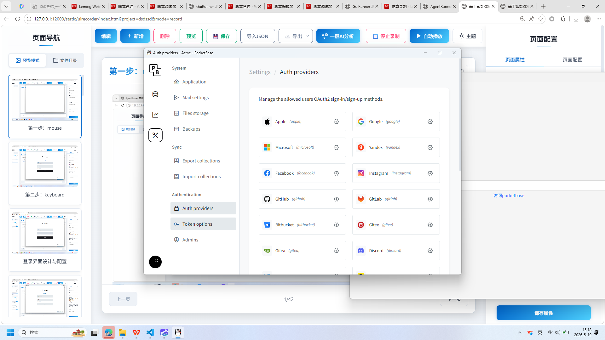

**操作详情**:
+ 操作类型: mouse; 
+ 时间戳: 2026-05-19T15:18:04.294113; 
+ 位置: (612, 656); 
+ 按钮: Button.left; 
+ 时间戳: 2026-05-19T15:18:03.769247

**页面描述**:
该界面为一个可视化页面配置工具，支持用户对页面属性进行编辑和管理。左侧导航栏提供预览模式和文件目录切换功能，中间区域用于展示当前编辑的页面内容，右侧配置面板包含标题、链接、上下文输入、测试用例要求及备注信息等字段，用户可填写相关信息并保存。顶部工具栏提供新增、删除、预览、保存、导入导出JSON、一键AI分析、停止录制和自动播放等功能按钮，便于高效完成页面配置与测试任务。

# 44. 页面配置与预览

**操作详情**:
+ 操作类型: mouse; 
+ 时间戳: 2026-05-19T15:18:04.784369; 
+ 位置: (614, 710); 
+ 按钮: Button.left; 
+ 时间戳: 2026-05-19T15:18:04.180575

**页面描述**:
该界面提供页面属性的配置功能，用户可在右侧输入标题、链接、上下文信息、测试用例要求及备注信息。左侧导航支持页面切换和文件目录管理，顶部工具栏包含编辑、新增、删除、预览、保存、导入导出JSON、AI分析、停止录制和自动播放等功能按钮。中间区域为页面预览窗口，可实时查看配置效果，底部分页控件支持多页内容浏览。整体设计便于用户进行页面内容的快速配置与调试。

# 45. 页面配置与预览

**操作详情**:
+ 操作类型: mouse; 
+ 时间戳: 2026-05-19T15:18:05.266892; 
+ 位置: (604, 756); 
+ 按钮: Button.left; 
+ 时间戳: 2026-05-19T15:18:04.608448

**页面描述**:
该界面提供了一个可视化页面配置工具，用户可以通过左侧的导航栏进行页面管理，包括新建、编辑和删除页面。右侧的‘页面属性’面板允许用户输入标题、链接、上下文信息、测试用例要求及备注信息，并通过‘保存属性’按钮保存配置。中央区域用于预览当前页面内容，支持一键AI分析、自动播放等功能，方便用户在设计过程中实时查看效果并进行调整。

# 46. 页面配置与预览

**操作详情**:
+ 操作类型: mouse; 
+ 时间戳: 2026-05-19T15:18:07.856128; 
+ 位置: (485, 842); 
+ 按钮: Button.left; 
+ 时间戳: 2026-05-19T15:18:07.344505

**页面描述**:
该界面提供了一个直观的页面配置与预览功能，用户可以在右侧的‘页面属性’面板中输入标题、链接、上下文信息、测试用例要求及备注信息等，完成页面的基本设置。左侧的‘页面导航’区域支持预览模式和文件目录管理，便于在多页面间切换。中间区域展示当前页面的实时预览效果，用户可随时查看配置后的页面呈现状态。顶部工具栏提供了编辑、新增、删除、保存、导入导出JSON、一键AI分析、停止录制和自动播放等功能按钮，支持高效的页面开发与调试流程。整体设计注重操作便捷性与可视化反馈，适用于快速构建和调整网页内容。

# 47. 页面配置与预览

**操作详情**:
+ 操作类型: mouse; 
+ 时间戳: 2026-05-19T15:18:08.653784; 
+ 位置: (497, 844); 
+ 按钮: Button.left; 
+ 时间戳: 2026-05-19T15:18:08.096139

**页面描述**:
该界面提供页面属性的编辑与配置功能，用户可在右侧面板输入标题、链接、上下文信息、测试用例要求及备注信息。左侧导航支持预览模式和文件目录切换，中央区域展示当前页面的实时预览效果。顶部工具栏包含新增、删除、保存、导入导出JSON、AI分析、录制控制和自动播放等功能按钮，支持完整的页面管理流程。

# 48. 页面配置与预览

**操作详情**:
+ 操作类型: mouse; 
+ 时间戳: 2026-05-19T15:18:09.318280; 
+ 位置: (532, 792); 
+ 按钮: Button.left; 
+ 时间戳: 2026-05-19T15:18:08.824783

**页面描述**:
该界面提供页面属性的编辑与配置功能，用户可在右侧面板设置页面标题、链接、上下文信息、测试用例要求及备注内容。左侧导航支持页面管理与文件目录浏览，中央区域用于实时预览当前配置效果。顶部工具栏包含新增、删除、保存、导入导出JSON、AI分析、录制控制和自动播放等操作选项，实现全流程的页面配置与测试管理。

# 49. 页面配置与预览

**操作详情**:
+ 操作类型: mouse; 
+ 时间戳: 2026-05-19T15:18:10.814143; 
+ 位置: (1431, 172); 
+ 按钮: Button.left; 
+ 时间戳: 2026-05-19T15:18:10.328733

**页面描述**:
该界面提供了一个可视化页面配置工具，用户可以在右侧的‘页面属性’面板中设置页面标题、链接、上下文信息、测试用例要求和备注信息。左侧的‘页面导航’区域支持预览模式和文件目录管理，中央区域用于实时预览当前配置的页面内容。顶部工具栏包含编辑、新增、删除、保存、导入导出、AI分析、停止录制和自动播放等功能按钮，支持高效的页面管理和自动化操作。

# 50. 页面配置与编辑

**操作详情**:
+ 操作类型: mouse; 
+ 时间戳: 2026-05-19T15:18:11.729017; 
+ 位置: (1456, 249); 
+ 按钮: Button.left; 
+ 时间戳: 2026-05-19T15:18:11.200456

**页面描述**:
该界面提供了一个可视化页面配置工具，用户可以通过左侧导航栏选择预览模式或文件目录，中央区域用于展示和编辑当前页面内容。右侧的‘页面属性’面板允许用户输入标题、链接、上下文信息、测试用例要求及备注信息，并通过‘保存属性’按钮提交修改。顶部工具栏支持新建、删除、预览、保存、导入导出JSON数据、一键AI分析、停止录制和自动播放等功能，适用于快速构建和管理页面配置。

# 51. 页面配置与预览

**操作详情**:
+ 操作类型: mouse; 
+ 时间戳: 2026-05-19T15:18:13.178317; 
+ 位置: (1506, 236); 
+ 按钮: Button.left; 
+ 时间戳: 2026-05-19T15:18:12.672507

**页面描述**:
该界面提供了一个可视化页面配置工具，用户可以通过左侧导航栏管理页面结构，并在中央区域实时预览页面内容。右侧的‘页面属性’面板允许用户输入标题、链接、上下文信息、测试用例要求及备注等元数据，完成页面的详细配置。顶部功能按钮支持编辑、新增、删除、保存、导入导出JSON数据以及一键AI分析和自动播放等功能，提升操作效率。当前显示的是一个空白的预览窗口，用于展示配置后的页面效果。

---

*报告由 AgentRunner Markdown Exporter 生成*