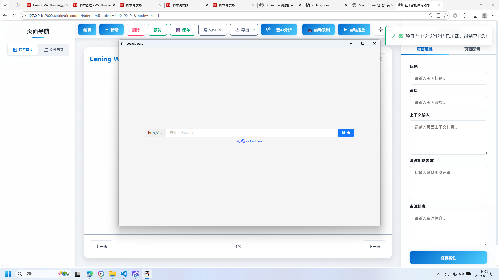
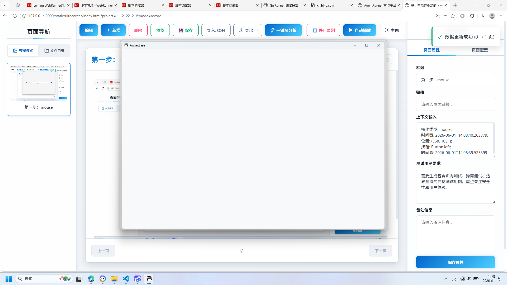
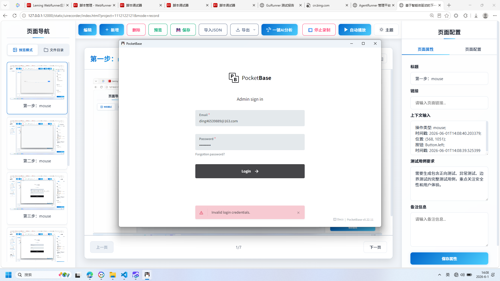
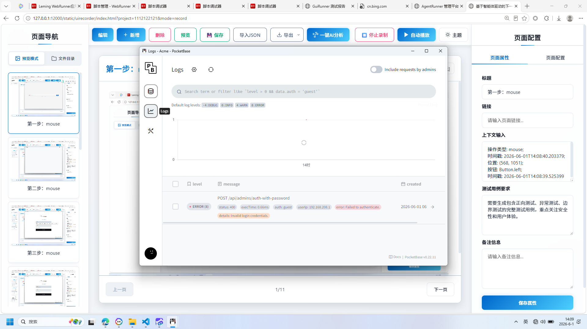
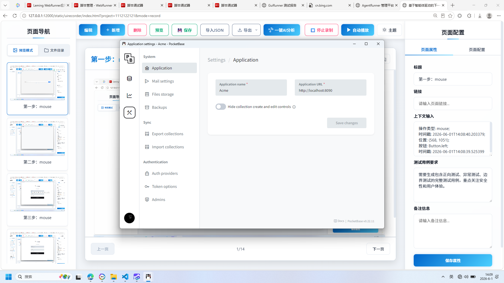
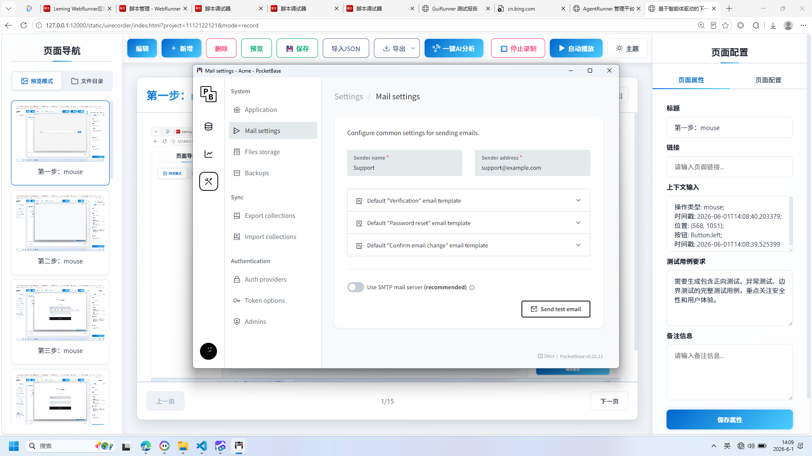
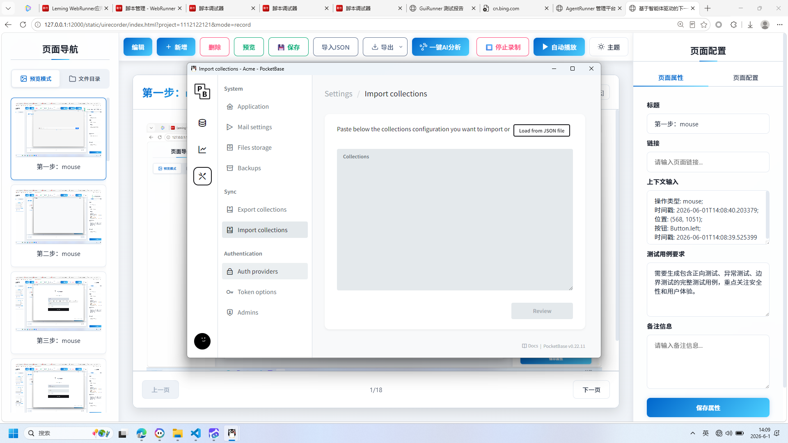
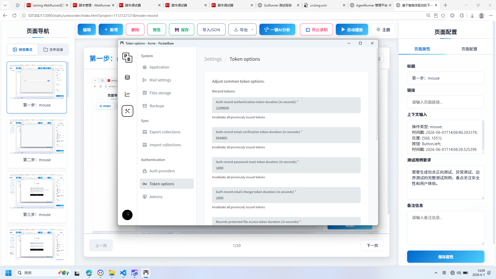
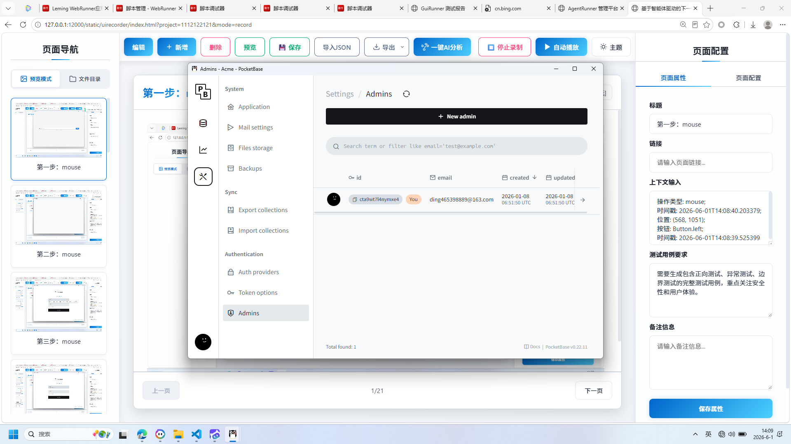

# 基于智能体驱动的下一代测试平台 AgentRunner

+ **生成时间**: 2026-06-01 14:09:30
+ **数据源**: F:\workspace\yfjzworkspace\webspace\ai-template\agentrunner\uirecordercore\filestorage\1112122121\records.json
+ **操作总数**: 27

# 1. 第一步：mouse

**操作详情**:
+ 操作类型: mouse; 
+ 时间戳: 2026-06-01T14:08:40.203379; 
+ 位置: (568, 1051); 
+ 按钮: Button.left; 
+ 时间戳: 2026-06-01T14:08:39.525399

# 2. 第二步：mouse

**操作详情**:
+ 操作类型: mouse; 
+ 时间戳: 2026-06-01T14:08:41.208682; 
+ 位置: (973, 554); 
+ 按钮: Button.left; 
+ 时间戳: 2026-06-01T14:08:40.675437

# 3. 第三步：mouse

**操作详情**:
+ 操作类型: mouse; 
+ 时间戳: 2026-06-01T14:08:42.516229; 
+ 位置: (888, 473); 
+ 按钮: Button.left; 
+ 时间戳: 2026-06-01T14:08:41.961242

# 4. 第四步：keyboard

**操作详情**:
+ 操作类型: keyboard; 
+ 时间戳: 2026-06-01T14:08:48.036652; 
+ 输入内容: ding46539889@163.com; 
+ 长度: 20; 
+ 首字符: d; 
+ 末字符: m; 
+ 结束原因: tab_key; 
+ 时间戳: 2026-06-01T14:08:47.532097; 
+ 截图类型: 首字符

# 5. 第五步：keyboard

**操作详情**:
+ 操作类型: keyboard; 
+ 时间戳: 2026-06-01T14:08:48.042614; 
+ 输入内容: ding46539889@163.com; 
+ 长度: 20; 
+ 首字符: d; 
+ 末字符: m; 
+ 结束原因: tab_key; 
+ 时间戳: 2026-06-01T14:08:47.532097; 
+ 截图类型: 末字符

# 6. 第六步：mouse

**操作详情**:
+ 操作类型: mouse; 
+ 时间戳: 2026-06-01T14:08:52.654343; 
+ 位置: (860, 669); 
+ 按钮: Button.left; 
+ 时间戳: 2026-06-01T14:08:52.117134

# 7. 第七步：mouse

**操作详情**:
+ 操作类型: mouse; 
+ 时间戳: 2026-06-01T14:08:53.411942; 
+ 位置: (860, 669); 
+ 按钮: Button.left; 
+ 时间戳: 2026-06-01T14:08:52.873650

# 8. 第八步：keyboard

**操作详情**:
+ 操作类型: keyboard; 
+ 时间戳: 2026-06-01T14:08:53.987987; 
+ 输入内容: 1234567890; 
+ 长度: 10; 
+ 首字符: 1; 
+ 末字符: 0; 
+ 结束原因: timeout; 
+ 时间戳: 2026-06-01T14:08:53.508960; 
+ 截图类型: 首字符

# 9. 第九步：keyboard

**操作详情**:
+ 操作类型: keyboard; 
+ 时间戳: 2026-06-01T14:08:53.994080; 
+ 输入内容: 1234567890; 
+ 长度: 10; 
+ 首字符: 1; 
+ 末字符: 0; 
+ 结束原因: timeout; 
+ 时间戳: 2026-06-01T14:08:53.508960; 
+ 截图类型: 末字符

# 10. 第十步：mouse

**操作详情**:
+ 操作类型: mouse; 
+ 时间戳: 2026-06-01T14:08:57.320062; 
+ 位置: (845, 469); 
+ 按钮: Button.left; 
+ 时间戳: 2026-06-01T14:08:56.787334

# 11. 第十一步：mouse

**操作详情**:
+ 操作类型: mouse; 
+ 时间戳: 2026-06-01T14:08:59.610511; 
+ 位置: (877, 636); 
+ 按钮: Button.left; 
+ 时间戳: 2026-06-01T14:08:59.080862

# 12. 第十二步：keyboard

**操作详情**:
+ 操作类型: keyboard; 
+ 时间戳: 2026-06-01T14:09:01.193062; 
+ 输入内容: 8; 
+ 长度: 1; 
+ 首字符: 8; 
+ 末字符: 8; 
+ 结束原因: timeout; 
+ 时间戳: 2026-06-01T14:09:00.694351; 
+ 截图类型: 首字符

# 13. 第十三步：keyboard

**操作详情**:
+ 操作类型: keyboard; 
+ 时间戳: 2026-06-01T14:09:01.200588; 
+ 输入内容: 8; 
+ 长度: 1; 
+ 首字符: 8; 
+ 末字符: 8; 
+ 结束原因: timeout; 
+ 时间戳: 2026-06-01T14:09:00.694351; 
+ 截图类型: 末字符

# 14. 第十四步：mouse

**操作详情**:
+ 操作类型: mouse; 
+ 时间戳: 2026-06-01T14:09:01.306922; 
+ 位置: (509, 352); 
+ 按钮: Button.left; 
+ 时间戳: 2026-06-01T14:09:00.752802

# 15. 第十五步：mouse

**操作详情**:
+ 操作类型: mouse; 
+ 时间戳: 2026-06-01T14:09:02.026677; 
+ 位置: (484, 445); 
+ 按钮: Button.left; 
+ 时间戳: 2026-06-01T14:09:01.473896

# 16. 第十六步：mouse

**操作详情**:
+ 操作类型: mouse; 
+ 时间戳: 2026-06-01T14:09:02.838655; 
+ 位置: (622, 310); 
+ 按钮: Button.left; 
+ 时间戳: 2026-06-01T14:09:02.295444

# 17. 第十七步：mouse

**操作详情**:
+ 操作类型: mouse; 
+ 时间戳: 2026-06-01T14:09:03.461778; 
+ 位置: (618, 375); 
+ 按钮: Button.left; 
+ 时间戳: 2026-06-01T14:09:02.823665

# 18. 第十八步：mouse

**操作详情**:
+ 操作类型: mouse; 
+ 时间戳: 2026-06-01T14:09:04.091039; 
+ 位置: (615, 404); 
+ 按钮: Button.left; 
+ 时间戳: 2026-06-01T14:09:03.345849

# 19. 第十九步：mouse

**操作详情**:
+ 操作类型: mouse; 
+ 时间戳: 2026-06-01T14:09:04.721036; 
+ 位置: (620, 517); 
+ 按钮: Button.left; 
+ 时间戳: 2026-06-01T14:09:04.066745

# 20. 第二十步：mouse

**操作详情**:
+ 操作类型: mouse; 
+ 时间戳: 2026-06-01T14:09:05.300719; 
+ 位置: (619, 560); 
+ 按钮: Button.left; 
+ 时间戳: 2026-06-01T14:09:04.595380

# 21. 第21步：mouse

**操作详情**:
+ 操作类型: mouse; 
+ 时间戳: 2026-06-01T14:09:05.938845; 
+ 位置: (600, 663); 
+ 按钮: Button.left; 
+ 时间戳: 2026-06-01T14:09:05.345866

# 22. 第22步：mouse

**操作详情**:
+ 操作类型: mouse; 
+ 时间戳: 2026-06-01T14:09:06.529817; 
+ 位置: (600, 715); 
+ 按钮: Button.left; 
+ 时间戳: 2026-06-01T14:09:05.967382

# 23. 第23步：mouse

**操作详情**:
+ 操作类型: mouse; 
+ 时间戳: 2026-06-01T14:09:07.253388; 
+ 位置: (599, 760); 
+ 按钮: Button.left; 
+ 时间戳: 2026-06-01T14:09:06.660455

# 24. 第24步：mouse

**操作详情**:
+ 操作类型: mouse; 
+ 时间戳: 2026-06-01T14:09:07.970922; 
+ 位置: (497, 834); 
+ 按钮: Button.left; 
+ 时间戳: 2026-06-01T14:09:07.424429

# 25. 第25步：mouse

**操作详情**:
+ 操作类型: mouse; 
+ 时间戳: 2026-06-01T14:09:08.776298; 
+ 位置: (553, 784); 
+ 按钮: Button.left; 
+ 时间戳: 2026-06-01T14:09:08.190476

# 26. 第26步：mouse

**操作详情**:
+ 操作类型: mouse; 
+ 时间戳: 2026-06-01T14:09:10.457614; 
+ 位置: (1445, 174); 
+ 按钮: Button.left; 
+ 时间戳: 2026-06-01T14:09:09.903712

# 27. 第27步：mouse

**操作详情**:
+ 操作类型: mouse; 
+ 时间戳: 2026-06-01T14:09:11.037330; 
+ 位置: (1445, 174); 
+ 按钮: Button.left; 
+ 时间戳: 2026-06-01T14:09:10.489167

---

*报告由 AgentRunner Markdown Exporter 生成*