# 基于智能体驱动的下一代测试平台 AgentRunner

+ **生成时间**: 2026-06-02 10:35:55
+ **数据源**: F:\workspace\yfjzworkspace\webspace\ai-template\agentrunner\uirecordercore\filestorage\1112122121\records.json
+ **操作总数**: 27

# 1. 页面URL配置弹窗

**操作详情**:
+ 操作类型: mouse; 
+ 时间戳: 2026-06-01T14:08:40.203379; 
+ 位置: (568, 1051); 
+ 按钮: Button.left; 
+ 时间戳: 2026-06-01T14:08:39.525399

**页面描述**:
用于输入并确认目标页面的访问地址。用户可在弹窗中选择协议（如http://），填写完整网址，并点击“确定”按钮保存该页面的访问链接，以便后续自动化测试或录制操作使用。

# 2. 页面访问地址配置

**操作详情**:
+ 操作类型: mouse; 
+ 时间戳: 2026-06-01T14:08:41.208682; 
+ 位置: (973, 554); 
+ 按钮: Button.left; 
+ 时间戳: 2026-06-01T14:08:40.675437

**页面描述**:
用于配置目标网页的访问地址，支持输入URL并确认。界面提供协议选择（如http://）、地址输入框及确认按钮，便于用户快速指定要测试或录制的网页资源。

# 3. 页面属性配置与URL输入

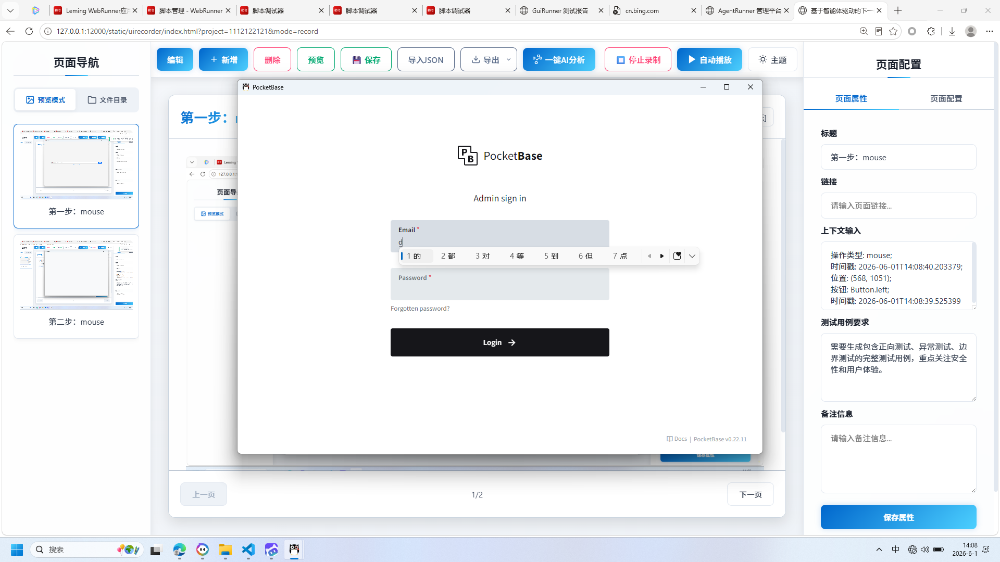

**操作详情**:
+ 操作类型: mouse; 
+ 时间戳: 2026-06-01T14:08:42.516229; 
+ 位置: (888, 473); 
+ 按钮: Button.left; 
+ 时间戳: 2026-06-01T14:08:41.961242

**页面描述**:
用户可通过此界面配置页面的基本属性，包括标题、链接、上下文输入、测试用例要求及备注信息。当前弹窗用于输入目标页面的访问地址（如pocket_base），并确认后将启动录制流程，支持自动化测试脚本的创建与管理。

# 4. 页面属性配置弹窗

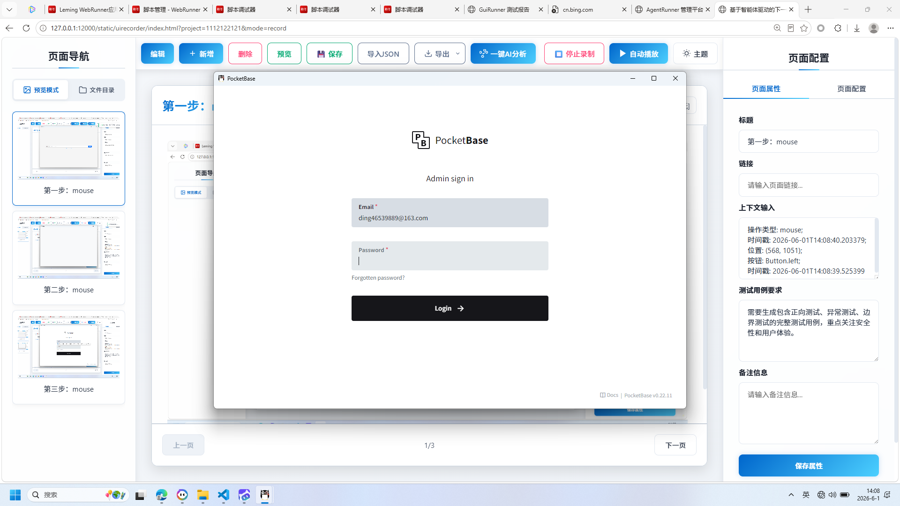

**操作详情**:
+ 操作类型: keyboard; 
+ 时间戳: 2026-06-01T14:08:48.036652; 
+ 输入内容: ding46539889@163.com; 
+ 长度: 20; 
+ 首字符: d; 
+ 末字符: m; 
+ 结束原因: tab_key; 
+ 时间戳: 2026-06-01T14:08:47.532097; 
+ 截图类型: 首字符

**页面描述**:
用于配置页面相关属性的弹窗界面，包含标题、链接、上下文输入、测试用例要求及备注信息等字段。用户可通过填写这些内容来定义页面行为和测试需求，并点击“保存属性”按钮提交配置。

# 5. 页面属性配置与URL输入

**操作详情**:
+ 操作类型: keyboard; 
+ 时间戳: 2026-06-01T14:08:48.042614; 
+ 输入内容: ding46539889@163.com; 
+ 长度: 20; 
+ 首字符: d; 
+ 末字符: m; 
+ 结束原因: tab_key; 
+ 时间戳: 2026-06-01T14:08:47.532097; 
+ 截图类型: 末字符

**页面描述**:
用户可通过此界面配置页面属性，包括标题、链接、上下文输入、测试用例要求及备注信息。同时支持输入目标页面的访问地址并确认，用于后续自动化测试或录制流程。

# 6. 页面URL录入与属性配置

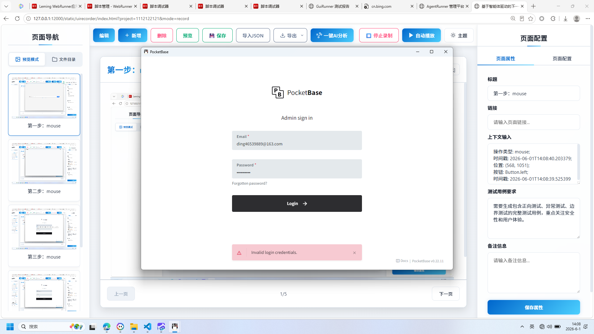

**操作详情**:
+ 操作类型: mouse; 
+ 时间戳: 2026-06-01T14:08:52.654343; 
+ 位置: (860, 669); 
+ 按钮: Button.left; 
+ 时间戳: 2026-06-01T14:08:52.117134

**页面描述**:
用户可通过弹窗输入目标页面的访问地址，系统将自动加载并开始录制。右侧面板允许详细配置页面标题、链接、上下文信息、测试用例要求及备注，所有设置完成后点击“保存属性”即可生效。

# 7. 页面属性配置

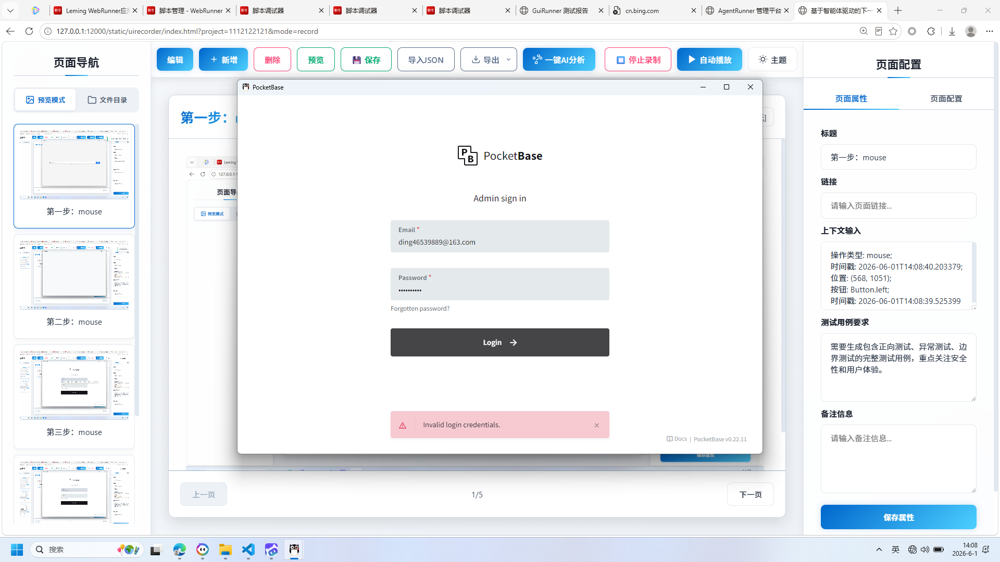

**操作详情**:
+ 操作类型: mouse; 
+ 时间戳: 2026-06-01T14:08:53.411942; 
+ 位置: (860, 669); 
+ 按钮: Button.left; 
+ 时间戳: 2026-06-01T14:08:52.873650

**页面描述**:
用于配置目标网页的详细信息，包括标题、链接、上下文输入、测试用例要求及备注。用户可通过填写表单并点击“保存属性”按钮，将设置应用于当前项目，支持自动化测试流程的定制化管理。

# 8. 页面属性配置与URL输入

**操作详情**:
+ 操作类型: keyboard; 
+ 时间戳: 2026-06-01T14:08:53.987987; 
+ 输入内容: 1234567890; 
+ 长度: 10; 
+ 首字符: 1; 
+ 末字符: 0; 
+ 结束原因: timeout; 
+ 时间戳: 2026-06-01T14:08:53.508960; 
+ 截图类型: 首字符

**页面描述**:
该界面用于配置页面的元信息和访问地址。用户可在右侧填写页面标题、链接、上下文输入、测试用例要求及备注信息，并通过底部按钮保存属性。弹窗中提供URL输入框，支持选择协议并直接访问指定网页，点击“确定”后完成页面关联设置。

# 9. 页面属性配置与录制管理

**操作详情**:
+ 操作类型: keyboard; 
+ 时间戳: 2026-06-01T14:08:53.994080; 
+ 输入内容: 1234567890; 
+ 长度: 10; 
+ 首字符: 1; 
+ 末字符: 0; 
+ 结束原因: timeout; 
+ 时间戳: 2026-06-01T14:08:53.508960; 
+ 截图类型: 末字符

**页面描述**:
该界面用于配置页面的标题、链接、上下文输入及测试用例要求等属性，并支持启动录制功能。用户可通过弹窗输入访问地址，右侧表单填写详细信息，底部按钮可保存设置。顶部工具栏提供编辑、新增、删除、预览、保存、导入导出等功能，便于高效管理页面元素和自动化测试流程。

# 10. 页面属性配置与URL输入

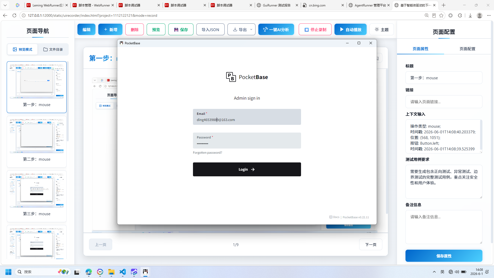

**操作详情**:
+ 操作类型: mouse; 
+ 时间戳: 2026-06-01T14:08:57.320062; 
+ 位置: (845, 469); 
+ 按钮: Button.left; 
+ 时间戳: 2026-06-01T14:08:56.787334

**页面描述**:
该界面用于配置页面属性，包括标题、链接、上下文输入、测试用例要求及备注信息。用户可通过弹窗输入目标页面的访问地址，并确认以完成页面录制设置。

# 11. 页面URL配置弹窗

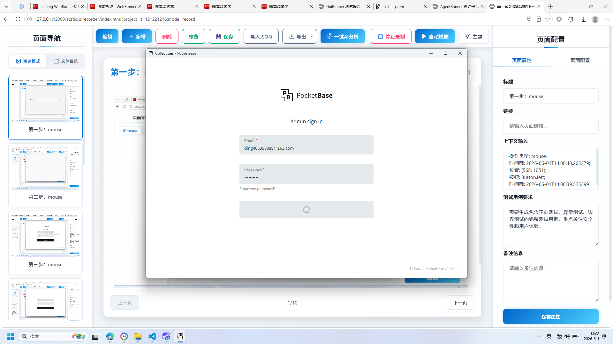

**操作详情**:
+ 操作类型: mouse; 
+ 时间戳: 2026-06-01T14:08:59.610511; 
+ 位置: (877, 636); 
+ 按钮: Button.left; 
+ 时间戳: 2026-06-01T14:08:59.080862

**页面描述**:
用于输入并确认目标网页的访问地址。用户可在弹窗中选择协议（如http://），输入完整网址，并点击“确定”按钮保存配置，以便后续自动化测试或录制操作使用。

# 12. 页面URL输入弹窗

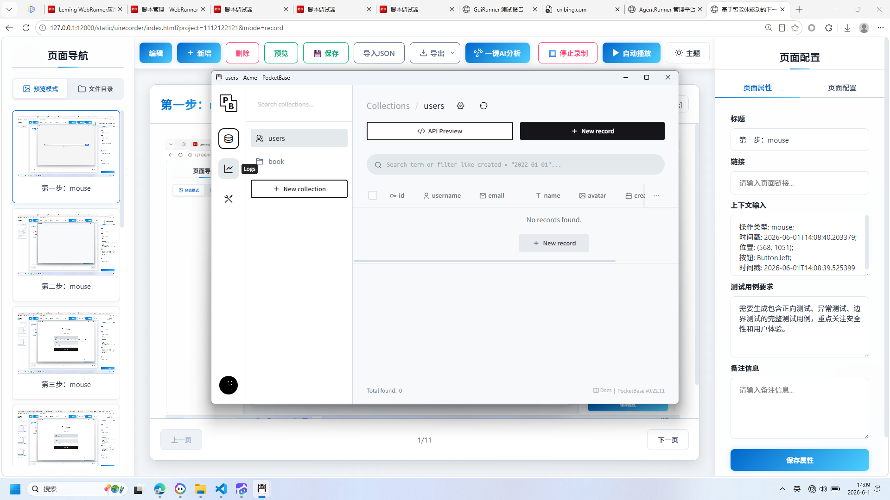

**操作详情**:
+ 操作类型: keyboard; 
+ 时间戳: 2026-06-01T14:09:01.193062; 
+ 输入内容: 8; 
+ 长度: 1; 
+ 首字符: 8; 
+ 末字符: 8; 
+ 结束原因: timeout; 
+ 时间戳: 2026-06-01T14:09:00.694351; 
+ 截图类型: 首字符

**页面描述**:
用于录入目标网页地址的弹出窗口。用户可在此输入完整的访问链接，选择协议（如http://），并点击“确定”按钮确认，以便后续进行页面录制或测试操作。

# 13. 页面属性配置与URL输入

**操作详情**:
+ 操作类型: keyboard; 
+ 时间戳: 2026-06-01T14:09:01.200588; 
+ 输入内容: 8; 
+ 长度: 1; 
+ 首字符: 8; 
+ 末字符: 8; 
+ 结束原因: timeout; 
+ 时间戳: 2026-06-01T14:09:00.694351; 
+ 截图类型: 末字符

**页面描述**:
用户可在弹窗中输入目标网页的访问地址，系统将自动识别并关联至当前页面属性配置。右侧面板提供标题、链接、上下文输入、测试用例要求及备注信息的填写区域，便于全面定义页面行为与测试条件。

# 14. 页面URL配置弹窗

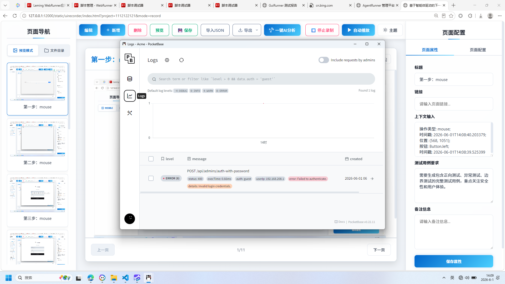

**操作详情**:
+ 操作类型: mouse; 
+ 时间戳: 2026-06-01T14:09:01.306922; 
+ 位置: (509, 352); 
+ 按钮: Button.left; 
+ 时间戳: 2026-06-01T14:09:00.752802

**页面描述**:
用于输入并确认目标网页的访问地址。用户可在弹窗中选择协议（如http://），填写完整网址，并点击“确定”按钮保存配置，以便后续自动化测试或录制流程使用。

# 15. 页面URL录入与属性配置

**操作详情**:
+ 操作类型: mouse; 
+ 时间戳: 2026-06-01T14:09:02.026677; 
+ 位置: (484, 445); 
+ 按钮: Button.left; 
+ 时间戳: 2026-06-01T14:09:01.473896

**页面描述**:
用户可通过弹窗输入目标页面的访问地址，系统将自动加载并开始录制该页面的操作流程。同时，在右侧面板中可详细配置页面标题、链接、上下文信息、测试用例要求及备注等属性，便于后续自动化测试或脚本生成。

# 16. 页面URL配置弹窗

**操作详情**:
+ 操作类型: mouse; 
+ 时间戳: 2026-06-01T14:09:02.838655; 
+ 位置: (622, 310); 
+ 按钮: Button.left; 
+ 时间戳: 2026-06-01T14:09:02.295444

**页面描述**:
用于输入并确认目标页面的访问地址。用户可在弹窗中选择协议类型（如http://），填写具体的网址，点击“确定”按钮后将该地址关联至当前测试用例或页面对象，以便后续自动化操作识别和访问。

# 17. 页面URL录入与属性配置

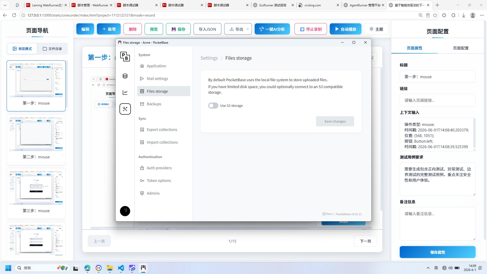

**操作详情**:
+ 操作类型: mouse; 
+ 时间戳: 2026-06-01T14:09:03.461778; 
+ 位置: (618, 375); 
+ 按钮: Button.left; 
+ 时间戳: 2026-06-01T14:09:02.823665

**页面描述**:
用户可通过弹窗输入目标页面的访问地址，并在右侧面板中填写页面标题、链接、上下文信息、测试用例要求及备注。所有配置完成后，点击“保存属性”按钮即可保存当前页面设置。

# 18. 页面URL配置弹窗

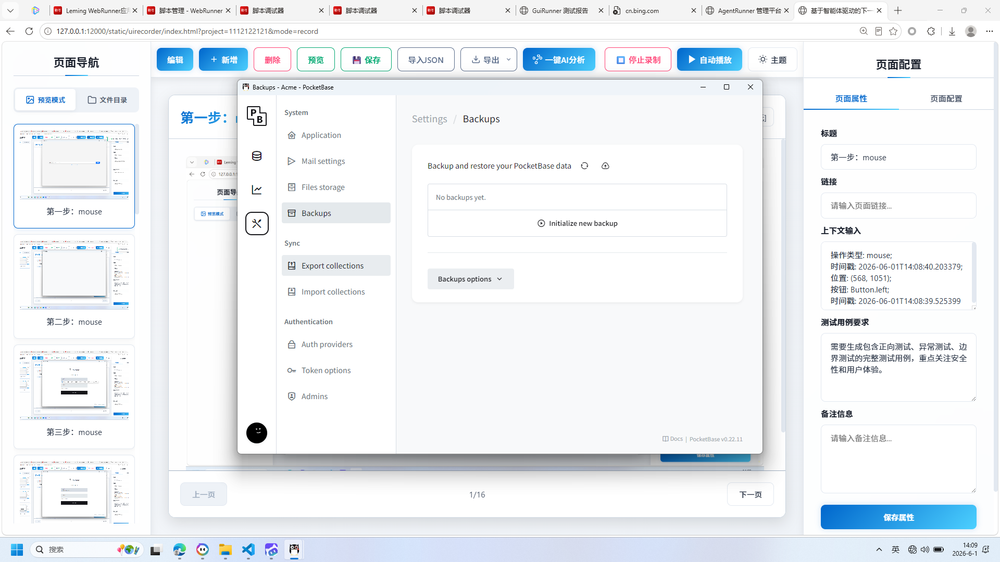

**操作详情**:
+ 操作类型: mouse; 
+ 时间戳: 2026-06-01T14:09:04.091039; 
+ 位置: (615, 404); 
+ 按钮: Button.left; 
+ 时间戳: 2026-06-01T14:09:03.345849

**页面描述**:
用于输入并确认目标网页的访问地址。用户可在弹窗中填写完整的URL链接，点击“确定”按钮后，系统将记录该页面信息并将其纳入当前测试项目。

# 19. 页面属性配置弹窗

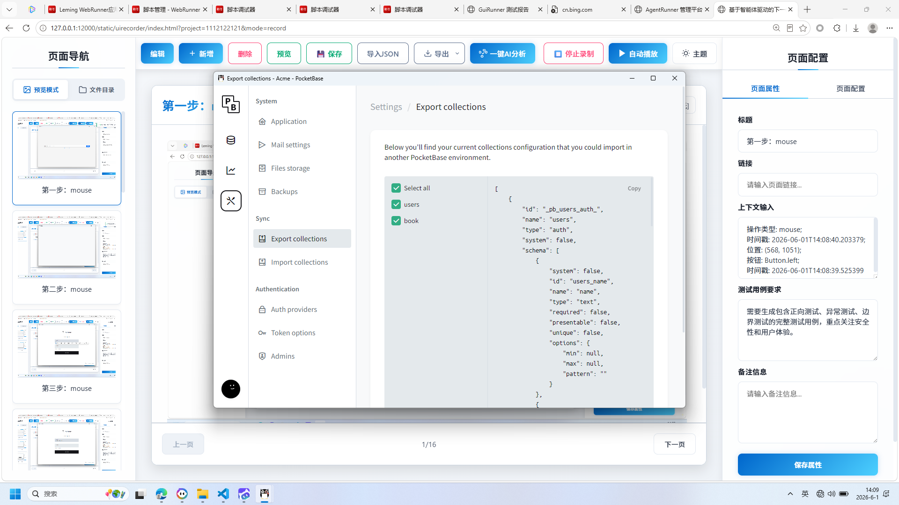

**操作详情**:
+ 操作类型: mouse; 
+ 时间戳: 2026-06-01T14:09:04.721036; 
+ 位置: (620, 517); 
+ 按钮: Button.left; 
+ 时间戳: 2026-06-01T14:09:04.066745

**页面描述**:
用于配置目标网页的详细信息，包括标题、链接、上下文输入、测试用例要求及备注。用户可在此弹窗中填写必要字段，点击“确定”按钮保存设置。

# 20. 页面URL配置弹窗

**操作详情**:
+ 操作类型: mouse; 
+ 时间戳: 2026-06-01T14:09:05.300719; 
+ 位置: (619, 560); 
+ 按钮: Button.left; 
+ 时间戳: 2026-06-01T14:09:04.595380

**页面描述**:
用于输入并确认目标网页的访问地址。用户可在弹窗中选择协议（如http://），填写完整网址，并点击“确定”按钮保存配置，以便后续自动化测试或录制操作引用该页面。

# 21. 页面URL配置弹窗

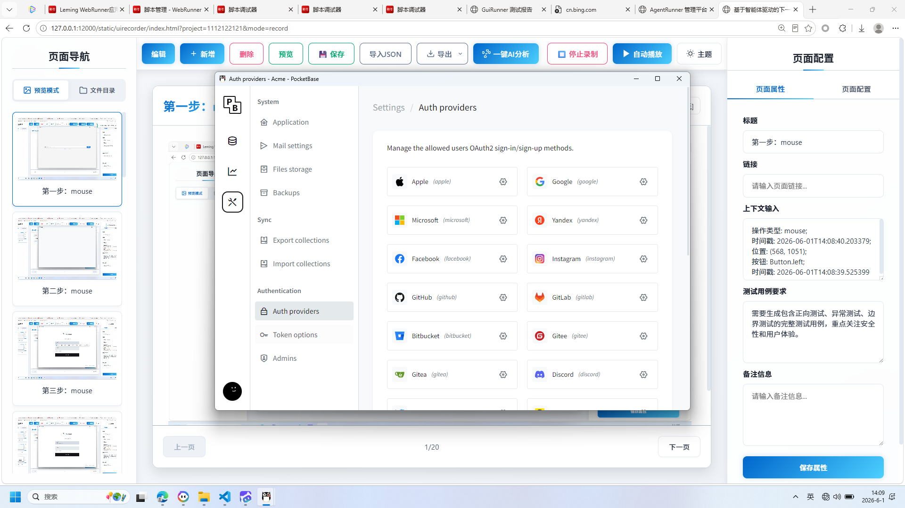

**操作详情**:
+ 操作类型: mouse; 
+ 时间戳: 2026-06-01T14:09:05.938845; 
+ 位置: (600, 663); 
+ 按钮: Button.left; 
+ 时间戳: 2026-06-01T14:09:05.345866

**页面描述**:
用于输入并确认目标网页的访问地址。用户可在弹窗中选择协议（如http://），填写完整网址，并点击“确定”按钮保存配置，以便后续自动化测试或录制操作使用。

# 22. 页面URL配置弹窗

**操作详情**:
+ 操作类型: mouse; 
+ 时间戳: 2026-06-01T14:09:06.529817; 
+ 位置: (600, 715); 
+ 按钮: Button.left; 
+ 时间戳: 2026-06-01T14:09:05.967382

**页面描述**:
用于输入并确认目标网页的访问地址。用户可在弹窗中选择协议（如http://），输入完整网址，并点击“确定”按钮完成配置，以便后续自动化测试或录制操作引用该页面。

# 23. 页面属性配置与URL输入

**操作详情**:
+ 操作类型: mouse; 
+ 时间戳: 2026-06-01T14:09:07.253388; 
+ 位置: (599, 760); 
+ 按钮: Button.left; 
+ 时间戳: 2026-06-01T14:09:06.660455

**页面描述**:
用户可在弹窗中输入目标页面的访问地址，右侧面板提供标题、链接、上下文输入、测试用例要求及备注等详细属性编辑区，支持一键保存配置。

# 24. 页面URL录入与属性配置

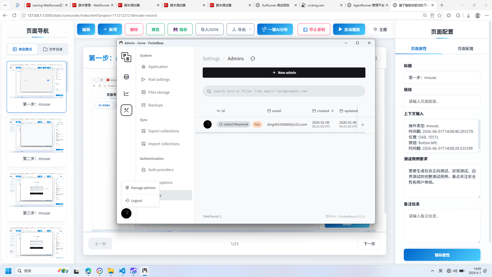

**操作详情**:
+ 操作类型: mouse; 
+ 时间戳: 2026-06-01T14:09:07.970922; 
+ 位置: (497, 834); 
+ 按钮: Button.left; 
+ 时间戳: 2026-06-01T14:09:07.424429

**页面描述**:
用于输入并确认目标页面的访问地址，同时支持配置页面标题、链接、上下文信息、测试用例要求及备注等详细属性，便于后续自动化测试或录制操作。

# 25. 页面URL配置弹窗

**操作详情**:
+ 操作类型: mouse; 
+ 时间戳: 2026-06-01T14:09:08.776298; 
+ 位置: (553, 784); 
+ 按钮: Button.left; 
+ 时间戳: 2026-06-01T14:09:08.190476

**页面描述**:
用于输入并确认目标网页的访问地址。用户可在弹窗中填写完整的URL（如http://example.com），点击“确定”按钮后，系统将记录该地址作为测试或录制任务的目标页面。

# 26. 页面URL配置弹窗

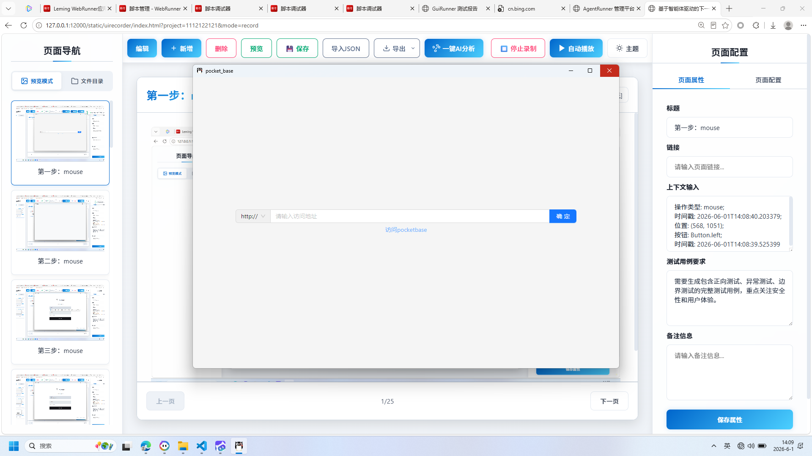

**操作详情**:
+ 操作类型: mouse; 
+ 时间戳: 2026-06-01T14:09:10.457614; 
+ 位置: (1445, 174); 
+ 按钮: Button.left; 
+ 时间戳: 2026-06-01T14:09:09.903712

**页面描述**:
用于输入并确认目标页面的访问地址。用户可在弹窗中填写完整的URL链接，点击“确定”按钮后，系统将记录该页面地址，以便后续自动化测试或录制操作使用。

# 27. 页面属性配置与URL输入

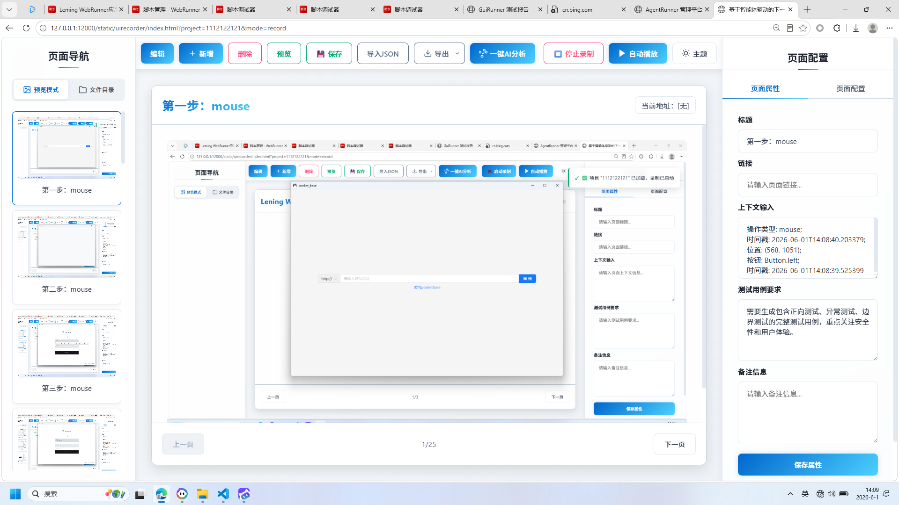

**操作详情**:
+ 操作类型: mouse; 
+ 时间戳: 2026-06-01T14:09:11.037330; 
+ 位置: (1445, 174); 
+ 按钮: Button.left; 
+ 时间戳: 2026-06-01T14:09:10.489167

**页面描述**:
用于配置页面的基本属性，包括标题、链接、上下文输入、测试用例要求及备注信息。弹窗界面支持输入目标页面的访问地址，并提供确认操作按钮。

---

*报告由 AgentRunner Markdown Exporter 生成*