# 基于智能体驱动的下一代测试平台 AgentRunner

+ **生成时间**: 2026-06-02 10:39:13
+ **数据源**: F:\workspace\yfjzworkspace\webspace\ai-template\agentrunner\uirecordercore\filestorage\测试\records.json
+ **操作总数**: 16

# 1. 管理员登录界面

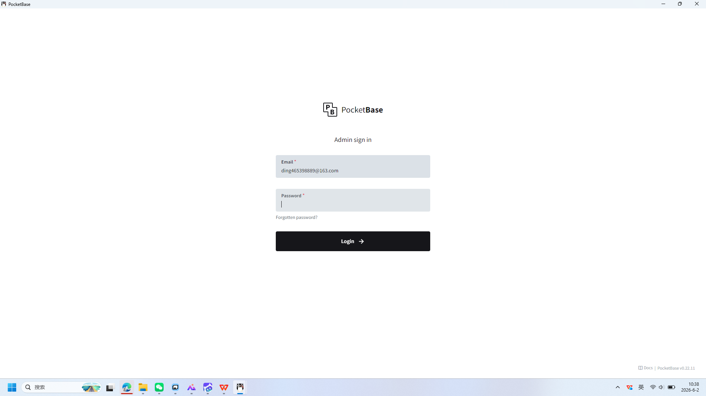

**操作详情**:
+ 操作类型: keyboard; 
+ 时间戳: 2026-06-02T10:38:16.384670; 
+ 输入内容: ding465398889@163.com; 
+ 长度: 21; 
+ 首字符: d; 
+ 末字符: m; 
+ 结束原因: tab_key; 
+ 时间戳: 2026-06-02T10:38:16.017147; 
+ 截图类型: 首字符

**页面描述**:
用于管理员身份验证的登录页面，包含邮箱和密码输入框。用户需输入注册邮箱并填写密码后，点击“Login”按钮完成登录。页面提供“Forgot password?”链接以协助用户找回密码。

# 2. PocketBase 管理员登录界面

**操作详情**:
+ 操作类型: keyboard; 
+ 时间戳: 2026-06-02T10:38:16.389709; 
+ 输入内容: ding465398889@163.com; 
+ 长度: 21; 
+ 首字符: d; 
+ 末字符: m; 
+ 结束原因: tab_key; 
+ 时间戳: 2026-06-02T10:38:16.017147; 
+ 截图类型: 末字符

**页面描述**:
该界面用于管理员身份验证，包含邮箱和密码输入框。用户需输入注册邮箱并填写密码后，点击“Login”按钮完成登录。界面提供“Forgotten password?”链接以协助忘记密码的用户重置密码。

# 3. PocketBase 管理员登录

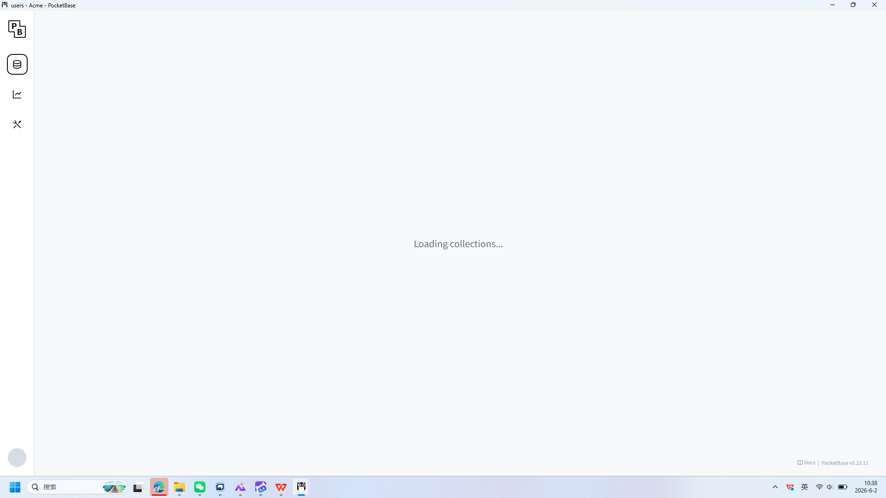

**操作详情**:
+ 操作类型: mouse; 
+ 时间戳: 2026-06-02T10:38:20.847829; 
+ 位置: (893, 645); 
+ 按钮: Button.left; 
+ 时间戳: 2026-06-02T10:38:20.405464

**页面描述**:
这是一个用于管理员身份验证的登录界面。用户需输入注册邮箱和密码，系统将验证凭据并允许访问后台管理功能。界面提供密码找回链接以协助用户恢复账户访问权限。

# 4. 管理员登录界面

**操作详情**:
+ 操作类型: keyboard; 
+ 时间戳: 2026-06-02T10:38:22.036687; 
+ 输入内容: 1234567890; 
+ 长度: 10; 
+ 首字符: 1; 
+ 末字符: 0; 
+ 结束原因: timeout; 
+ 时间戳: 2026-06-02T10:38:21.687855; 
+ 截图类型: 首字符

**页面描述**:
用于管理员身份验证的登录页面，包含邮箱和密码输入框，支持通过邮箱找回密码功能，并提供登录按钮以完成身份认证。

# 5. PocketBase 管理员登录界面

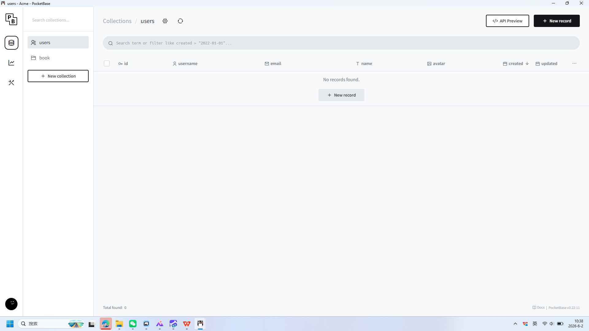

**操作详情**:
+ 操作类型: keyboard; 
+ 时间戳: 2026-06-02T10:38:22.041687; 
+ 输入内容: 1234567890; 
+ 长度: 10; 
+ 首字符: 1; 
+ 末字符: 0; 
+ 结束原因: timeout; 
+ 时间戳: 2026-06-02T10:38:21.687855; 
+ 截图类型: 末字符

**页面描述**:
该界面用于管理员身份验证，包含邮箱和密码输入框。用户需填写绑定的邮箱地址并输入正确的密码后，点击“Login”按钮完成登录。界面提供“Forgotten password?”链接以协助用户找回密码。

# 6. PocketBase 管理员登录界面

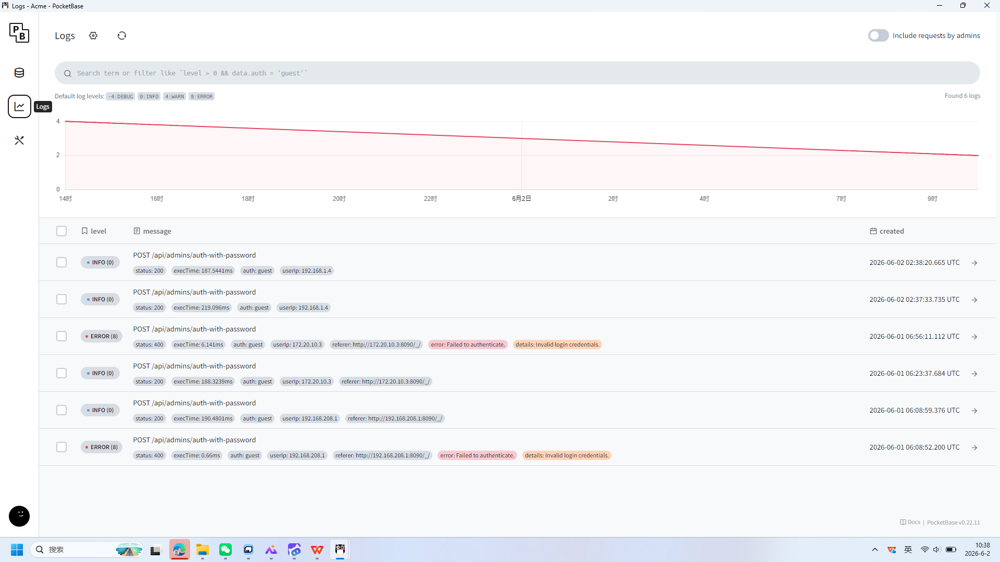

**操作详情**:
+ 操作类型: mouse; 
+ 时间戳: 2026-06-02T10:38:24.185278; 
+ 位置: (20, 197); 
+ 按钮: Button.left; 
+ 时间戳: 2026-06-02T10:38:23.674524

**页面描述**:
该界面用于管理员身份验证，用户需输入注册邮箱和密码进行登录。界面包含两个必填字段：邮箱地址（已预填为 ding465398889@163.com）和密码（当前为空）。下方提供“忘记密码？”链接以协助用户重置密码，并配有醒目的“登录”按钮用于提交凭证。

# 7. PocketBase 管理员登录界面

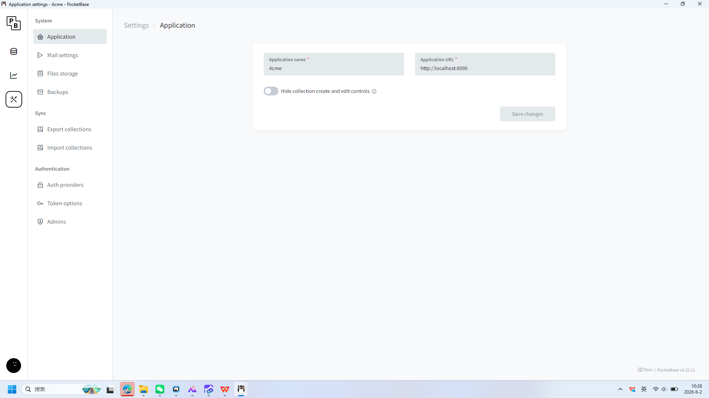

**操作详情**:
+ 操作类型: mouse; 
+ 时间戳: 2026-06-02T10:38:25.000407; 
+ 位置: (37, 280); 
+ 按钮: Button.left; 
+ 时间戳: 2026-06-02T10:38:24.529193

**页面描述**:
该界面用于管理员身份验证，用户需输入注册邮箱和密码进行登录。界面包含邮箱和密码两个必填字段，支持通过“Forgot password?”链接重置密码，并提供“Login”按钮提交登录请求。

# 8. PocketBase 管理员登录

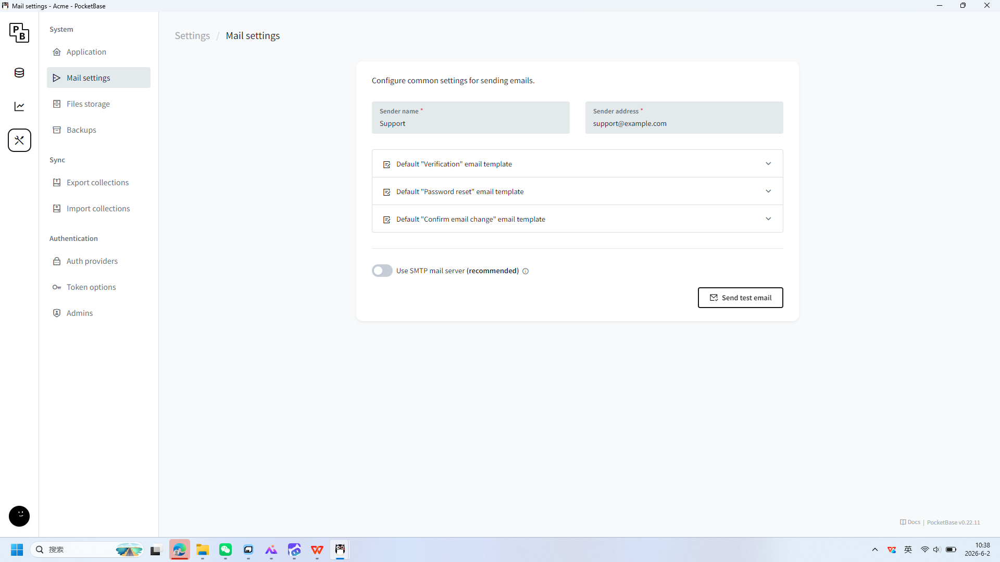

**操作详情**:
+ 操作类型: mouse; 
+ 时间戳: 2026-06-02T10:38:26.517462; 
+ 位置: (164, 163); 
+ 按钮: Button.left; 
+ 时间戳: 2026-06-02T10:38:26.054678

**页面描述**:
这是一个用于访问 PocketBase 后台管理系统的登录界面。用户需输入注册时绑定的邮箱地址和密码，点击“Login”按钮即可完成身份验证并进入管理后台。界面提供密码找回链接以协助用户解决登录障碍。

# 9. PocketBase 管理员登录界面

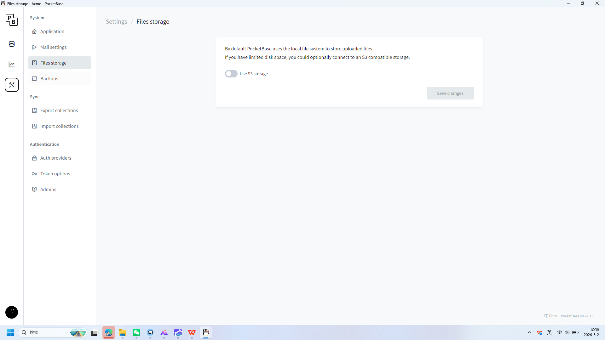

**操作详情**:
+ 操作类型: mouse; 
+ 时间戳: 2026-06-02T10:38:27.299771; 
+ 位置: (174, 212); 
+ 按钮: Button.left; 
+ 时间戳: 2026-06-02T10:38:26.786952

**页面描述**:
这是一个用于访问 PocketBase 后台管理系统的登录页面。用户需输入绑定的邮箱地址和密码，点击“Login”按钮即可完成身份验证并进入管理后台。页面还提供“Forgotten password?”链接，用于找回或重置密码。

# 10. PocketBase 管理员登录

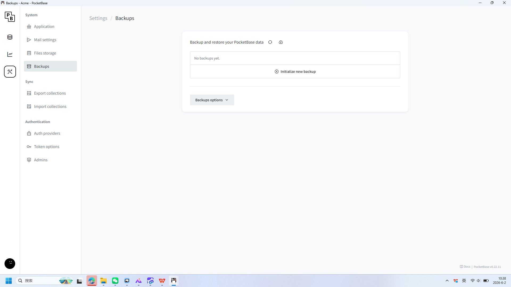

**操作详情**:
+ 操作类型: mouse; 
+ 时间戳: 2026-06-02T10:38:28.487772; 
+ 位置: (168, 254); 
+ 按钮: Button.left; 
+ 时间戳: 2026-06-02T10:38:28.005374

**页面描述**:
这是一个用于 PocketBase 平台的管理员登录界面。用户需输入注册邮箱和密码，点击“Login”按钮即可完成身份验证并进入后台管理系统。界面提供密码找回链接，方便用户处理忘记密码的情况。

# 11. PocketBase 管理员登录界面

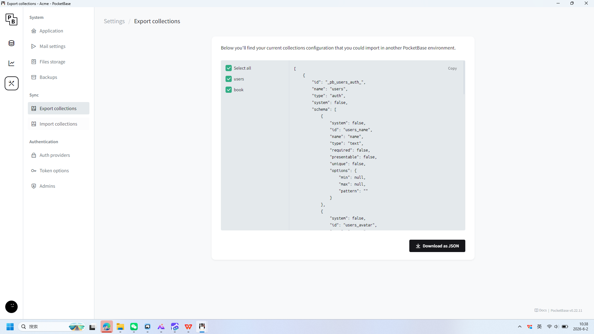

**操作详情**:
+ 操作类型: mouse; 
+ 时间戳: 2026-06-02T10:38:29.367957; 
+ 位置: (182, 345); 
+ 按钮: Button.left; 
+ 时间戳: 2026-06-02T10:38:28.840065

**页面描述**:
该界面用于管理员身份验证，用户需输入注册邮箱和密码以登录系统。界面简洁明了，包含邮箱和密码两个必填字段，下方提供“忘记密码？”链接以协助用户找回账户信息。点击“Login”按钮后将提交表单并验证凭据，成功登录后可访问后台管理功能。

# 12. PocketBase 管理员登录界面

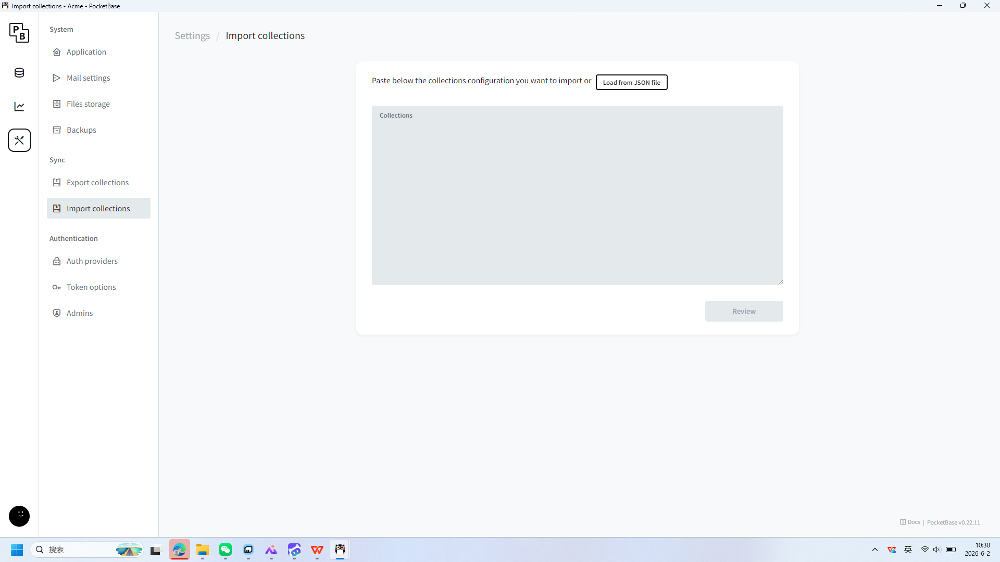

**操作详情**:
+ 操作类型: mouse; 
+ 时间戳: 2026-06-02T10:38:30.259863; 
+ 位置: (167, 417); 
+ 按钮: Button.left; 
+ 时间戳: 2026-06-02T10:38:29.771484

**页面描述**:
该界面用于管理员身份验证，用户需输入注册邮箱和密码进行登录。界面包含两个必填字段：邮箱（已预填为 ding465398889@163.com）和密码（当前为空），下方提供“Forgot password?”链接以协助找回密码。点击黑色的“Login →”按钮即可提交登录信息。

# 13. PocketBase 管理员登录

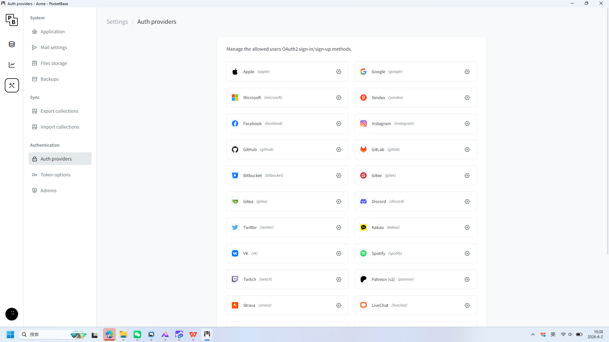

**操作详情**:
+ 操作类型: mouse; 
+ 时间戳: 2026-06-02T10:38:31.068534; 
+ 位置: (167, 499); 
+ 按钮: Button.left; 
+ 时间戳: 2026-06-02T10:38:30.597240

**页面描述**:
这是一个用于管理员登录的界面，用户需输入绑定的邮箱地址和密码以验证身份。界面提供邮箱和密码输入框，并配有“忘记密码？”链接用于密码找回。点击“登录”按钮后，系统将验证凭据并允许用户进入后台管理系统。

# 14. PocketBase 管理员登录界面

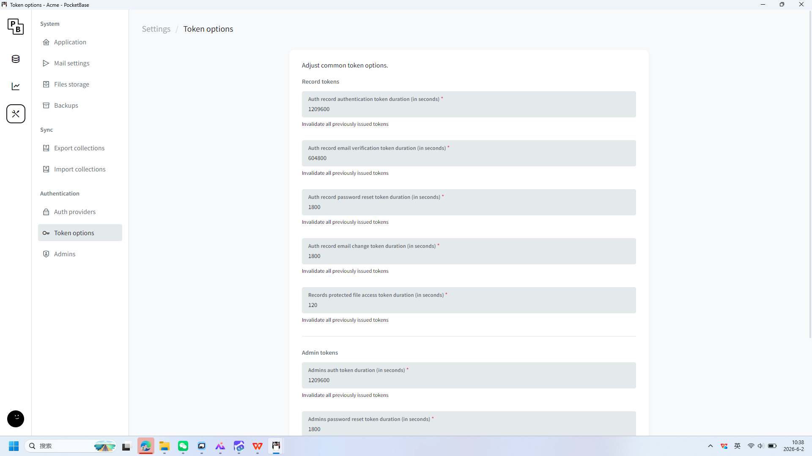

**操作详情**:
+ 操作类型: mouse; 
+ 时间戳: 2026-06-02T10:38:31.948464; 
+ 位置: (167, 533); 
+ 按钮: Button.left; 
+ 时间戳: 2026-06-02T10:38:31.458793

**页面描述**:
该界面用于管理员身份验证，用户需输入注册邮箱和密码进行登录。界面包含两个必填字段：邮箱（已预填示例地址）和密码（当前为空），下方设有“忘记密码？”链接以协助用户找回账户凭证。点击黑色“Login”按钮即可提交登录信息，成功后进入后台管理区域。

# 15. PocketBase 管理员登录

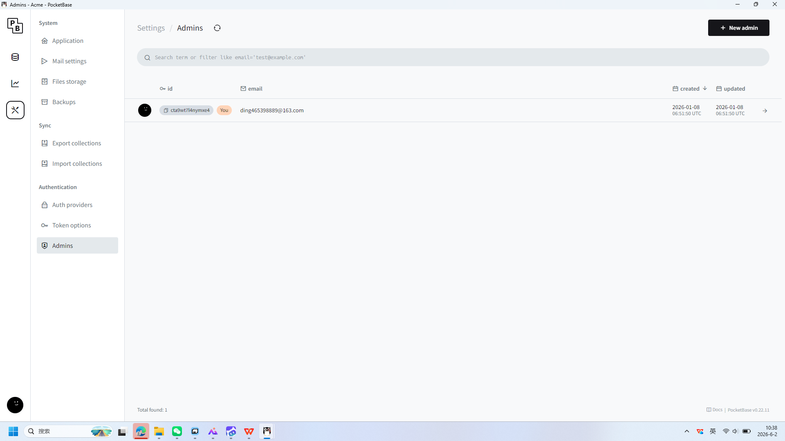

**操作详情**:
+ 操作类型: mouse; 
+ 时间戳: 2026-06-02T10:38:32.685309; 
+ 位置: (155, 602); 
+ 按钮: Button.left; 
+ 时间戳: 2026-06-02T10:38:32.185279

**页面描述**:
这是一个用于访问 PocketBase 后台管理系统的登录界面。用户需输入绑定的邮箱地址和密码，点击“Login”按钮即可完成身份验证并进入管理后台。界面还提供“Forgotten password?”链接，便于用户在忘记密码时进行找回操作。

# 16. PocketBase 管理员登录界面

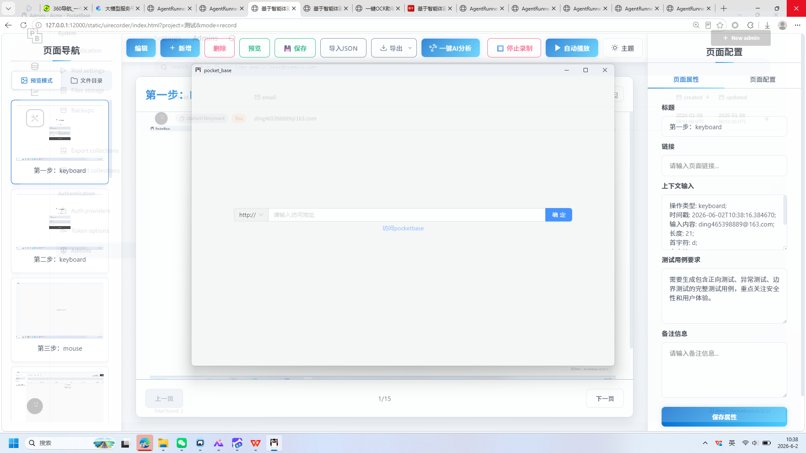

**操作详情**:
+ 操作类型: mouse; 
+ 时间戳: 2026-06-02T10:38:33.865711; 
+ 位置: (1918, 0); 
+ 按钮: Button.left; 
+ 时间戳: 2026-06-02T10:38:33.289129

**页面描述**:
该界面用于管理员身份验证，用户需输入注册邮箱和密码进行登录。界面包含邮箱和密码两个必填字段，支持通过“Forgot password?”链接重置密码，并提供“Login”按钮提交登录请求。

---

*报告由 AgentRunner Markdown Exporter 生成*