# 基于智能体驱动的下一代测试平台 AgentRunner

+ **生成时间**: 2026-06-02 14:45:19
+ **数据源**: F:\workspace\yfjzworkspace\webspace\ai-template\agentrunner\uirecordercore\filestorage\sddssd\records.json
+ **操作总数**: 26

# 1. 第一步：mouse

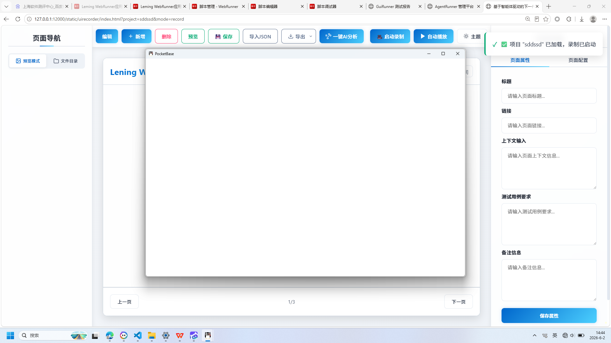

**操作详情**:
+ 操作类型: mouse; 
+ 时间戳: 2026-06-02T14:44:21.426174; 
+ 位置: (941, 543); 
+ 按钮: Button.left; 
+ 时间戳: 2026-06-02T14:44:20.833725

# 2. 第二步：mouse

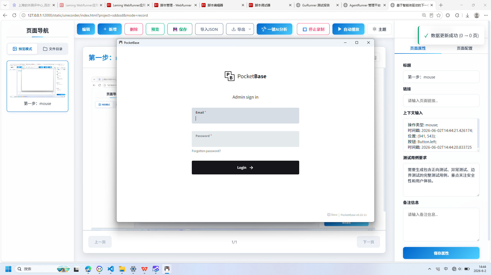

**操作详情**:
+ 操作类型: mouse; 
+ 时间戳: 2026-06-02T14:44:22.896981; 
+ 位置: (834, 466); 
+ 按钮: Button.left; 
+ 时间戳: 2026-06-02T14:44:22.323816

# 3. 第三步：keyboard

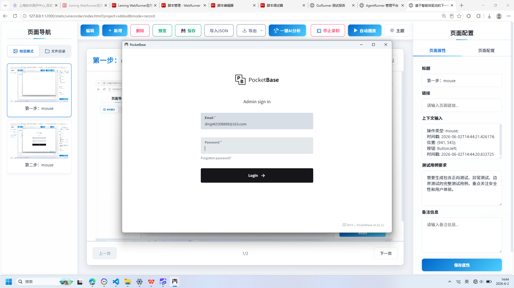

**操作详情**:
+ 操作类型: keyboard; 
+ 时间戳: 2026-06-02T14:44:30.127476; 
+ 输入内容: ding465398889@163.com; 
+ 长度: 21; 
+ 首字符: d; 
+ 末字符: m; 
+ 结束原因: tab_key; 
+ 时间戳: 2026-06-02T14:44:29.572709; 
+ 截图类型: 首字符

# 4. 第四步：keyboard

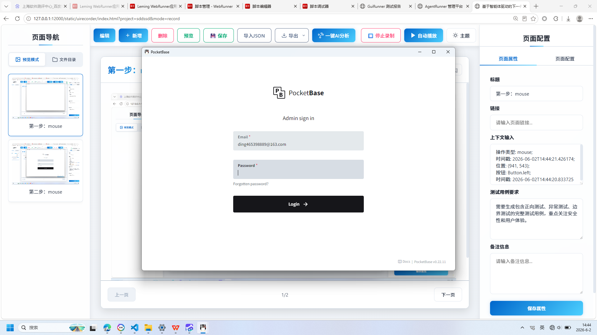

**操作详情**:
+ 操作类型: keyboard; 
+ 时间戳: 2026-06-02T14:44:30.132523; 
+ 输入内容: ding465398889@163.com; 
+ 长度: 21; 
+ 首字符: d; 
+ 末字符: m; 
+ 结束原因: tab_key; 
+ 时间戳: 2026-06-02T14:44:29.572709; 
+ 截图类型: 末字符

# 5. 第五步：mouse

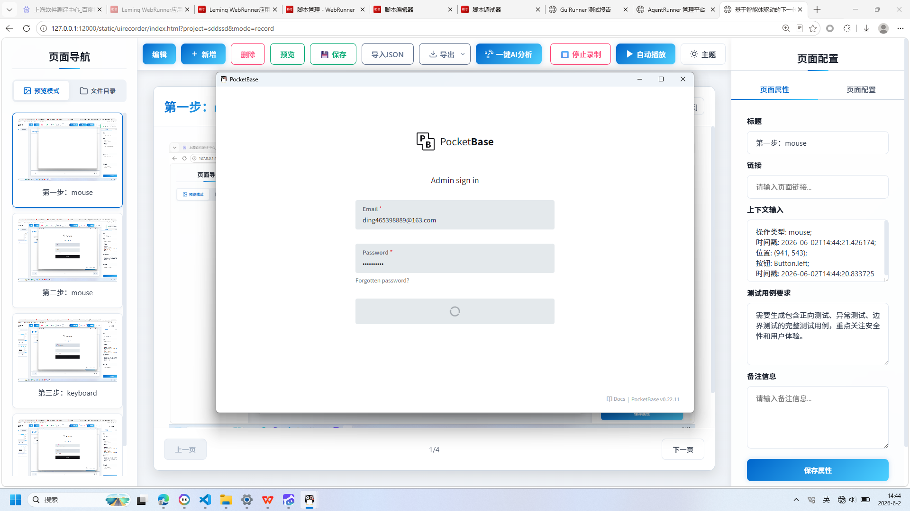

**操作详情**:
+ 操作类型: mouse; 
+ 时间戳: 2026-06-02T14:44:36.083540; 
+ 位置: (894, 641); 
+ 按钮: Button.left; 
+ 时间戳: 2026-06-02T14:44:35.568392

# 6. 第六步：keyboard

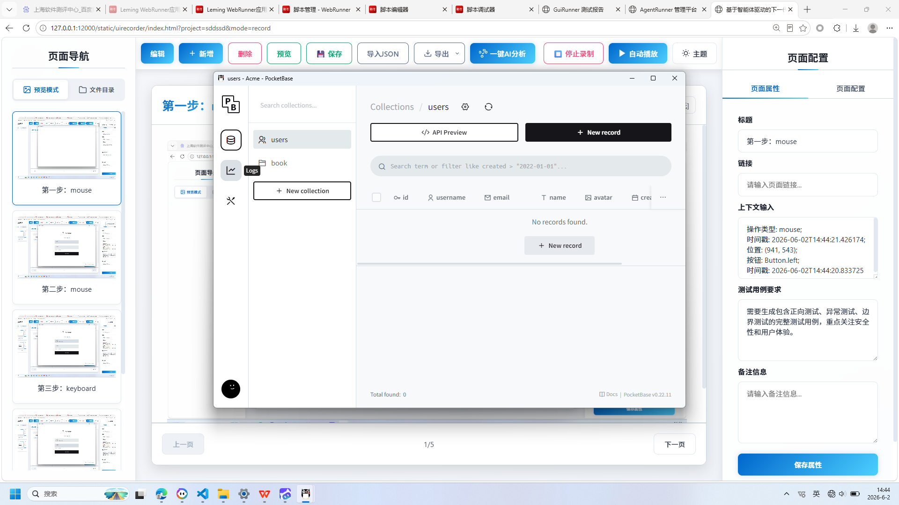

**操作详情**:
+ 操作类型: keyboard; 
+ 时间戳: 2026-06-02T14:44:37.826709; 
+ 输入内容: 1234567890; 
+ 长度: 10; 
+ 首字符: 1; 
+ 末字符: 0; 
+ 结束原因: timeout; 
+ 时间戳: 2026-06-02T14:44:37.274006; 
+ 截图类型: 首字符

# 7. 第七步：keyboard

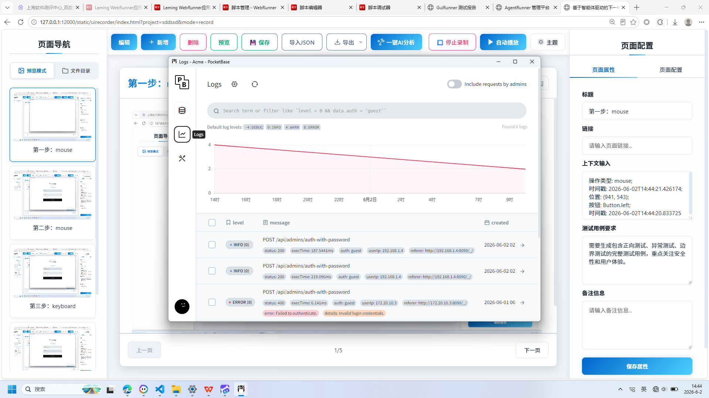

**操作详情**:
+ 操作类型: keyboard; 
+ 时间戳: 2026-06-02T14:44:37.832713; 
+ 输入内容: 1234567890; 
+ 长度: 10; 
+ 首字符: 1; 
+ 末字符: 0; 
+ 结束原因: timeout; 
+ 时间戳: 2026-06-02T14:44:37.274006; 
+ 截图类型: 末字符

# 8. 第八步：mouse

**操作详情**:
+ 操作类型: mouse; 
+ 时间戳: 2026-06-02T14:44:37.868005; 
+ 位置: (512, 364); 
+ 按钮: Button.left; 
+ 时间戳: 2026-06-02T14:44:37.221951

# 9. 第九步：mouse

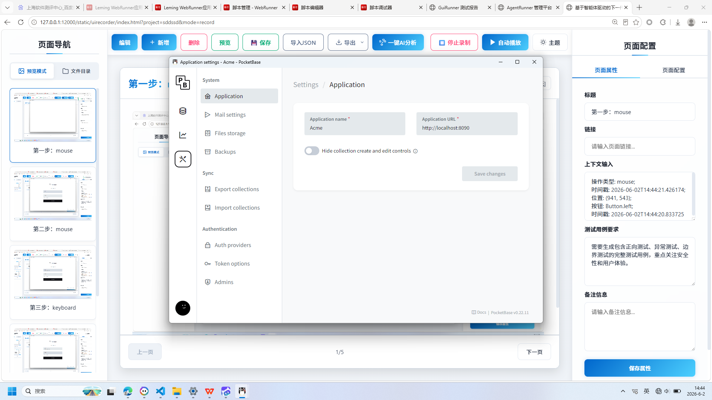

**操作详情**:
+ 操作类型: mouse; 
+ 时间戳: 2026-06-02T14:44:38.432494; 
+ 位置: (488, 438); 
+ 按钮: Button.left; 
+ 时间戳: 2026-06-02T14:44:37.888040

# 10. 第十步：mouse

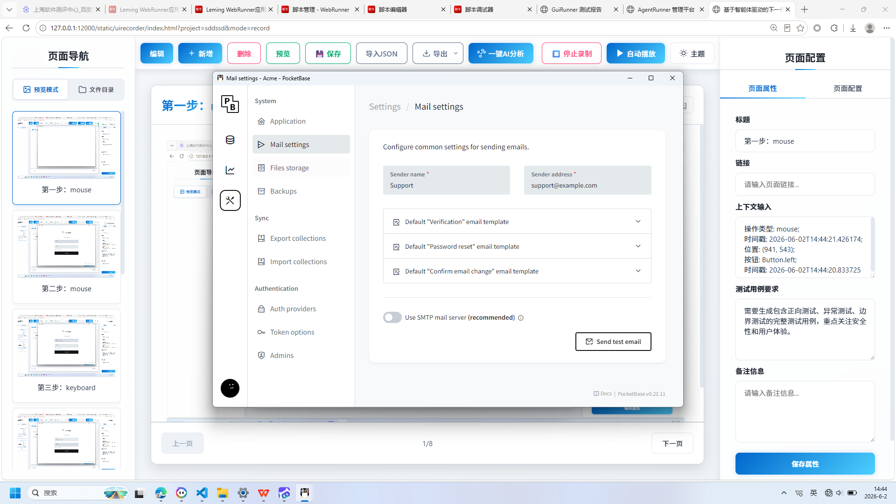

**操作详情**:
+ 操作类型: mouse; 
+ 时间戳: 2026-06-02T14:44:39.221765; 
+ 位置: (582, 299); 
+ 按钮: Button.left; 
+ 时间戳: 2026-06-02T14:44:38.668824

# 11. 第十一步：mouse

**操作详情**:
+ 操作类型: mouse; 
+ 时间戳: 2026-06-02T14:44:39.934784; 
+ 位置: (615, 383); 
+ 按钮: Button.left; 
+ 时间戳: 2026-06-02T14:44:39.334503

# 12. 第十二步：mouse

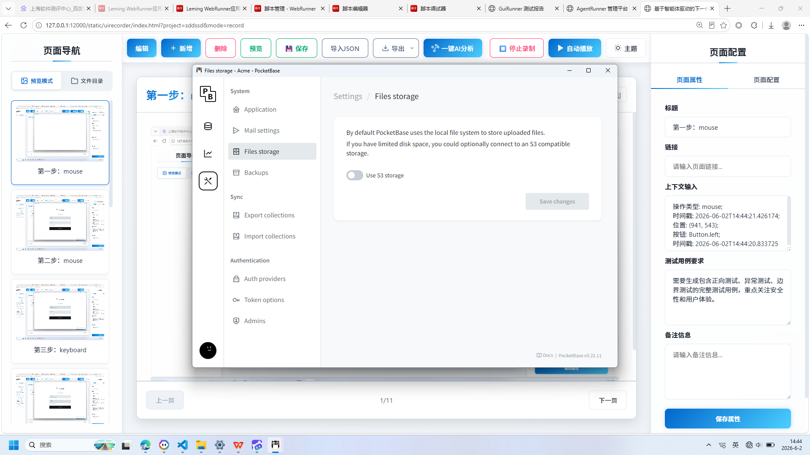

**操作详情**:
+ 操作类型: mouse; 
+ 时间戳: 2026-06-02T14:44:40.585734; 
+ 位置: (619, 368); 
+ 按钮: Button.left; 
+ 时间戳: 2026-06-02T14:44:40.049572

# 13. 第十三步：mouse

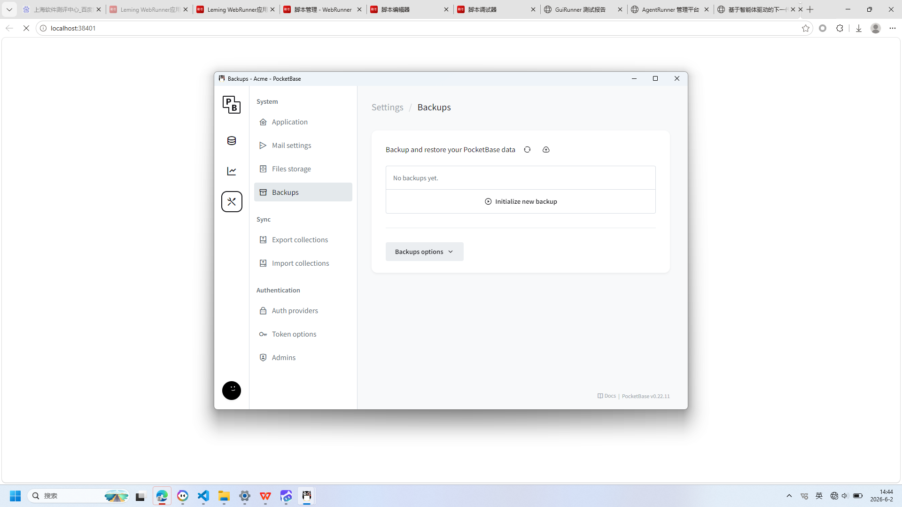

**操作详情**:
+ 操作类型: mouse; 
+ 时间戳: 2026-06-02T14:44:41.222304; 
+ 位置: (619, 411); 
+ 按钮: Button.left; 
+ 时间戳: 2026-06-02T14:44:40.759659

# 14. 第十四步：mouse

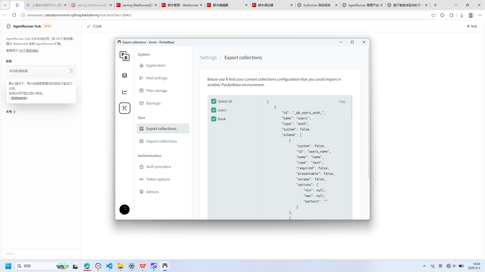

**操作详情**:
+ 操作类型: mouse; 
+ 时间戳: 2026-06-02T14:44:42.009755; 
+ 位置: (613, 497); 
+ 按钮: Button.left; 
+ 时间戳: 2026-06-02T14:44:41.504201

# 15. 第十五步：mouse

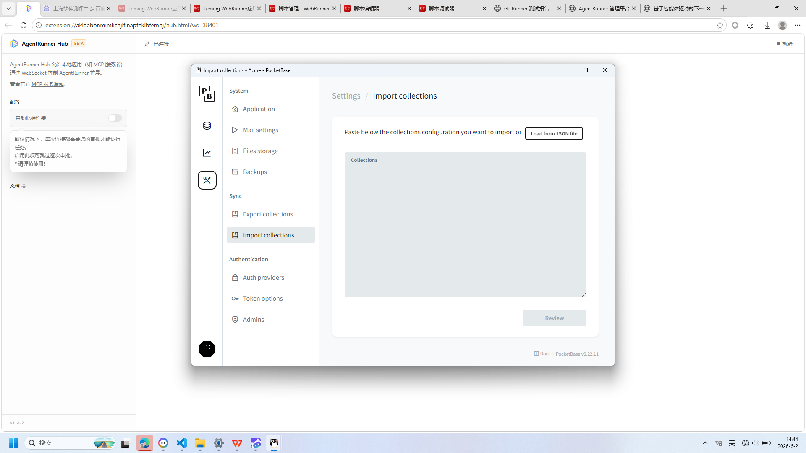

**操作详情**:
+ 操作类型: mouse; 
+ 时间戳: 2026-06-02T14:44:42.733808; 
+ 位置: (613, 555); 
+ 按钮: Button.left; 
+ 时间戳: 2026-06-02T14:44:42.213283

# 16. 第十六步：mouse

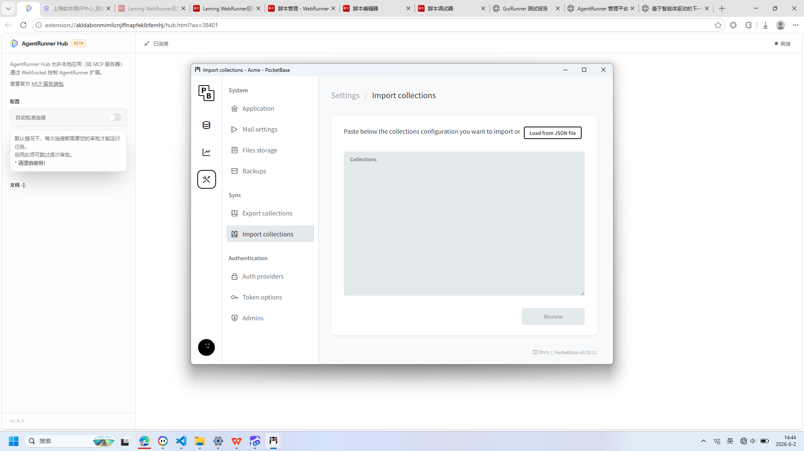

**操作详情**:
+ 操作类型: mouse; 
+ 时间戳: 2026-06-02T14:44:43.365820; 
+ 位置: (591, 635); 
+ 按钮: Button.left; 
+ 时间戳: 2026-06-02T14:44:42.864336

# 17. 第十七步：mouse

**操作详情**:
+ 操作类型: mouse; 
+ 时间戳: 2026-06-02T14:44:44.033570; 
+ 位置: (592, 662); 
+ 按钮: Button.left; 
+ 时间戳: 2026-06-02T14:44:43.467032

# 18. 第十八步：mouse

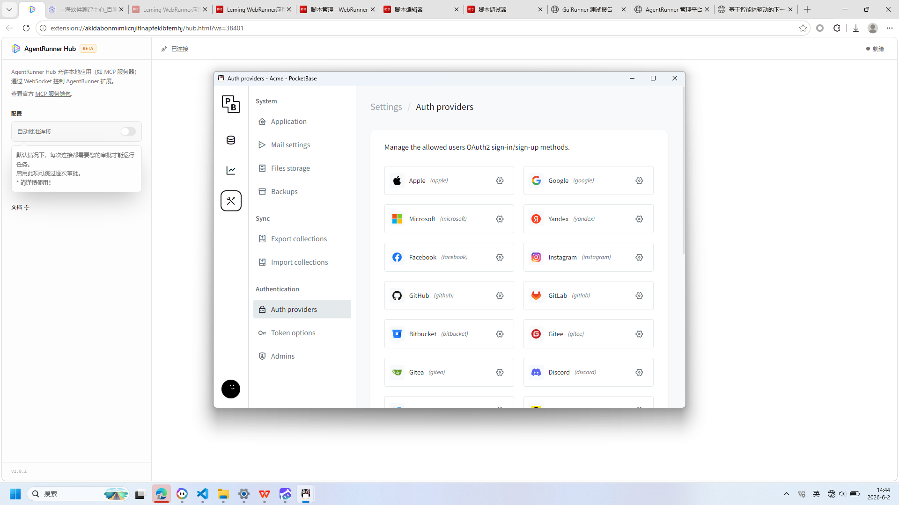

**操作详情**:
+ 操作类型: mouse; 
+ 时间戳: 2026-06-02T14:44:44.883402; 
+ 位置: (582, 739); 
+ 按钮: Button.left; 
+ 时间戳: 2026-06-02T14:44:44.268015

# 19. 第十九步：mouse

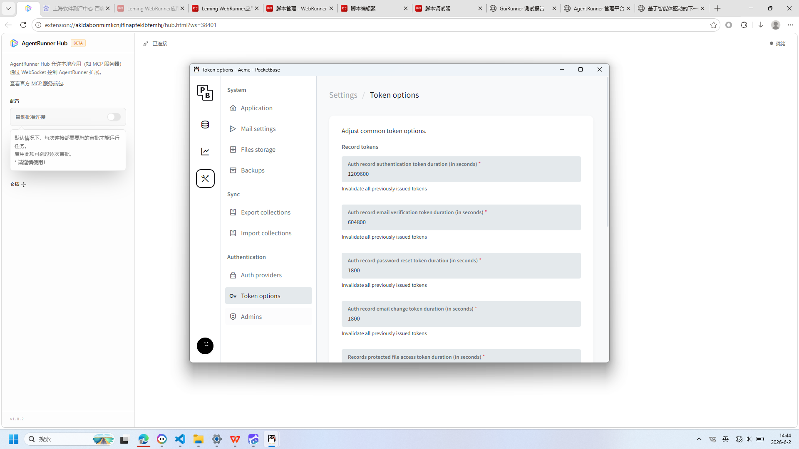

**操作详情**:
+ 操作类型: mouse; 
+ 时间戳: 2026-06-02T14:44:45.448083; 
+ 位置: (592, 718); 
+ 按钮: Button.left; 
+ 时间戳: 2026-06-02T14:44:44.884351

# 20. 第二十步：mouse

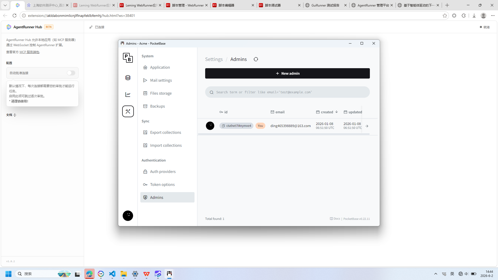

**操作详情**:
+ 操作类型: mouse; 
+ 时间戳: 2026-06-02T14:44:45.982422; 
+ 位置: (592, 765); 
+ 按钮: Button.left; 
+ 时间戳: 2026-06-02T14:44:45.406569

# 21. 第21步：mouse

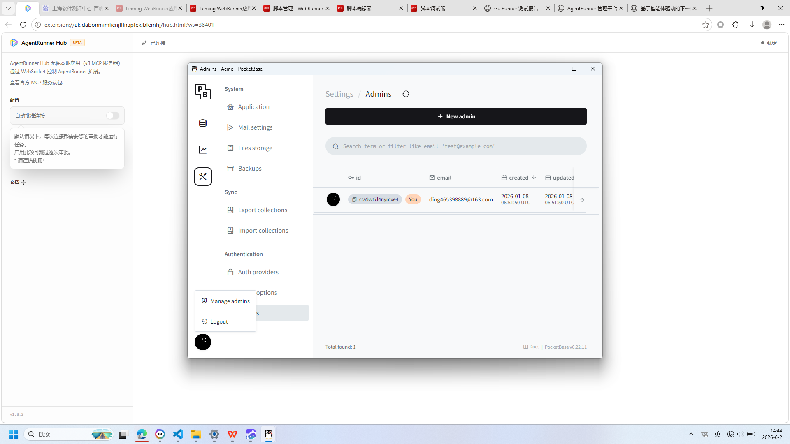

**操作详情**:
+ 操作类型: mouse; 
+ 时间戳: 2026-06-02T14:44:46.754570; 
+ 位置: (483, 832); 
+ 按钮: Button.left; 
+ 时间戳: 2026-06-02T14:44:46.202258

# 22. 第22步：mouse

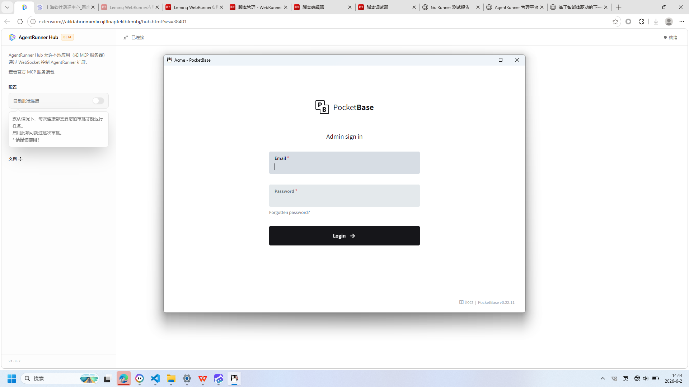

**操作详情**:
+ 操作类型: mouse; 
+ 时间戳: 2026-06-02T14:44:47.429609; 
+ 位置: (552, 779); 
+ 按钮: Button.left; 
+ 时间戳: 2026-06-02T14:44:46.917176

# 23. 第23步：mouse

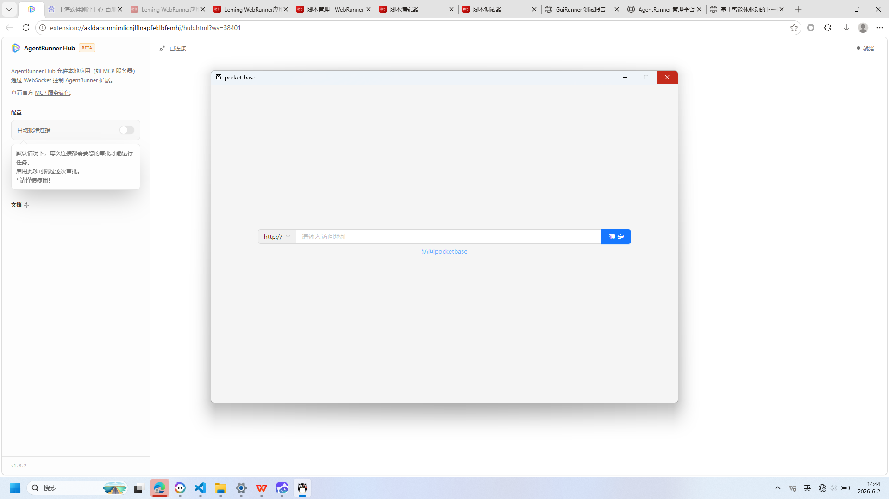

**操作详情**:
+ 操作类型: mouse; 
+ 时间戳: 2026-06-02T14:44:49.141716; 
+ 位置: (1440, 170); 
+ 按钮: Button.left; 
+ 时间戳: 2026-06-02T14:44:48.671819

# 24. 第24步：mouse

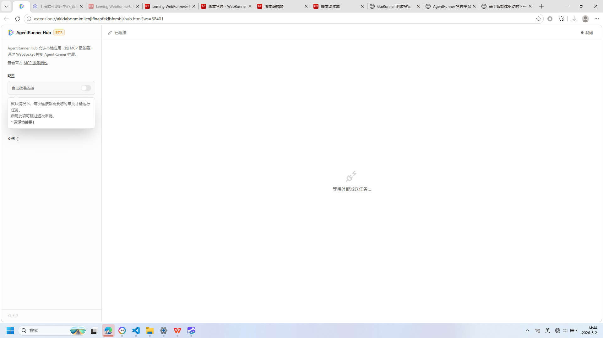

**操作详情**:
+ 操作类型: mouse; 
+ 时间戳: 2026-06-02T14:44:49.852318; 
+ 位置: (1440, 170); 
+ 按钮: Button.left; 
+ 时间戳: 2026-06-02T14:44:49.338179

# 25. 第25步：mouse

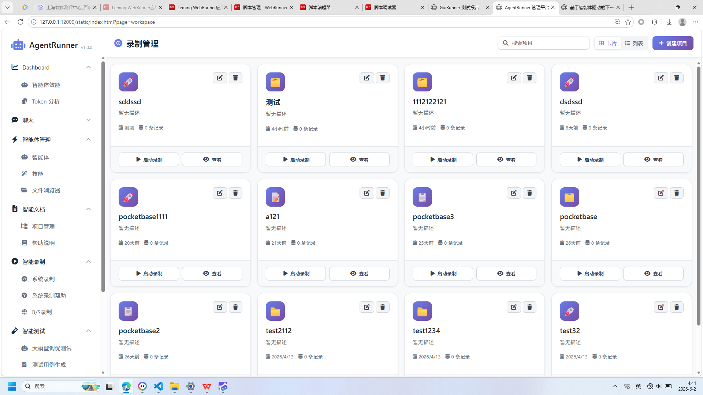

**操作详情**:
+ 操作类型: mouse; 
+ 时间戳: 2026-06-02T14:44:51.632346; 
+ 位置: (1414, 0); 
+ 按钮: Button.left; 
+ 时间戳: 2026-06-02T14:44:51.076684

# 26. 第26步：mouse

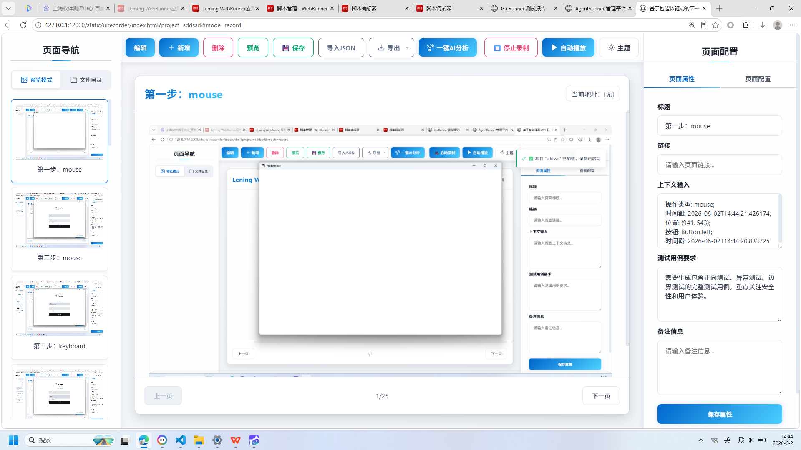

**操作详情**:
+ 操作类型: mouse; 
+ 时间戳: 2026-06-02T14:44:52.642516; 
+ 位置: (1586, 0); 
+ 按钮: Button.left; 
+ 时间戳: 2026-06-02T14:44:52.073172

---

*报告由 AgentRunner Markdown Exporter 生成*