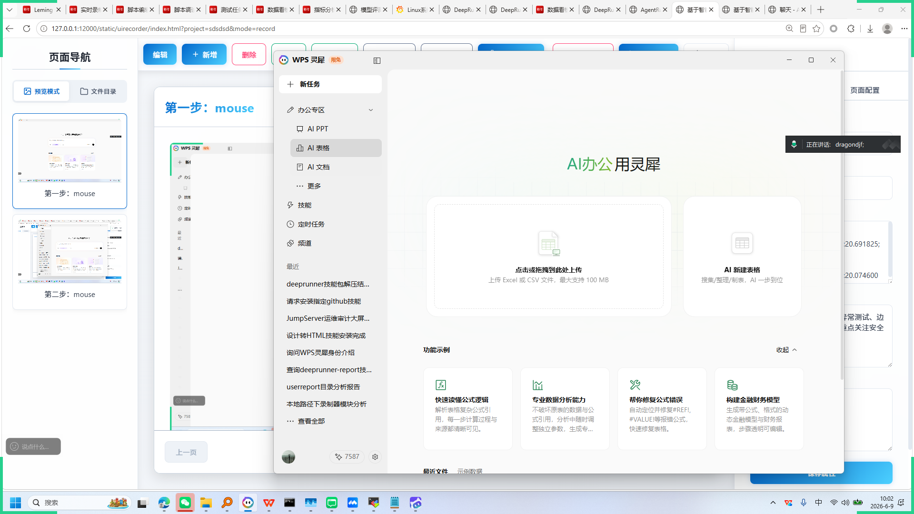
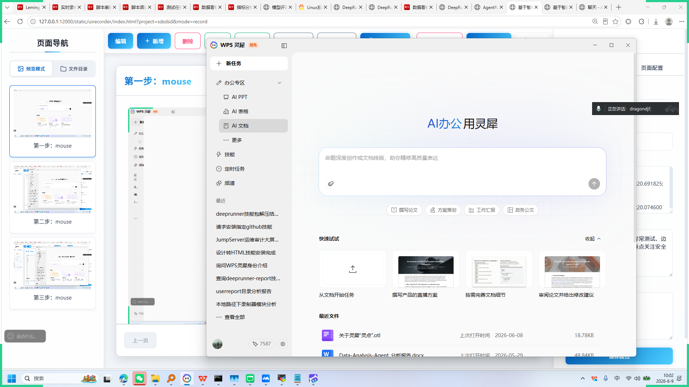
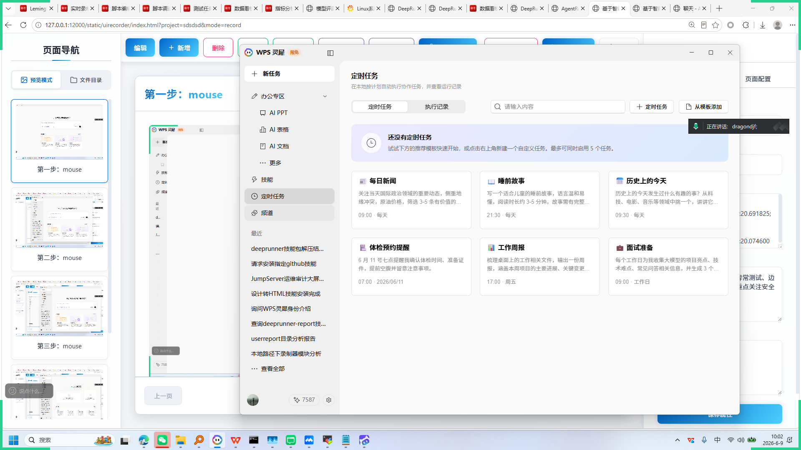
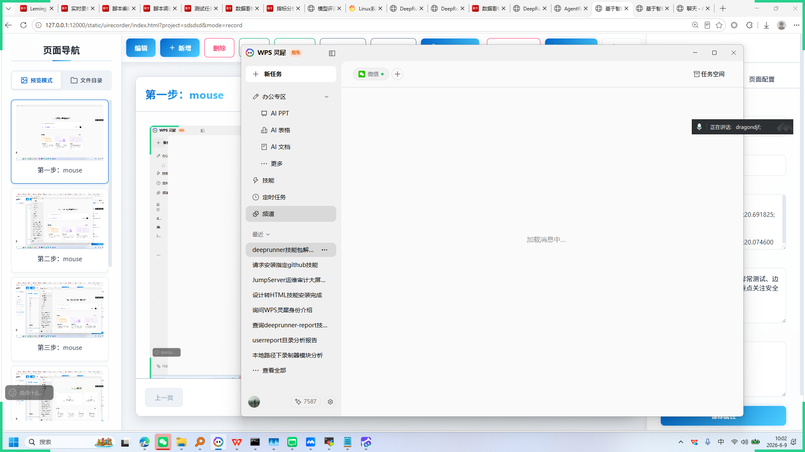
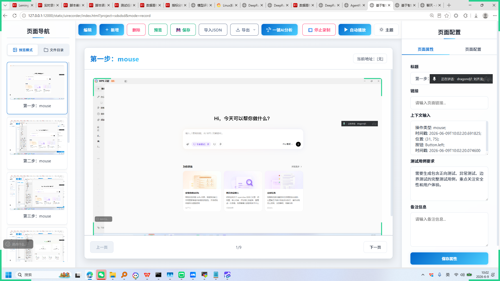

# 基于智能体驱动的下一代测试平台 AgentRunner

+ **生成时间**: 2026-06-09 10:02:52
+ **数据源**: F:\workspace\yfjzworkspace\webspace\ai-template\agentrunner\uirecordercore\filestorage\sdsdsd\records.json
+ **操作总数**: 10

# 1. WPS灵犀智能助手

**操作详情**:
+ 操作类型: mouse; 
+ 时间戳: 2026-06-09T10:02:20.691825; 
+ 位置: (31, 75); 
+ 按钮: Button.left; 
+ 时间戳: 2026-06-09T10:02:20.074600

**页面描述**:
这是一个AI驱动的智能助手界面，用户可通过输入或语音指令向其提问。界面提供“专家模式”开关和Pro模式选择，支持多种功能如技能包推荐、网页信息抓取和定时任务自动化。下方展示三个预设场景：“安装你的skills”、“网页信息猎人”和“定时任务”，帮助用户快速启动相关操作。

# 2. WPS灵犀AI助手

**操作详情**:
+ 操作类型: mouse; 
+ 时间戳: 2026-06-09T10:02:21.598595; 
+ 位置: (273, 17); 
+ 按钮: Button.left; 
+ 时间戳: 2026-06-09T10:02:21.009652

**页面描述**:
WPS灵犀是一款智能办公助手，提供AIPPT、AI表格、AI文档等多种功能。用户可通过输入或语音指令向助手提问，获取专业建议和自动化解决方案。界面包含“为你准备”板块，推荐如安装技能、网页信息猎人、定时任务等实用工具，帮助提升工作效率与智能化水平。

# 3. 第三步：mouse

**操作详情**:
+ 操作类型: mouse; 
+ 时间戳: 2026-06-09T10:02:22.776189; 
+ 位置: (696, 282); 
+ 按钮: Button.left; 
+ 时间戳: 2026-06-09T10:02:22.169967

# 4. 第四步：mouse

**操作详情**:
+ 操作类型: mouse; 
+ 时间戳: 2026-06-09T10:02:23.367367; 
+ 位置: (689, 316); 
+ 按钮: Button.left; 
+ 时间戳: 2026-06-09T10:02:22.681145

# 5. 第五步：mouse

**操作详情**:
+ 操作类型: mouse; 
+ 时间戳: 2026-06-09T10:02:23.910172; 
+ 位置: (688, 345); 
+ 按钮: Button.left; 
+ 时间戳: 2026-06-09T10:02:23.195133

# 6. 第六步：mouse

**操作详情**:
+ 操作类型: mouse; 
+ 时间戳: 2026-06-09T10:02:25.327983; 
+ 位置: (674, 477); 
+ 按钮: Button.left; 
+ 时间戳: 2026-06-09T10:02:24.745569

# 7. 第七步：mouse

**操作详情**:
+ 操作类型: mouse; 
+ 时间戳: 2026-06-09T10:02:25.899032; 
+ 位置: (668, 505); 
+ 按钮: Button.left; 
+ 时间戳: 2026-06-09T10:02:25.249618

# 8. 第八步：mouse

**操作详情**:
+ 操作类型: mouse; 
+ 时间戳: 2026-06-09T10:02:26.524985; 
+ 位置: (682, 592); 
+ 按钮: Button.left; 
+ 时间戳: 2026-06-09T10:02:25.849538

# 9. 第九步：mouse

**操作详情**:
+ 操作类型: mouse; 
+ 时间戳: 2026-06-09T10:02:27.156340; 
+ 位置: (682, 651); 
+ 按钮: Button.left; 
+ 时间戳: 2026-06-09T10:02:26.577064

# 10. 第十步：mouse

**操作详情**:
+ 操作类型: mouse; 
+ 时间戳: 2026-06-09T10:02:32.390073; 
+ 位置: (1661, 120); 
+ 按钮: Button.left; 
+ 时间戳: 2026-06-09T10:02:31.777259

---

*报告由 AgentRunner Markdown Exporter 生成*