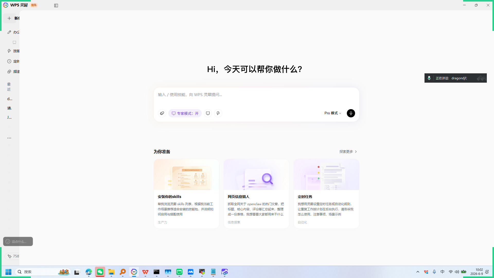
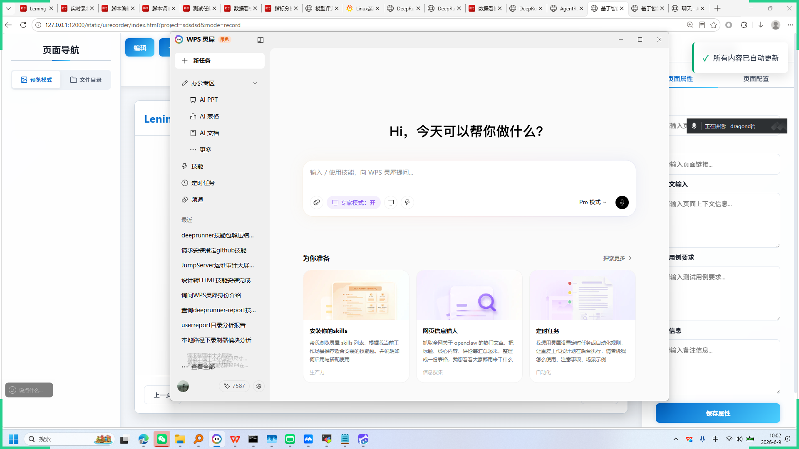
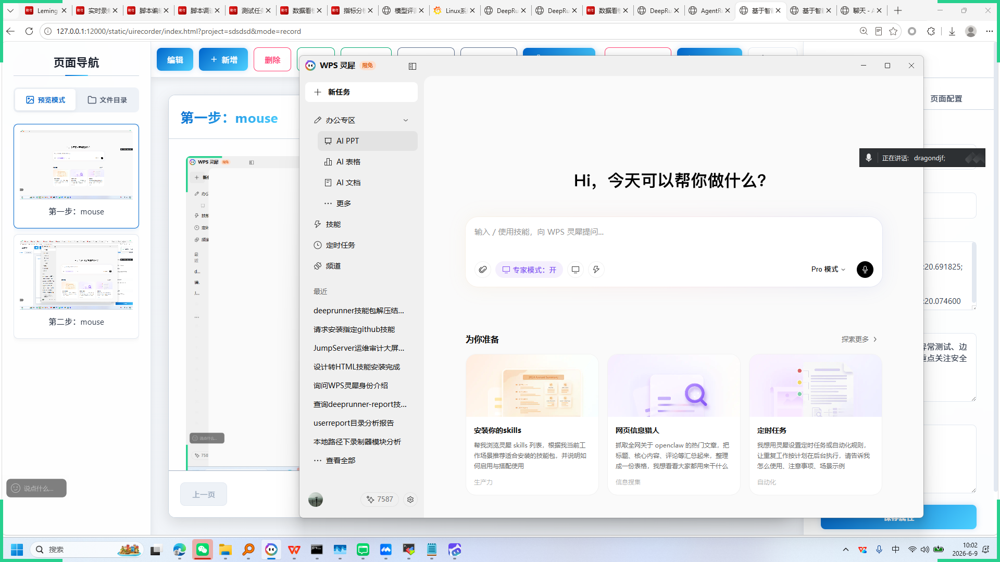
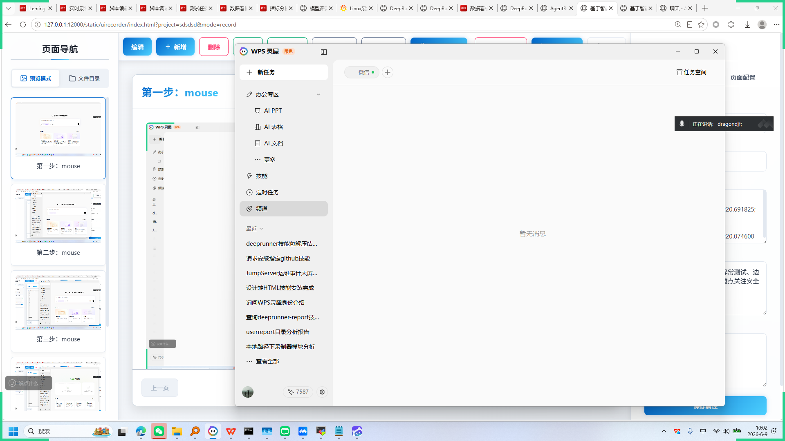
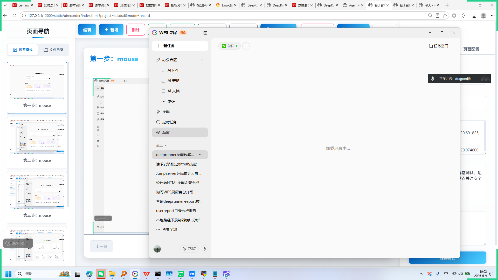

# 基于智能体驱动的下一代测试平台 AgentRunner

+ **生成时间**: 2026-06-09 10:03:16
+ **数据源**: F:\workspace\yfjzworkspace\webspace\ai-template\agentrunner\uirecordercore\filestorage\sdsdsd\records.json
+ **操作总数**: 10

# 1. WPS灵犀智能助手

**操作详情**:
+ 操作类型: mouse; 
+ 时间戳: 2026-06-09T10:02:20.691825; 
+ 位置: (31, 75); 
+ 按钮: Button.left; 
+ 时间戳: 2026-06-09T10:02:20.074600

**页面描述**:
这是一个AI驱动的智能助手界面，用户可通过输入或语音指令向其提问。界面提供“专家模式”开关和Pro模式选择，支持多种功能如技能包推荐、网页信息抓取和定时任务自动化。下方展示三个预设场景：“安装你的skills”、“网页信息猎人”和“定时任务”，帮助用户快速启动相关操作。

# 2. WPS灵犀智能助手

**操作详情**:
+ 操作类型: mouse; 
+ 时间戳: 2026-06-09T10:02:21.598595; 
+ 位置: (273, 17); 
+ 按钮: Button.left; 
+ 时间戳: 2026-06-09T10:02:21.009652

**页面描述**:
这是一个AI驱动的智能助手界面，用户可通过输入或语音指令向其提问。界面提供“专家模式”开关、Pro模式选择及语音输入功能。下方推荐三大核心功能：安装适配技能包提升生产力、抓取网页信息进行内容聚合、设置定时任务实现自动化操作，帮助用户高效完成各类工作需求。

# 3. WPS灵犀智能助手

**操作详情**:
+ 操作类型: mouse; 
+ 时间戳: 2026-06-09T10:02:22.776189; 
+ 位置: (696, 282); 
+ 按钮: Button.left; 
+ 时间戳: 2026-06-09T10:02:22.169967

**页面描述**:
WPS灵犀是一款智能办公助手，通过对话交互帮助用户高效完成任务。用户可在主界面输入指令或使用预设技能，如安装适合的技能包、抓取网络信息、设置定时自动化任务等。系统支持语音输入，并提供“专家模式”以满足专业需求。界面简洁直观，旨在提升办公效率与智能化体验。

# 4. WPS灵犀智能助手

**操作详情**:
+ 操作类型: mouse; 
+ 时间戳: 2026-06-09T10:02:23.367367; 
+ 位置: (689, 316); 
+ 按钮: Button.left; 
+ 时间戳: 2026-06-09T10:02:22.681145

**页面描述**:
这是一个AI驱动的智能助手界面，用户可通过输入或语音指令向其提问。界面提供“专家模式”开关、Pro模式选择及语音输入功能。下方推荐了三个核心功能模块：“安装你的skills”用于根据工作场景推荐并指导使用技能包；“网页信息猎人”用于抓取和整理网络热门文章内容；“定时任务”用于设置自动化规则执行重复性工作计划。整体设计旨在提升办公效率，实现智能化辅助操作。

# 5. WPS灵犀智能助手

**操作详情**:
+ 操作类型: mouse; 
+ 时间戳: 2026-06-09T10:02:23.910172; 
+ 位置: (688, 345); 
+ 按钮: Button.left; 
+ 时间戳: 2026-06-09T10:02:23.195133

**页面描述**:
这是一个AI驱动的智能助手界面，用户可通过输入或语音指令向其提问。界面提供“专家模式”开关、多种预设任务模板（如安装技能包、网页信息抓取、定时任务设置），并支持Pro模式扩展功能，旨在高效完成办公、信息搜集与自动化等任务。

# 6. WPS灵犀智能助手

**操作详情**:
+ 操作类型: mouse; 
+ 时间戳: 2026-06-09T10:02:25.327983; 
+ 位置: (674, 477); 
+ 按钮: Button.left; 
+ 时间戳: 2026-06-09T10:02:24.745569

**页面描述**:
这是一个AI驱动的智能助手界面，旨在通过自然语言交互帮助用户高效完成各类任务。核心功能包括：1. 通用问答与技能调用：用户可通过输入框直接提问或使用预设技能，如“安装你的skills”、“网页信息猎人”和“定时任务”，助手将提供针对性解决方案。2. 模式切换：支持“专家模式”以获取更深入、专业的响应，并可切换至“Pro模式”体验高级功能。3. 多模态交互：界面集成语音输入功能，方便用户通过语音指令进行操作。整体设计简洁直观，聚焦于提升用户在办公、信息搜集和自动化等场景下的生产力。

# 7. WPS灵犀智能助手

**操作详情**:
+ 操作类型: mouse; 
+ 时间戳: 2026-06-09T10:02:25.899032; 
+ 位置: (668, 505); 
+ 按钮: Button.left; 
+ 时间戳: 2026-06-09T10:02:25.249618

**页面描述**:
这是一个AI驱动的智能助手界面，用户可通过输入或语音指令向其提问。界面提供“专家模式”切换、语音输入功能，并推荐三大核心能力：安装适合场景的技能包、抓取并整理网络热门信息、设置定时任务与自动化规则，旨在提升办公效率和自动化水平。

# 8. 第八步：mouse

**操作详情**:
+ 操作类型: mouse; 
+ 时间戳: 2026-06-09T10:02:26.524985; 
+ 位置: (682, 592); 
+ 按钮: Button.left; 
+ 时间戳: 2026-06-09T10:02:25.849538

# 9. 第九步：mouse

**操作详情**:
+ 操作类型: mouse; 
+ 时间戳: 2026-06-09T10:02:27.156340; 
+ 位置: (682, 651); 
+ 按钮: Button.left; 
+ 时间戳: 2026-06-09T10:02:26.577064

# 10. 第十步：mouse

**操作详情**:
+ 操作类型: mouse; 
+ 时间戳: 2026-06-09T10:02:32.390073; 
+ 位置: (1661, 120); 
+ 按钮: Button.left; 
+ 时间戳: 2026-06-09T10:02:31.777259

---

*报告由 AgentRunner Markdown Exporter 生成*