# 基于智能体驱动的下一代测试平台 AgentRunner

+ **生成时间**: 2026-06-11 14:49:26
+ **数据源**: F:\workspace\yfjzworkspace\webspace\ai-template\agentrunner\uirecordercore\filestorage\sss\records.json
+ **操作总数**: 20

# 1. 第一步：mouse

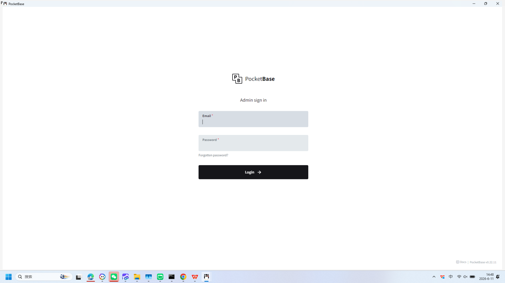

**操作详情**:
+ 操作类型: mouse; 
+ 时间戳: 2026-06-11T14:48:45.113693; 
+ 位置: (1394, 168); 
+ 按钮: Button.left; 
+ 时间戳: 2026-06-11T14:48:44.571534

# 2. 第二步：mouse

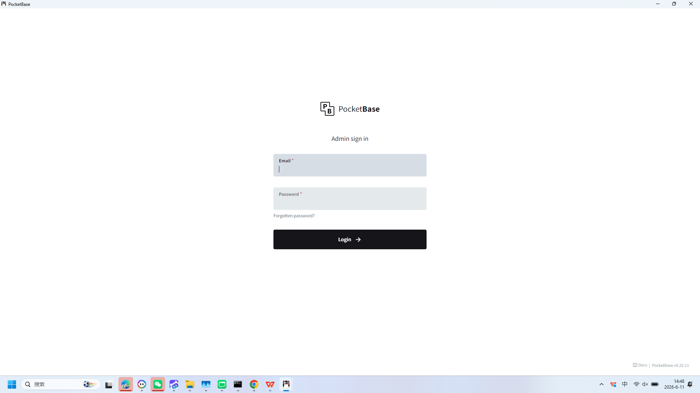

**操作详情**:
+ 操作类型: mouse; 
+ 时间戳: 2026-06-11T14:48:45.960720; 
+ 位置: (802, 468); 
+ 按钮: Button.left; 
+ 时间戳: 2026-06-11T14:48:45.482751

# 3. 第三步：keyboard

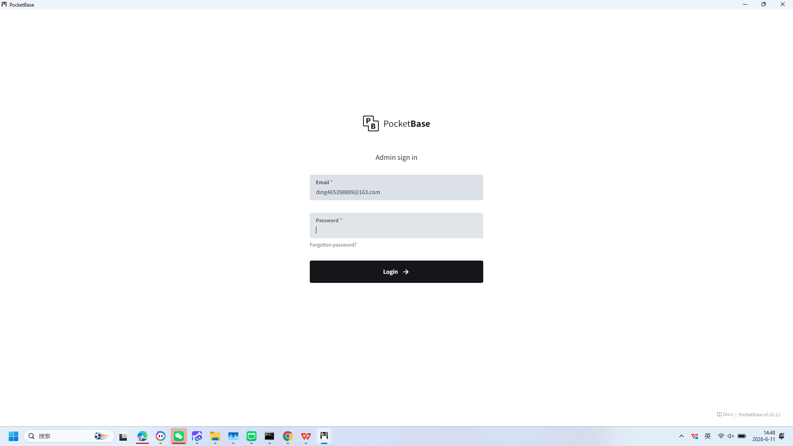

**操作详情**:
+ 操作类型: keyboard; 
+ 时间戳: 2026-06-11T14:48:52.024569; 
+ 输入内容: ding465398889@163.com; 
+ 长度: 21; 
+ 首字符: d; 
+ 末字符: m; 
+ 结束原因: tab_key; 
+ 时间戳: 2026-06-11T14:48:51.643376; 
+ 截图类型: 首字符

# 4. 第四步：keyboard

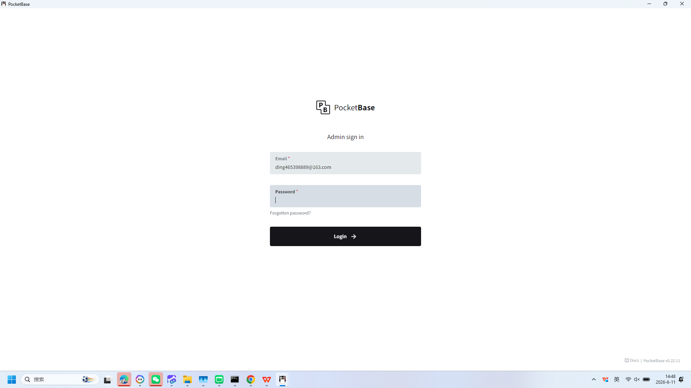

**操作详情**:
+ 操作类型: keyboard; 
+ 时间戳: 2026-06-11T14:48:52.029526; 
+ 输入内容: ding465398889@163.com; 
+ 长度: 21; 
+ 首字符: d; 
+ 末字符: m; 
+ 结束原因: tab_key; 
+ 时间戳: 2026-06-11T14:48:51.643376; 
+ 截图类型: 末字符

# 5. 第五步：mouse

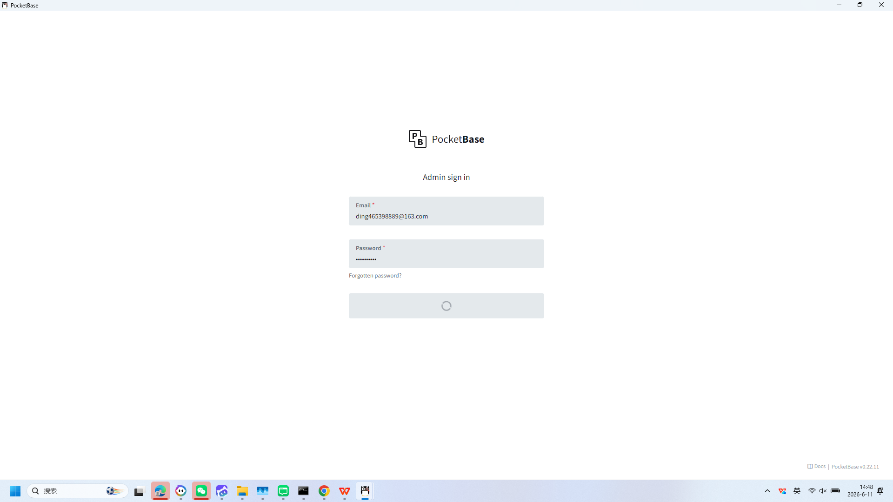

**操作详情**:
+ 操作类型: mouse; 
+ 时间戳: 2026-06-11T14:48:55.693616; 
+ 位置: (921, 660); 
+ 按钮: Button.left; 
+ 时间戳: 2026-06-11T14:48:55.187058

# 6. 第六步：mouse

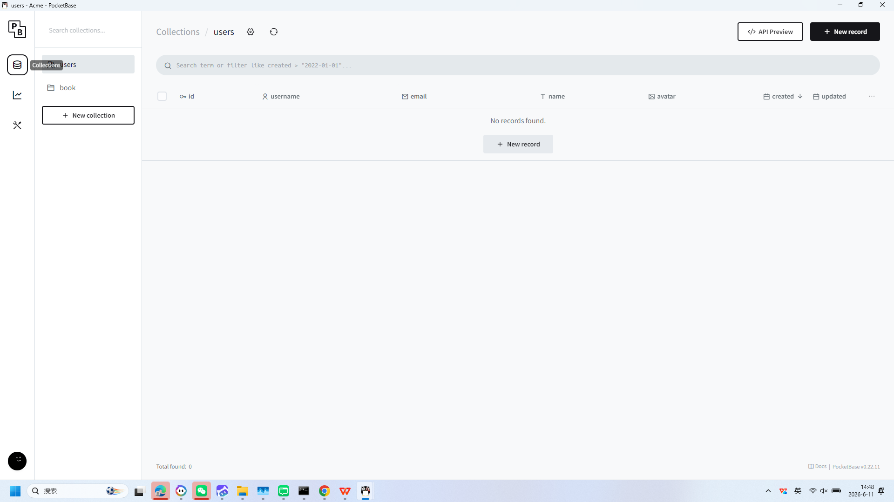

**操作详情**:
+ 操作类型: mouse; 
+ 时间戳: 2026-06-11T14:48:57.300573; 
+ 位置: (45, 129); 
+ 按钮: Button.left; 
+ 时间戳: 2026-06-11T14:48:56.794646

# 7. 第七步：mouse

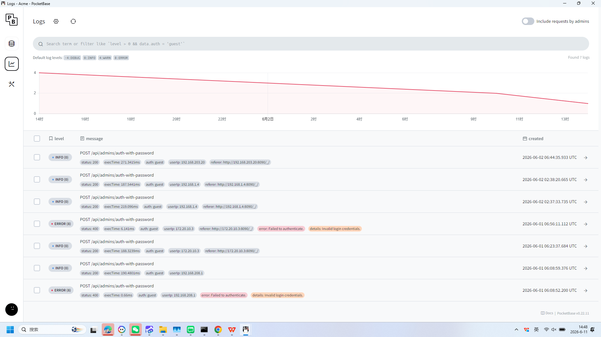

**操作详情**:
+ 操作类型: mouse; 
+ 时间戳: 2026-06-11T14:48:57.884715; 
+ 位置: (42, 187); 
+ 按钮: Button.left; 
+ 时间戳: 2026-06-11T14:48:57.322567

# 8. 第八步：keyboard

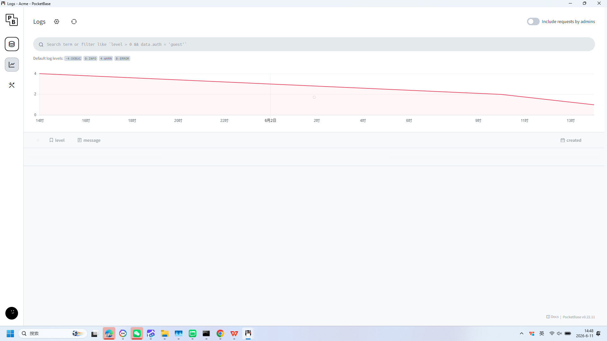

**操作详情**:
+ 操作类型: keyboard; 
+ 时间戳: 2026-06-11T14:48:57.964188; 
+ 输入内容: 1234567890; 
+ 长度: 10; 
+ 首字符: 1; 
+ 末字符: 0; 
+ 结束原因: timeout; 
+ 时间戳: 2026-06-11T14:48:57.523176; 
+ 截图类型: 首字符

# 9. 第九步：keyboard

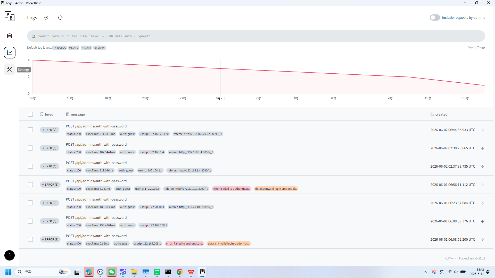

**操作详情**:
+ 操作类型: keyboard; 
+ 时间戳: 2026-06-11T14:48:57.970176; 
+ 输入内容: 1234567890; 
+ 长度: 10; 
+ 首字符: 1; 
+ 末字符: 0; 
+ 结束原因: timeout; 
+ 时间戳: 2026-06-11T14:48:57.523176; 
+ 截图类型: 末字符

# 10. 第十步：mouse

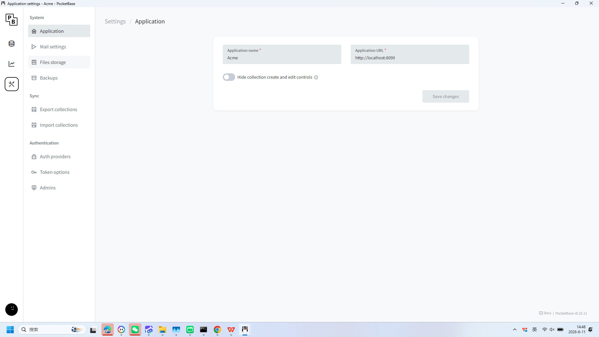

**操作详情**:
+ 操作类型: mouse; 
+ 时间戳: 2026-06-11T14:48:58.436706; 
+ 位置: (38, 253); 
+ 按钮: Button.left; 
+ 时间戳: 2026-06-11T14:48:57.913746

# 11. 第十一步：mouse

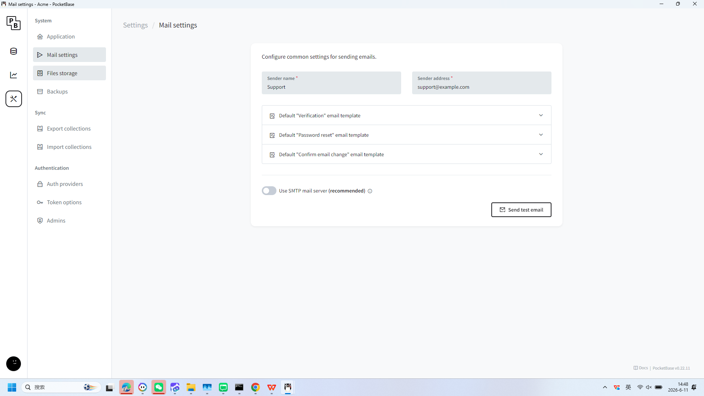

**操作详情**:
+ 操作类型: mouse; 
+ 时间戳: 2026-06-11T14:48:59.090602; 
+ 位置: (213, 151); 
+ 按钮: Button.left; 
+ 时间戳: 2026-06-11T14:48:58.546080

# 12. 第十二步：mouse

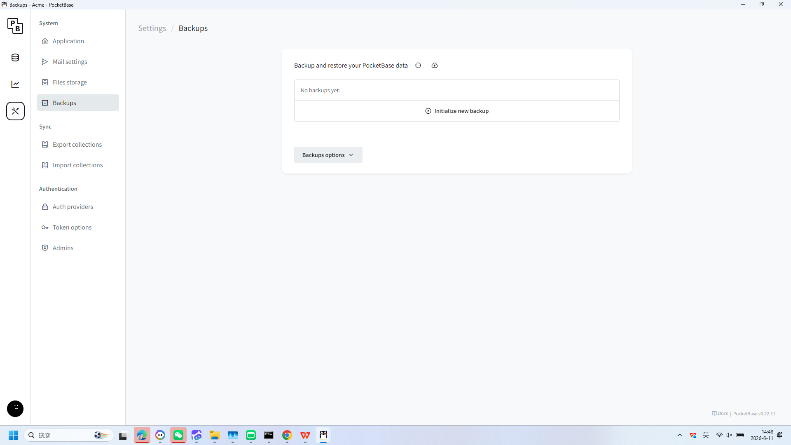

**操作详情**:
+ 操作类型: mouse; 
+ 时间戳: 2026-06-11T14:48:59.872522; 
+ 位置: (192, 252); 
+ 按钮: Button.left; 
+ 时间戳: 2026-06-11T14:48:59.369441

# 13. 第十三步：mouse

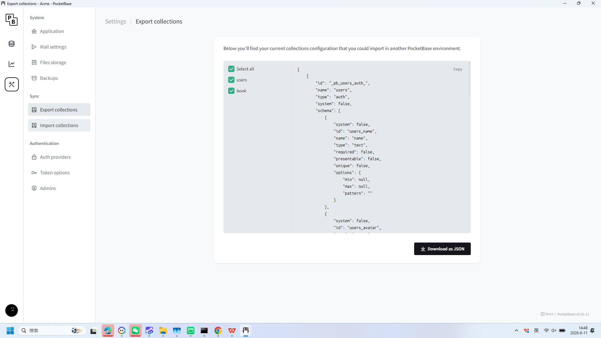

**操作详情**:
+ 操作类型: mouse; 
+ 时间戳: 2026-06-11T14:49:00.401551; 
+ 位置: (186, 335); 
+ 按钮: Button.left; 
+ 时间戳: 2026-06-11T14:48:59.842537

# 14. 第十四步：mouse

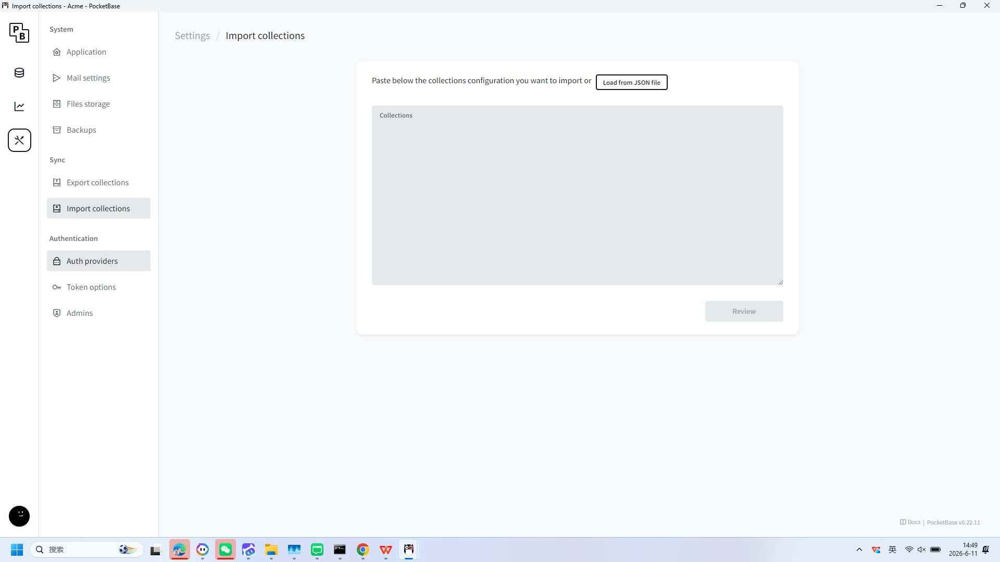

**操作详情**:
+ 操作类型: mouse; 
+ 时间戳: 2026-06-11T14:49:00.910912; 
+ 位置: (187, 401); 
+ 按钮: Button.left; 
+ 时间戳: 2026-06-11T14:49:00.306409

# 15. 第十五步：mouse

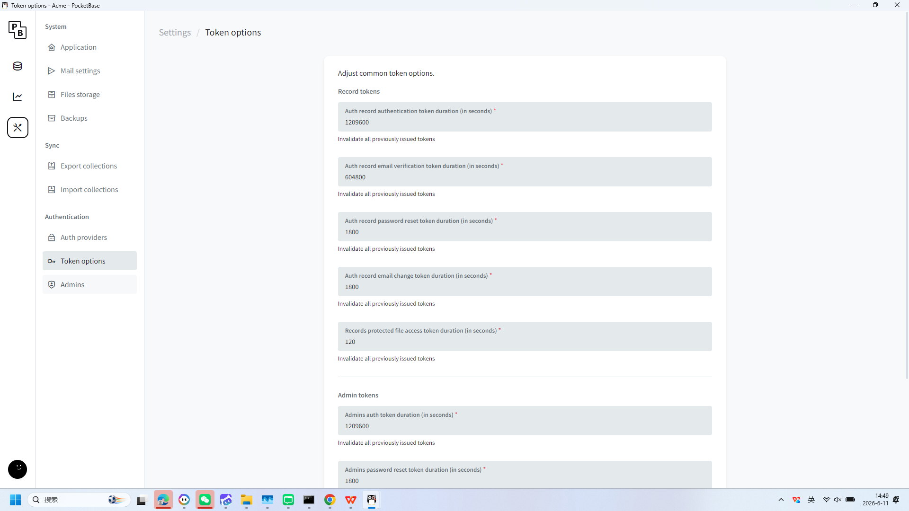

**操作详情**:
+ 操作类型: mouse; 
+ 时间戳: 2026-06-11T14:49:01.667597; 
+ 位置: (181, 538); 
+ 按钮: Button.left; 
+ 时间戳: 2026-06-11T14:49:01.145555

# 16. 第十六步：mouse

**操作详情**:
+ 操作类型: mouse; 
+ 时间戳: 2026-06-11T14:49:02.222611; 
+ 位置: (170, 598); 
+ 按钮: Button.left; 
+ 时间戳: 2026-06-11T14:49:01.729111

# 17. 第十七步：mouse

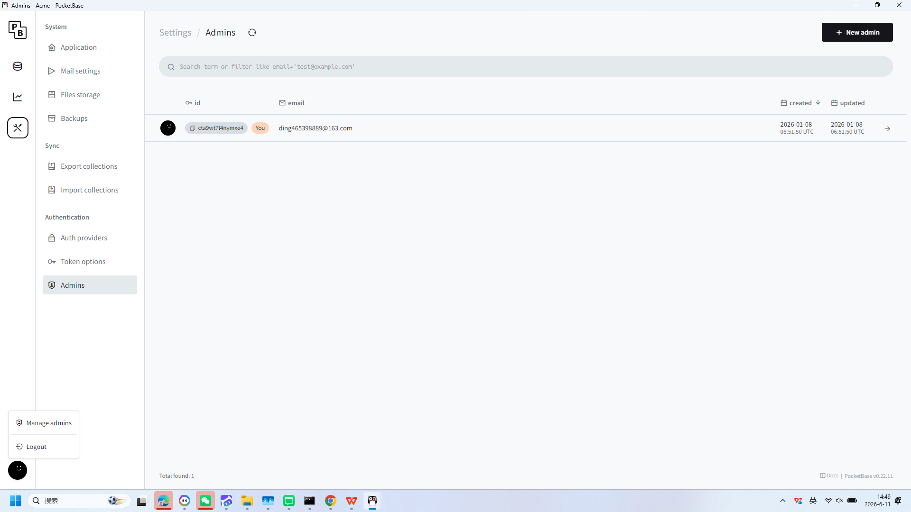

**操作详情**:
+ 操作类型: mouse; 
+ 时间戳: 2026-06-11T14:49:03.069544; 
+ 位置: (45, 981); 
+ 按钮: Button.left; 
+ 时间戳: 2026-06-11T14:49:02.562218

# 18. 第十八步：mouse

**操作详情**:
+ 操作类型: mouse; 
+ 时间戳: 2026-06-11T14:49:03.804919; 
+ 位置: (117, 945); 
+ 按钮: Button.left; 
+ 时间戳: 2026-06-11T14:49:03.314236

# 19. 第十九步：mouse

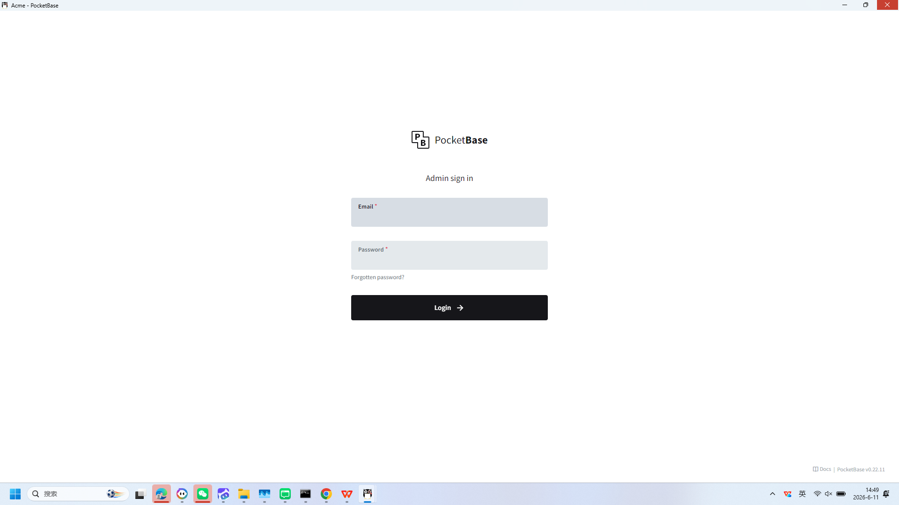

**操作详情**:
+ 操作类型: mouse; 
+ 时间戳: 2026-06-11T14:49:08.828863; 
+ 位置: (1892, 17); 
+ 按钮: Button.left; 
+ 时间戳: 2026-06-11T14:49:08.353740

# 20. 第二十步：mouse

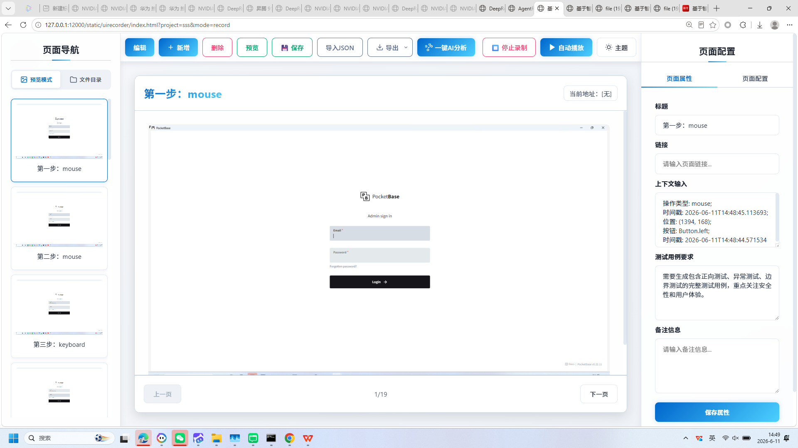

**操作详情**:
+ 操作类型: mouse; 
+ 时间戳: 2026-06-11T14:49:11.905627; 
+ 位置: (1899, 6); 
+ 按钮: Button.left; 
+ 时间戳: 2026-06-11T14:49:11.328837

---

*报告由 AgentRunner Markdown Exporter 生成*